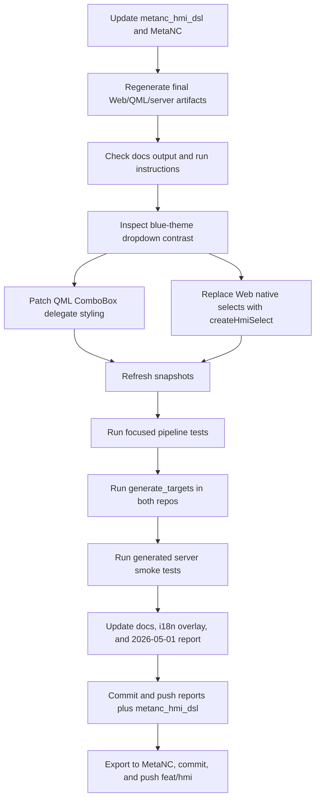

# Workflow Diagram

```mermaid
flowchart TD
    A[Update metanc_hmi_dsl and MetaNC] --> B[Regenerate final Web/QML/server artifacts]
    B --> C[Check docs output and run instructions]
    C --> D[Inspect blue-theme dropdown contrast]
    D --> E[Patch QML ComboBox delegate styling]
    D --> F[Replace Web native selects with createHmiSelect]
    E --> G[Refresh snapshots]
    F --> G
    G --> H[Run focused pipeline tests]
    H --> I[Run generate_targets in both repos]
    I --> J[Run generated server smoke tests]
    J --> K[Update docs, i18n overlay, and 2026-05-01 report]
    K --> L[Commit and push reports plus metanc_hmi_dsl]
    L --> M[Export to MetaNC, commit, and push feat/hmi]
```
