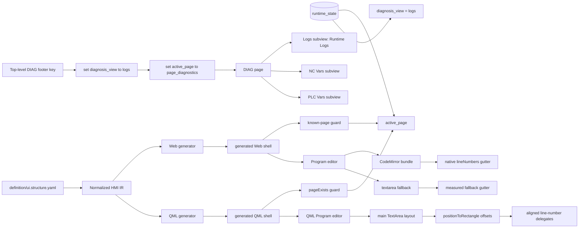

# Architecture Diagram

```mermaid
flowchart LR
    DSL[definition/ui.structure.yaml] --> IR[Normalized HMI IR]
    IR --> WebGen[Web generator]
    IR --> QmlGen[QML generator]

    WebGen --> WebShell[generated Web shell]
    QmlGen --> QmlShell[generated QML shell]

    Runtime[(runtime_state)]
    Runtime --> ActivePage[active_page]
    Runtime --> DiagnosisView[diagnosis_view = logs]

    DiagEntry[Top-level DIAG footer key] --> ActionA[set diagnosis_view to logs]
    ActionA --> ActionB[set active_page to page_diagnostics]
    ActionB --> DiagPage[DIAG page]

    DiagPage --> Logs[Logs subview: Runtime Logs]
    DiagPage --> NCVars[NC Vars subview]
    DiagPage --> PLCVars[PLC Vars subview]

    WebShell --> PageGuardWeb[known-page guard]
    QmlShell --> PageGuardQml[pageExists guard]
    PageGuardWeb --> ActivePage
    PageGuardQml --> ActivePage

    WebShell --> WebEditor[Program editor]
    WebEditor --> CodeMirror[CodeMirror bundle]
    CodeMirror --> NativeGutter[native lineNumbers gutter]
    WebEditor --> TextareaFallback[textarea fallback]
    TextareaFallback --> MeasuredGutter[measured fallback gutter]

    QmlShell --> QmlEditor[QML Program editor]
    QmlEditor --> MainTextArea[main TextArea layout]
    MainTextArea --> PositionRect[positionToRectangle offsets]
    PositionRect --> QmlLineNumbers[aligned line-number delegates]
```
