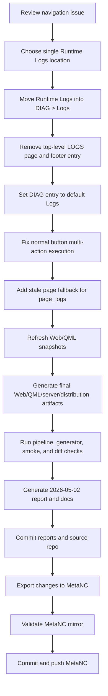

# Workflow Diagram

```mermaid
flowchart TD
    A[Review navigation issue] --> B[Choose single Runtime Logs location]
    B --> C[Move Runtime Logs into DIAG > Logs]
    C --> D[Remove top-level LOGS page and footer entry]
    D --> E[Set DIAG entry to default Logs]
    E --> F[Fix normal button multi-action execution]
    F --> G[Add stale page fallback for page_logs]
    G --> H[Refresh Web/QML snapshots]
    H --> I[Generate final Web/QML/server/distribution artifacts]
    I --> J[Run pipeline, generator, smoke, and diff checks]
    J --> K[Generate 2026-05-02 report and docs]
    K --> L[Commit reports and source repo]
    L --> M[Export changes to MetaNC]
    M --> N[Validate MetaNC mirror]
    N --> O[Commit and push MetaNC]
```
