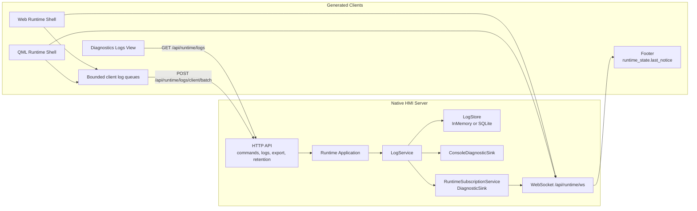

# Architecture Diagram

`RuntimeSubscriptionService` is the bridge between authoritative server logs and
server-driven footer feedback. It sends only notice payloads over WebSocket; log
history remains behind the REST query/export APIs.
