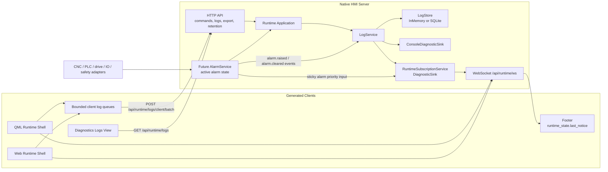

# Architecture Diagram

`RuntimeSubscriptionService` is the bridge between authoritative server logs and
server-driven footer feedback. It sends only notice payloads over WebSocket; log
history remains behind the REST query/export APIs.

The future alarm layer must own active/cleared alarm state from backend sources.
Logs record alarm lifecycle events, and notices present the selected operator
feedback; neither log text nor footer notices are the alarm-state authority.
