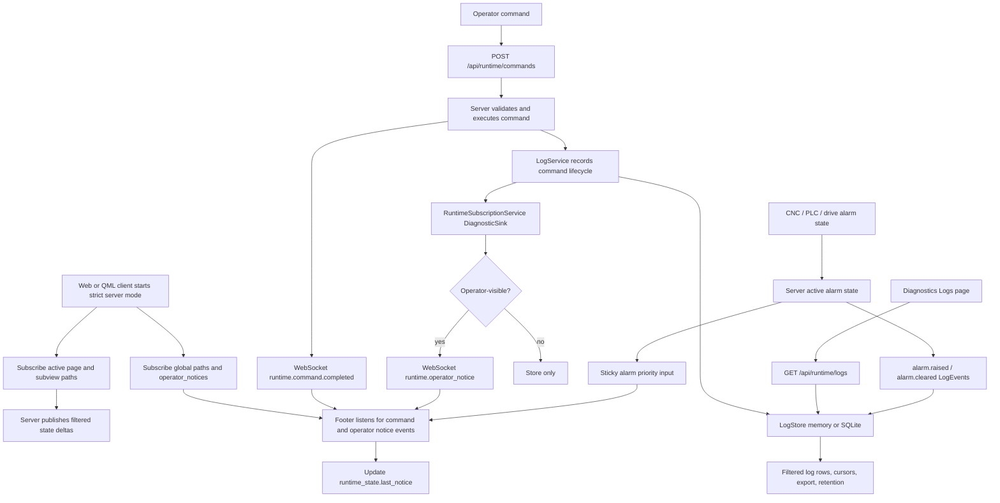

# Workflow Diagram

The key boundary is that the Diagnostics Logs table reads log rows explicitly,
while the footer receives only lightweight server-selected notices.
Alarm sticky behavior must use backend active alarm state; log rows only record
that alarm lifecycle events happened.
