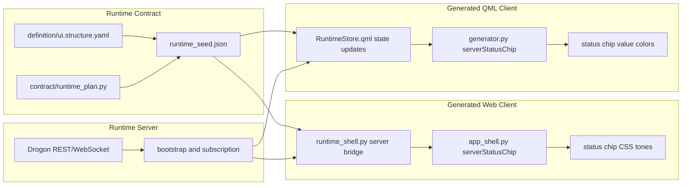

# Architecture Diagram

The top status chip is intentionally generated at the shell layer rather than
inside a page. That keeps Web and QML aligned, and leaves pages focused on
machine operation instead of transport diagnostics.
