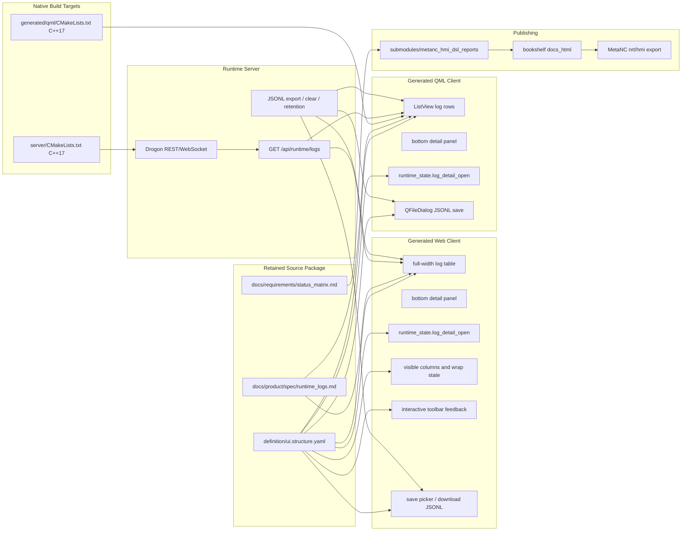

# Architecture Diagram

The runtime log store remains server-owned. Generated clients keep only a bounded
recent window and expose details, column visibility, message wrapping, and
toolbar interaction states as local view concerns, so the UI layout changes do
not alter the REST/WebSocket log contract. JSONL export still comes from the
same server-owned history when available; clients only decide how that payload is
saved locally.
