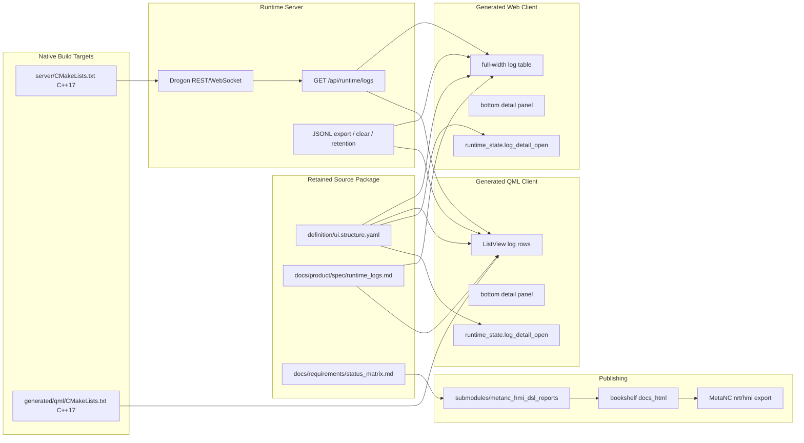

# Architecture Diagram

The runtime log store remains server-owned. Generated clients keep only a bounded
recent window and expose details as a local view concern, so the UI layout change
does not alter the REST/WebSocket log contract.
