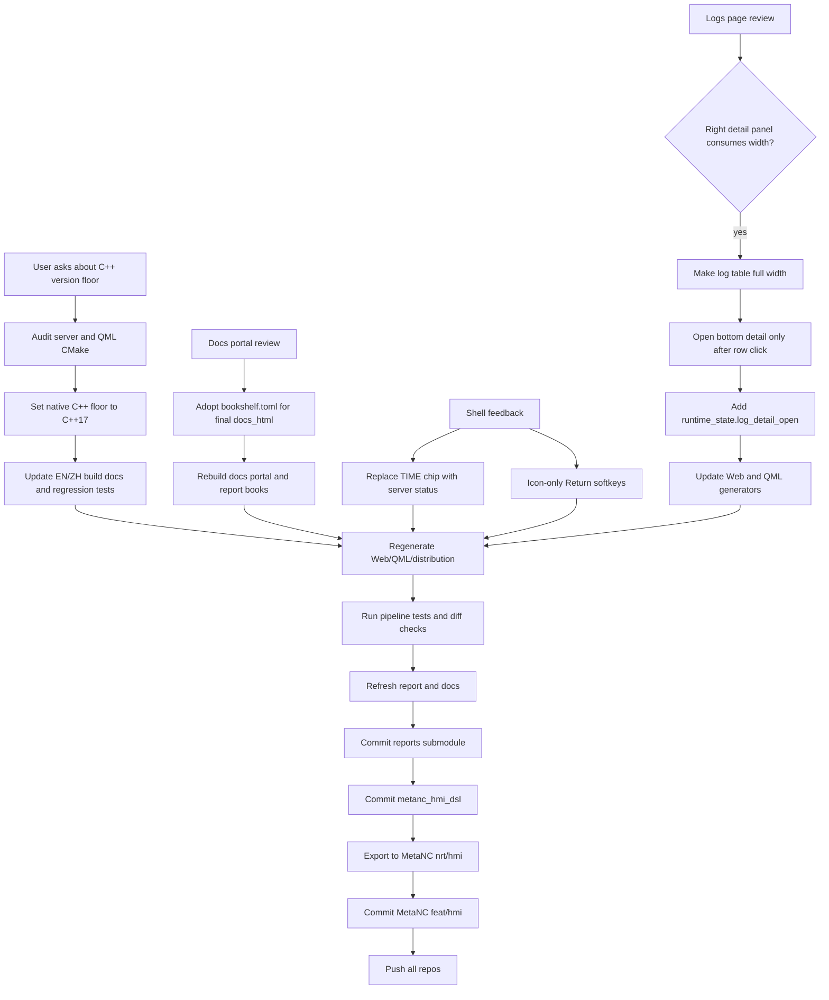

# Workflow Diagram

The key UI rule from this slice is list-first diagnostics: Logs should preserve
horizontal scan space by default, and detailed payload inspection should be an
explicit row action.
