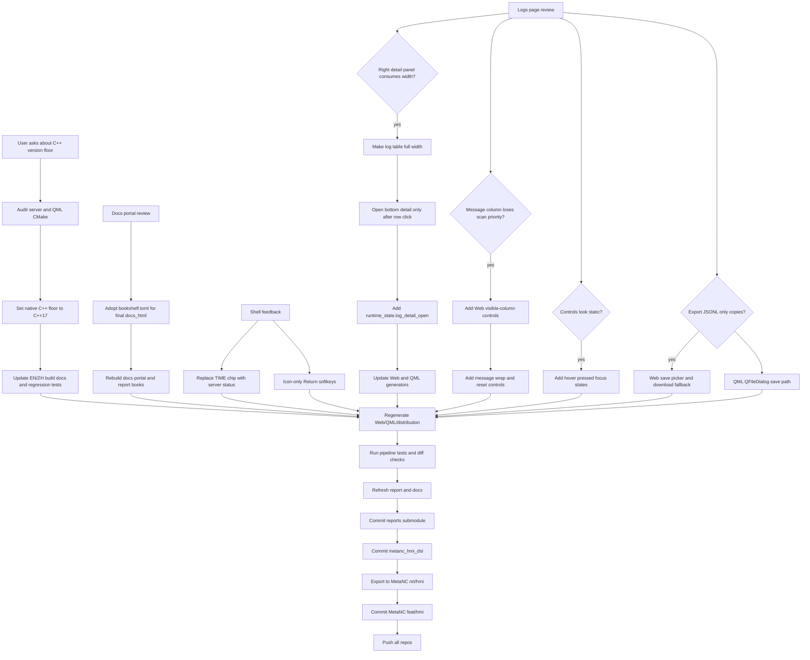

# Workflow Diagram

The key UI rule from this slice is list-first diagnostics: Logs should preserve
horizontal scan space by default, `Message` should remain the dominant scan
column, low-frequency fields should be opt-in, and every clickable Logs control
should visibly respond to hover, press, and focus. JSONL export is treated as a
file export command: Web uses the browser save/download path, while QML uses a
native save-file dialog with clipboard fallback only after write failure.
