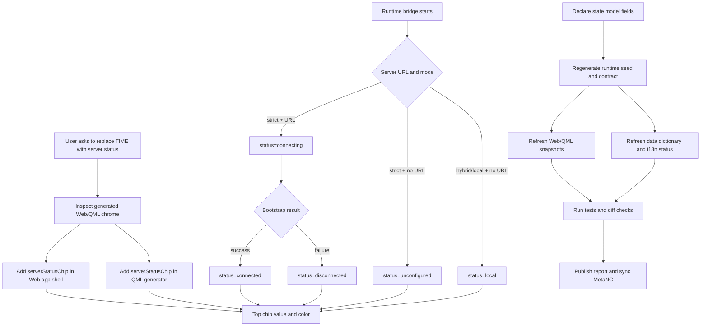

# Workflow Diagram

The important path is that UI color and label are derived from
`runtime_state.server_connection_status`, while `runtime_state.server_connected`
remains the compatibility boolean for code that only needs yes/no connectivity.
