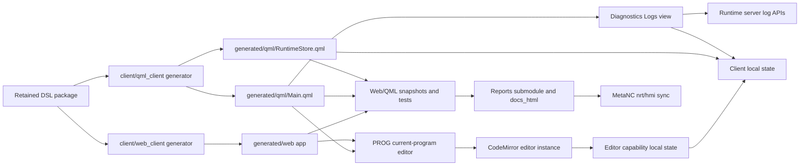

# Architecture Diagram

```mermaid
flowchart LR
    dsl[Retained DSL package]
    qmlgen[client/qml_client generator]
    mainqml[generated/qml/Main.qml]
    store[generated/qml/RuntimeStore.qml]
    logs[Diagnostics Logs view]
    webgen[client/web_client generator]
    webapp[generated/web app]
    prog[PROG current-program editor]
    editor[CodeMirror editor instance]
    caps[Editor capability local state]
    local[Client local state]
    server[Runtime server log APIs]
    snapshots[Web/QML snapshots and tests]
    reports[Reports submodule and docs_html]
    metanc[MetaNC nrt/hmi sync]

    dsl --> qmlgen
    dsl --> webgen
    qmlgen --> mainqml
    qmlgen --> store
    webgen --> webapp
    mainqml --> logs
    mainqml --> prog
    webapp --> prog
    prog --> editor
    editor --> caps
    caps --> local
    store --> local
    logs --> local
    logs --> server
    webapp --> snapshots
    mainqml --> snapshots
    store --> snapshots
    snapshots --> reports
    reports --> metanc
```
