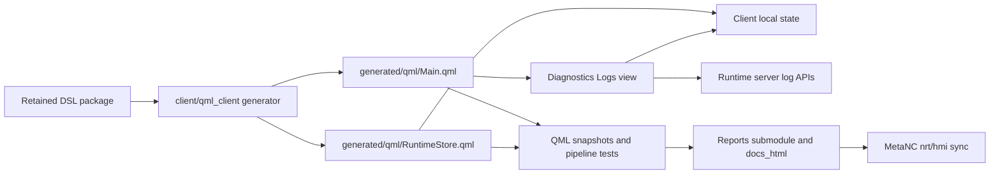

# Architecture Diagram

```mermaid
flowchart LR
    dsl[Retained DSL package]
    qmlgen[client/qml_client generator]
    mainqml[generated/qml/Main.qml]
    store[generated/qml/RuntimeStore.qml]
    logs[Diagnostics Logs view]
    local[Client local state]
    server[Runtime server log APIs]
    snapshots[QML snapshots and pipeline tests]
    reports[Reports submodule and docs_html]
    metanc[MetaNC nrt/hmi sync]

    dsl --> qmlgen
    qmlgen --> mainqml
    qmlgen --> store
    mainqml --> logs
    store --> local
    logs --> local
    logs --> server
    mainqml --> snapshots
    store --> snapshots
    snapshots --> reports
    reports --> metanc
```
