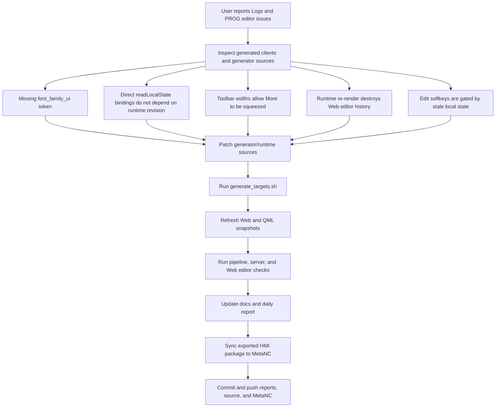

# Workflow Diagram

```mermaid
flowchart TD
    user[User reports Logs and PROG editor issues]
    inspect[Inspect generated clients and generator sources]
    root1[Missing font_family_ui token]
    root2[Direct readLocalState bindings do not depend on runtime.revision]
    root3[Toolbar widths allow More to be squeezed]
    root4[Runtime re-render destroys Web editor history]
    root5[Edit softkeys are gated by stale local state]
    fix[Patch generator/runtime sources]
    regen[Run generate_targets.sh]
    snap[Refresh Web and QML snapshots]
    test[Run pipeline, server, and Web editor checks]
    docs[Update docs and daily report]
    sync[Sync exported HMI package to MetaNC]
    publish[Commit and push reports, source, and MetaNC]

    user --> inspect
    inspect --> root1
    inspect --> root2
    inspect --> root3
    inspect --> root4
    inspect --> root5
    root1 --> fix
    root2 --> fix
    root3 --> fix
    root4 --> fix
    root5 --> fix
    fix --> regen
    regen --> snap
    snap --> test
    test --> docs
    docs --> sync
    sync --> publish
```
