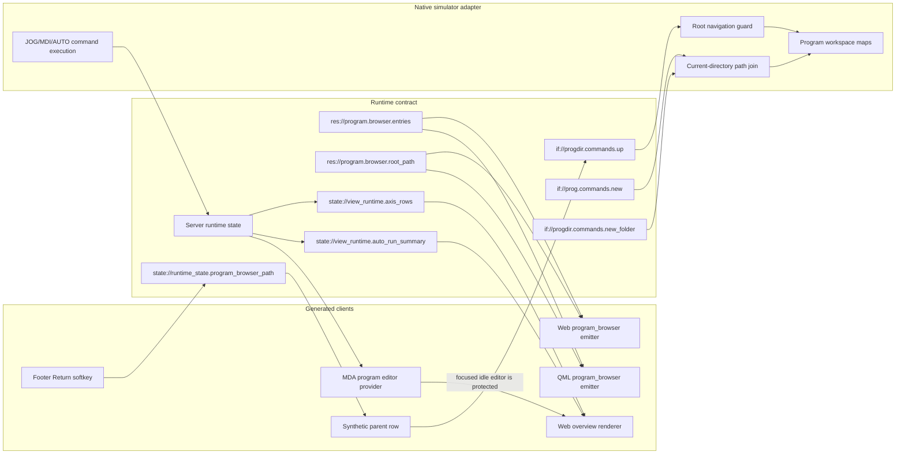

# Architecture Diagram

```mermaid
flowchart LR
    subgraph Client[Generated clients]
        W[Web program_browser emitter]
        Q[QML program_browser emitter]
        P[Synthetic parent row]
        R[Footer Return softkey]
        O[Web overview renderer]
        M[MDA program editor provider]
    end

    subgraph Contract[Runtime contract]
        Entries[res://program.browser.entries]
        Root[res://program.browser.root_path]
        Up[if://progdir.commands.up]
        NewFile[if://prog.commands.new]
        NewFolder[if://progdir.commands.new_folder]
        State[state://runtime_state.program_browser_path]
        RuntimeState[Server runtime state]
        Axis[state://view_runtime.axis_rows]
        Auto[state://view_runtime.auto_run_summary]
    end

    subgraph Server[Native simulator adapter]
        Workspace[Program workspace maps]
        RootGuard[Root navigation guard]
        JoinPath[Current-directory path join]
        Commands[JOG/MDI/AUTO command execution]
    end

    Entries --> W
    Entries --> Q
    Root --> W
    Root --> Q
    State --> P
    P --> Up
    R --> State
    Up --> RootGuard
    NewFile --> JoinPath
    NewFolder --> JoinPath
    JoinPath --> Workspace
    RootGuard --> Workspace
    Commands --> RuntimeState
    RuntimeState --> Axis
    RuntimeState --> Auto
    Axis --> O
    Auto --> O
    RuntimeState --> M
    M -->|focused idle editor is protected| O
```
