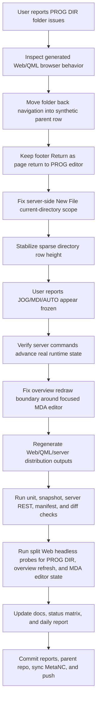

# Workflow Diagram

```mermaid
flowchart TD
    A[User reports PROG DIR folder issues] --> B[Inspect generated Web/QML browser behavior]
    B --> C[Move folder back navigation into synthetic parent row]
    C --> D[Keep footer Return as page return to PROG editor]
    D --> E[Fix server-side New File current-directory scope]
    E --> F[Stabilize sparse directory row height]
    F --> G[User reports JOG/MDI/AUTO appear frozen]
    G --> H[Verify server commands advance real runtime state]
    H --> I[Fix overview redraw boundary around focused MDA editor]
    I --> J[Regenerate Web/QML/server distribution outputs]
    J --> K[Run unit, snapshot, server REST, manifest, and diff checks]
    K --> L[Run split Web headless probes for PROG DIR, overview refresh, and MDA editor state]
    L --> M[Update docs, status matrix, and daily report]
    M --> N[Commit reports, parent repo, sync MetaNC, and push]
```
