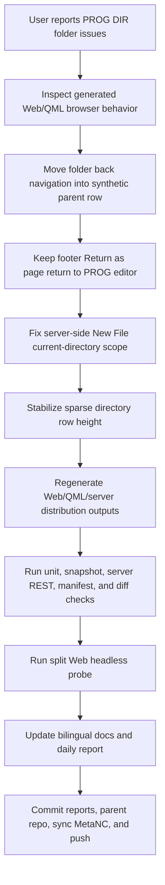

# Workflow Diagram

```mermaid
flowchart TD
    A[User reports PROG DIR folder issues] --> B[Inspect generated Web/QML browser behavior]
    B --> C[Move folder back navigation into synthetic parent row]
    C --> D[Keep footer Return as page return to PROG editor]
    D --> E[Fix server-side New File current-directory scope]
    E --> F[Stabilize sparse directory row height]
    F --> G[Regenerate Web/QML/server distribution outputs]
    G --> H[Run unit, snapshot, server REST, manifest, and diff checks]
    H --> I[Run split Web headless probe]
    I --> J[Update bilingual docs and daily report]
    J --> K[Commit reports, parent repo, sync MetaNC, and push]
```
