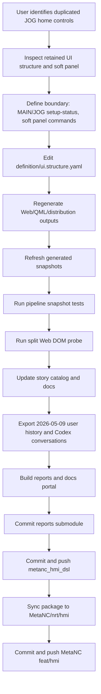

# Workflow Diagram

```mermaid
flowchart TD
    A[User identifies duplicated JOG home controls] --> B[Inspect retained UI structure and soft panel]
    B --> C[Define boundary: MAIN/JOG setup-status, soft panel commands]
    C --> D[Edit definition/ui.structure.yaml]
    D --> E[Regenerate Web/QML/distribution outputs]
    E --> F[Refresh generated snapshots]
    F --> G[Run pipeline snapshot tests]
    G --> H[Run split Web DOM probe]
    H --> I[Update story catalog and docs]
    I --> J[Export 2026-05-09 user history and Codex conversations]
    J --> K[Build reports and docs portal]
    K --> L[Commit reports submodule]
    L --> M[Commit and push metanc_hmi_dsl]
    M --> N[Sync package to MetaNC/nrt/hmi]
    N --> O[Commit and push MetaNC feat/hmi]
```
