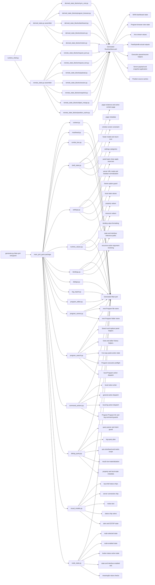

# Architecture Diagram

```mermaid
flowchart LR
    MainGen[generator.py Main.qml entrypoint] --> MainParts[main_qml_parts package]
    MainParts --> Context[context.py]
    MainParts --> Masthead[masthead.py]
    MainParts --> Combo[combo_box.py]
    MainParts --> ShellState[shell_state.py]
    MainParts --> Settings[settings.py]
    MainParts --> RuntimeValues[runtime_values.py]
    MainParts --> Bindings[bindings.py]
    MainParts --> Dialogs[dialogs.py]
    MainParts --> LogExport[log_export.py]
    MainParts --> ProgramEditor[program_editor.py]
    MainParts --> ProgramNames[program_names.py]
    MainParts --> ProgramSearch[program_search.py]
    MainParts --> CommandActions[command_actions.py]
    MainParts --> DebugQuery[debug_query.py]
    MainParts --> VisualModels[visual_models.py]
    MainParts --> NodeState[node_state.py]

    Shell[runtime_shell.py] --> Derived[derived_state.py assembler]
    Shell --> Remote[remote_state.py assembler]
    Derived --> SyncRoot[derived_state_blocks/sync_root.py]
    Derived --> Browser[derived_state_blocks/program_browser.py]
    Derived --> Dashboard[derived_state_blocks/dashboard.py]
    Derived --> Streams[derived_state_blocks/streams.py]
    Derived --> Motion[derived_state_blocks/motion.py]
    Remote --> RequestJson[remote_state_blocks/request_json.py]
    Remote --> RequestText[remote_state_blocks/request_text.py]
    Remote --> Payload[remote_state_blocks/payload.py]
    Remote --> Session[remote_state_blocks/session.py]
    Remote --> Snapshot[remote_state_blocks/snapshot.py]
    Remote --> Merge[remote_state_blocks/object_merge.py]
    Remote --> PositionCache[remote_state_blocks/position_cache.py]

    SyncRoot --> RuntimeStore[Generated RuntimeStore.qml]
    Browser --> RuntimeStore
    Dashboard --> RuntimeStore
    Streams --> RuntimeStore
    Motion --> RuntimeStore
    RequestJson --> RuntimeStore
    RequestText --> RuntimeStore
    Payload --> RuntimeStore
    Session --> RuntimeStore
    Snapshot --> RuntimeStore
    Merge --> RuntimeStore
    PositionCache --> RuntimeStore

    Context --> MainQml[Generated Main.qml]
    Masthead --> MainQml
    Combo --> MainQml
    ShellState --> MainQml
    Settings --> MainQml
    RuntimeValues --> MainQml
    Bindings --> MainQml
    Dialogs --> MainQml
    LogExport --> MainQml
    ProgramEditor --> MainQml
    ProgramNames --> MainQml
    ProgramSearch --> MainQml
    CommandActions --> MainQml
    DebugQuery --> MainQml
    VisualModels --> MainQml
    NodeState --> MainQml

    RuntimeStore --> Main[MAIN dashboard state]
    RuntimeStore --> ProgramDir[Program browser view state]
    RuntimeStore --> AxisStream[Axis stream values]
    RuntimeStore --> MotionOutputs[Feed/spindle actual outputs]
    RuntimeStore --> ExecutionControl[Execution pause/resume helpers]
    RuntimeStore --> ServerPayload[Server payload and snapshot application]
    RuntimeStore --> PositionSources[Position source caches]

    DebugQuery --> QueryParser[query parser and intent guard]
    DebugQuery --> LogQuery[log query plan]
    DebugQuery --> AxisScope[axis shorthand and metric scope]
    DebugQuery --> ResultRows[result row materialization]
    DebugQuery --> ValueMeta[property and local-state metadata]

    Bindings --> BindingFormat[binding value formatting]
    Bindings --> RefPaths[state and interface reference paths]
    Bindings --> ActionArgs[recursive action argument resolving]

    RuntimeValues --> StateAccess[local state values]
    RuntimeValues --> PropertyAccess[property values]
    RuntimeValues --> ResourceAccess[resource values]

    ShellState --> PageState[page existence and active content page]
    ShellState --> PageMeta[page metadata]
    ShellState --> WindowFit[window screen constraint]
    ShellState --> FooterState[footer model and return icon]

    Settings --> SettingsCategories[settings categories]
    Settings --> SettingsLifecycle[panel open close apply reset test]
    Settings --> SettingsNormalize[server URL mode and boolean normalization]
    Settings --> ThemeGuard[theme option guard]

    ProgramSearch --> SearchReplace[Search and replace panel helpers]
    ProgramSearch --> GotoHistory[Goto and editor history helpers]
    ProgramSearch --> ClipboardState[Cut copy paste action state]
    ProgramSearch --> Preflight[Program execution preflight]
    ProgramSearch --> LocalProgramActions[local Program action dispatch]

    ProgramNames --> NextProgramName[next Program file name]
    ProgramNames --> NextFolderName[next Program folder name]

    VisualModels --> StatusChips[top-shell status chips]
    VisualModels --> ServerChip[server connection chip]
    VisualModels --> NoticeText[notice text]
    VisualModels --> StatusColors[status chip colors]
    VisualModels --> AlertState[alert and ESTOP state]

    NodeState --> NodeSelected[node selected state]
    NodeState --> NodeEnabled[node enabled state]
    NodeState --> NodeStatus[button status active state]
    NodeState --> EnabledRefs[state and interface enabled refs]
    NodeState --> MeaningfulValue[meaningful value checks]

    CommandActions --> NoticeWriter[local notice writer]
    CommandActions --> ActionDispatch[general action dispatch]
    CommandActions --> LogActionDispatch[local log action dispatch]
    CommandActions --> CommandGuards[Program Program Dir and log command guards]
```
