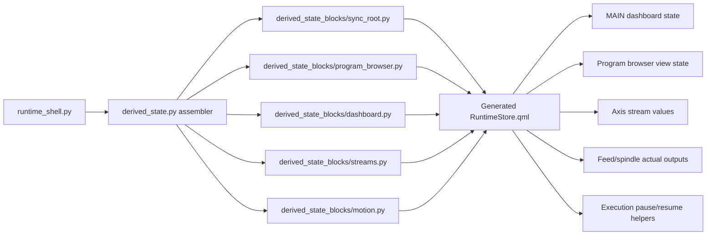

# Architecture Diagram

```mermaid
flowchart LR
    Shell[runtime_shell.py] --> Derived[derived_state.py assembler]
    Derived --> SyncRoot[derived_state_blocks/sync_root.py]
    Derived --> Browser[derived_state_blocks/program_browser.py]
    Derived --> Dashboard[derived_state_blocks/dashboard.py]
    Derived --> Streams[derived_state_blocks/streams.py]
    Derived --> Motion[derived_state_blocks/motion.py]

    SyncRoot --> RuntimeStore[Generated RuntimeStore.qml]
    Browser --> RuntimeStore
    Dashboard --> RuntimeStore
    Streams --> RuntimeStore
    Motion --> RuntimeStore

    RuntimeStore --> Main[MAIN dashboard state]
    RuntimeStore --> ProgramDir[Program browser view state]
    RuntimeStore --> AxisStream[Axis stream values]
    RuntimeStore --> MotionOutputs[Feed/spindle actual outputs]
    RuntimeStore --> ExecutionControl[Execution pause/resume helpers]
```
