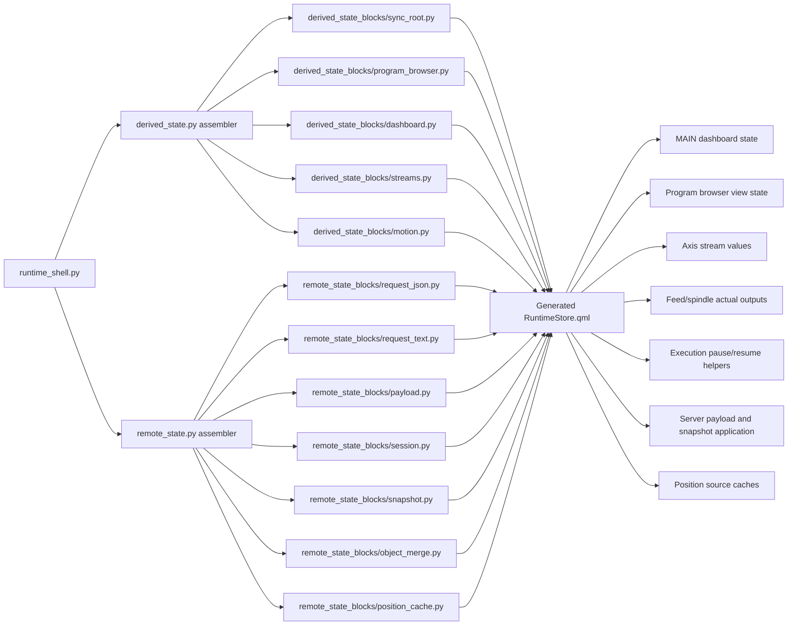

# Architecture Diagram

```mermaid
flowchart LR
    Shell[runtime_shell.py] --> Derived[derived_state.py assembler]
    Shell --> Remote[remote_state.py assembler]
    Derived --> SyncRoot[derived_state_blocks/sync_root.py]
    Derived --> Browser[derived_state_blocks/program_browser.py]
    Derived --> Dashboard[derived_state_blocks/dashboard.py]
    Derived --> Streams[derived_state_blocks/streams.py]
    Derived --> Motion[derived_state_blocks/motion.py]
    Remote --> RequestJson[remote_state_blocks/request_json.py]
    Remote --> RequestText[remote_state_blocks/request_text.py]
    Remote --> Payload[remote_state_blocks/payload.py]
    Remote --> Session[remote_state_blocks/session.py]
    Remote --> Snapshot[remote_state_blocks/snapshot.py]
    Remote --> Merge[remote_state_blocks/object_merge.py]
    Remote --> PositionCache[remote_state_blocks/position_cache.py]

    SyncRoot --> RuntimeStore[Generated RuntimeStore.qml]
    Browser --> RuntimeStore
    Dashboard --> RuntimeStore
    Streams --> RuntimeStore
    Motion --> RuntimeStore
    RequestJson --> RuntimeStore
    RequestText --> RuntimeStore
    Payload --> RuntimeStore
    Session --> RuntimeStore
    Snapshot --> RuntimeStore
    Merge --> RuntimeStore
    PositionCache --> RuntimeStore

    RuntimeStore --> Main[MAIN dashboard state]
    RuntimeStore --> ProgramDir[Program browser view state]
    RuntimeStore --> AxisStream[Axis stream values]
    RuntimeStore --> MotionOutputs[Feed/spindle actual outputs]
    RuntimeStore --> ExecutionControl[Execution pause/resume helpers]
    RuntimeStore --> ServerPayload[Server payload and snapshot application]
    RuntimeStore --> PositionSources[Position source caches]
```
