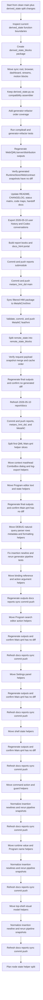

# Workflow Diagram

```mermaid
flowchart TD
    A[Start from clean main plus derived_state split changes] --> B[Inspect current derived_state function boundaries]
    B --> C[Create derived_state_blocks package]
    C --> D[Move sync root, browser, dashboard, streams, motion blocks]
    D --> E[Keep derived_state.py as compatibility assembler]
    E --> F[Add generator-refactor order coverage]
    F --> G[Run compileall and generator-refactor tests]
    G --> H[Regenerate Web/QML/server/distribution outputs]
    H --> I[Verify generated RuntimeStore/Web/contract snapshots have no diff]
    I --> J[Update README, CHANGELOG, status matrix, code maps, handoff docs]
    J --> K[Export 2026-05-10 user history and Codex conversations]
    K --> L[Build report books and docs_html portal]
    L --> M[Commit and push reports submodule]
    M --> N[Commit and push metanc_hmi_dsl main]
    N --> O[Sync filtered HMI package to MetaNC/nrt/hmi]
    O --> P[Validate, commit, and push MetaNC feat/hmi]
    P --> Q[Split remote_state into remote_state_blocks]
    Q --> R[Verify request payload snapshot merge and cache order]
    R --> S[Regenerate final outputs and confirm no generated diff]
    S --> T[Refresh 2026-05-10 report/docs]
    T --> U[Commit and push reports, metanc_hmi_dsl, and MetaNC]
    U --> V[Split first QML Main.qml helper slices]
    V --> W[Move context masthead ComboBox dialog and log-export helpers]
    W --> X[Move Program editor text and state helpers]
    X --> Y[Regenerate final outputs and confirm Main.qml has no diff]
    Y --> Z[Move DEBUG natural-query parser rows metadata and formatting helpers]
    Z --> AA[Fix insertion newline and rerun generator pipeline tests]
    AA --> AB[Move binding reference and action argument helpers]
    AB --> AC[Regenerate outputs docs reports sync commit push]
    AC --> AD[Move Program search editor action helpers]
    AD --> AE[Regenerate outputs and confirm Main.qml has no diff]
    AE --> AF[Refresh docs reports sync commit push]
    AF --> AG[Move Settings panel helpers]
    AG --> AH[Regenerate outputs and confirm Main.qml has no diff]
    AH --> AI[Refresh docs reports sync commit push]
    AI --> AJ[Move shell state helpers]
    AJ --> AK[Regenerate outputs and confirm Main.qml has no diff]
    AK --> AL[Refresh docs reports sync commit push]
    AL --> AM[Move command action and guard helpers]
    AM --> AN[Normalize insertion newlines and rerun pipeline snapshots]
    AN --> AO[Refresh docs reports sync commit push]
    AO --> AP[Move runtime value and Program name helpers]
    AP --> AQ[Normalize insertion newlines and rerun pipeline snapshots]
    AQ --> AR[Refresh docs reports sync commit push]
    AR --> AS[Move top-shell visual model helpers]
    AS --> AT[Normalize insertion newline and rerun pipeline snapshots]
    AT --> AU[Refresh docs reports sync commit push]
    AU --> AV[Plan node state helper split]
```
