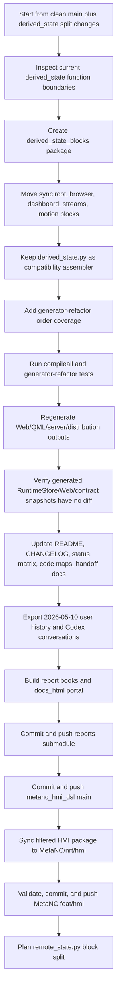

# Workflow Diagram

```mermaid
flowchart TD
    A[Start from clean main plus derived_state split changes] --> B[Inspect current derived_state function boundaries]
    B --> C[Create derived_state_blocks package]
    C --> D[Move sync root, browser, dashboard, streams, motion blocks]
    D --> E[Keep derived_state.py as compatibility assembler]
    E --> F[Add generator-refactor order coverage]
    F --> G[Run compileall and generator-refactor tests]
    G --> H[Regenerate Web/QML/server/distribution outputs]
    H --> I[Verify generated RuntimeStore/Web/contract snapshots have no diff]
    I --> J[Update README, CHANGELOG, status matrix, code maps, handoff docs]
    J --> K[Export 2026-05-10 user history and Codex conversations]
    K --> L[Build report books and docs_html portal]
    L --> M[Commit and push reports submodule]
    M --> N[Commit and push metanc_hmi_dsl main]
    N --> O[Sync filtered HMI package to MetaNC/nrt/hmi]
    O --> P[Validate, commit, and push MetaNC feat/hmi]
    P --> Q[Plan remote_state.py block split]
```
