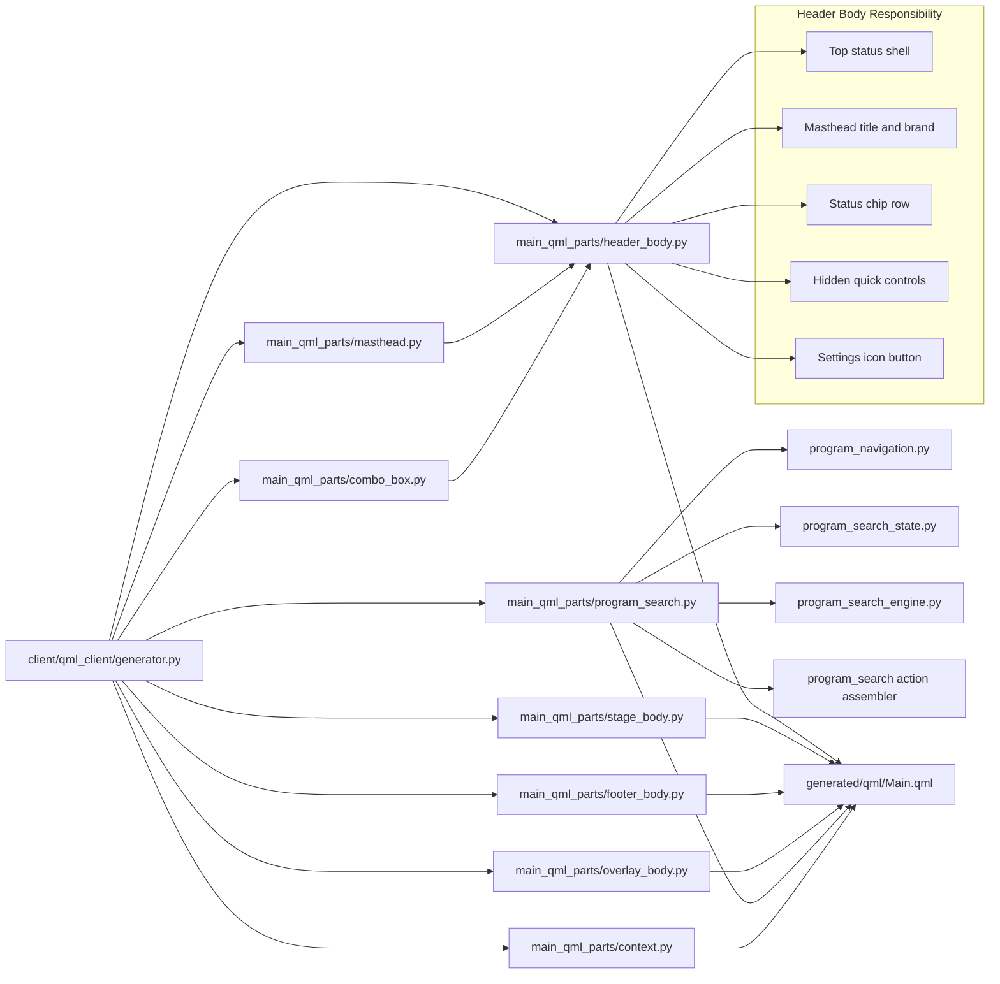

# Architecture Diagram

```mermaid
flowchart LR
    G[client/qml_client/generator.py]
    G --> H[main_qml_parts/header_body.py]
    G --> S[main_qml_parts/stage_body.py]
    G --> F[main_qml_parts/footer_body.py]
    G --> O[main_qml_parts/overlay_body.py]
    G --> C[main_qml_parts/context.py]
    G --> M[main_qml_parts/masthead.py]
    G --> CB[main_qml_parts/combo_box.py]
    G --> PS[main_qml_parts/program_search.py]
    PS --> PN[program_navigation.py]
    PS --> PSS[program_search_state.py]
    PS --> PSE[program_search_engine.py]
    PS --> PSA[program_search action assembler]
    H --> QML[generated/qml/Main.qml]
    S --> QML
    F --> QML
    O --> QML
    PS --> QML
    C --> QML
    M --> H
    CB --> H

    subgraph Header Body Responsibility
        H1[Top status shell]
        H2[Masthead title and brand]
        H3[Status chip row]
        H4[Hidden quick controls]
        H5[Settings icon button]
    end

    H --> H1
    H --> H2
    H --> H3
    H --> H4
    H --> H5
```
