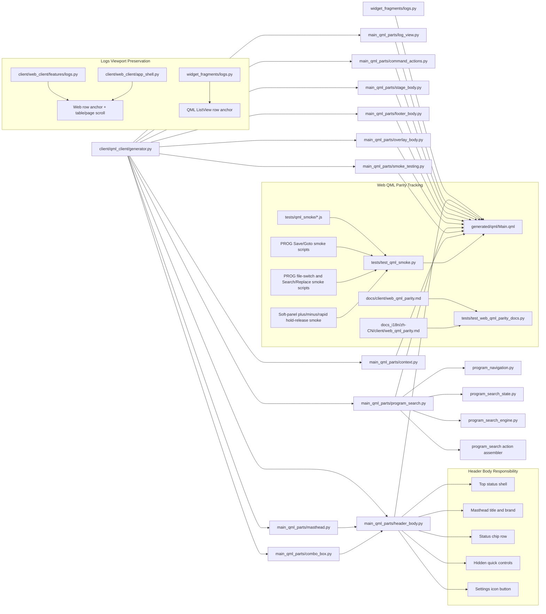

# Architecture Diagram

```mermaid
flowchart LR
    G[client/qml_client/generator.py]
    G --> H[main_qml_parts/header_body.py]
    G --> S[main_qml_parts/stage_body.py]
    G --> F[main_qml_parts/footer_body.py]
    G --> O[main_qml_parts/overlay_body.py]
    G --> C[main_qml_parts/context.py]
    G --> M[main_qml_parts/masthead.py]
    G --> CB[main_qml_parts/combo_box.py]
    G --> PS[main_qml_parts/program_search.py]
    G --> SM[main_qml_parts/smoke_testing.py]
    G --> LV[main_qml_parts/log_view.py]
    G --> CA[main_qml_parts/command_actions.py]
    WG[widget_fragments/logs.py] --> QML
    PS --> PN[program_navigation.py]
    PS --> PSS[program_search_state.py]
    PS --> PSE[program_search_engine.py]
    PS --> PSA[program_search action assembler]
    H --> QML[generated/qml/Main.qml]
    LV --> QML
    CA --> QML
    S --> QML
    F --> QML
    O --> QML
    PS --> QML
    SM --> QML
    C --> QML
    M --> H
    CB --> H

    subgraph Web QML Parity Tracking
        PARDOC[docs/client/web_qml_parity.md]
        PARZH[docs_i18n/zh-CN/client/web_qml_parity.md]
        PARTST[tests/test_web_qml_parity_docs.py]
        QSMOKE[tests/test_qml_smoke.py]
        QSCRIPTS[tests/qml_smoke/*.js]
        QPROG[PROG Save/Goto smoke scripts]
        QPROG2[PROG file-switch and Search/Replace smoke scripts]
        QJOG[Soft-panel plus/minus/rapid hold-release smoke]
        PARDOC --> PARTST
        PARZH --> PARTST
        QSCRIPTS --> QSMOKE
        QPROG --> QSMOKE
        QPROG2 --> QSMOKE
        QJOG --> QSMOKE
        QSMOKE --> QML
    end

    subgraph Header Body Responsibility
        H1[Top status shell]
        H2[Masthead title and brand]
        H3[Status chip row]
        H4[Hidden quick controls]
        H5[Settings icon button]
    end

    H --> H1
    H --> H2
    H --> H3
    H --> H4
    H --> H5

    subgraph Logs Viewport Preservation
        WLOG[client/web_client/features/logs.py]
        WSHELL[client/web_client/app_shell.py]
        QLOG[widget_fragments/logs.py]
        WLOG --> WANCHOR[Web row anchor + table/page scroll]
        WSHELL --> WANCHOR
        QLOG --> QANCHOR[QML ListView row anchor]
    end
```
