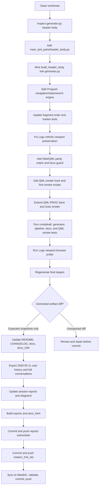

# Workflow Diagram

```mermaid
flowchart TD
    A[Clean worktrees] --> B[Inspect generator.py header body]
    B --> C[Add main_qml_parts/header_body.py]
    C --> D[Wire build_header_body into generator.py]
    D --> E[Split Program navigation/state/search engine]
    E --> F[Update fragment order and marker tests]
    F --> G[Fix Logs refresh viewport preservation]
    G --> H[Add Web/QML parity matrix and docs guard]
    H --> I[Add QML smoke hook and first smoke scripts]
    I --> I2[Extend QML PROG Save and Goto smoke]
    I2 --> J[Run compileall, generator, pipeline, docs, and QML smoke tests]
    J --> K[Run Logs viewport browser probe]
    K --> L[Regenerate final targets]
    L --> M{Generated artifact diff?}
    M -->|Expected snapshots only| N[Update README, CHANGELOG, docs, docs_i18n]
    M -->|Unexpected diff| R[Review and repair before commit]
    N --> O[Export 2026-05-11 user history and full conversations]
    O --> P[Update session reports and diagrams]
    P --> Q[Build reports and docs_html]
    Q --> S[Commit and push reports submodule]
    S --> T[Commit and push metanc_hmi_dsl]
    T --> U[Sync to MetaNC, validate, commit, push]
```
