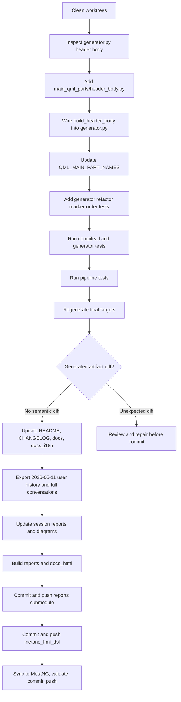

# Workflow Diagram

```mermaid
flowchart TD
    A[Clean worktrees] --> B[Inspect generator.py header body]
    B --> C[Add main_qml_parts/header_body.py]
    C --> D[Wire build_header_body into generator.py]
    D --> E[Update QML_MAIN_PART_NAMES]
    E --> F[Add generator refactor marker-order tests]
    F --> G[Run compileall and generator tests]
    G --> H[Run pipeline tests]
    H --> I[Regenerate final targets]
    I --> J{Generated artifact diff?}
    J -->|No semantic diff| K[Update README, CHANGELOG, docs, docs_i18n]
    J -->|Unexpected diff| R[Review and repair before commit]
    K --> L[Export 2026-05-11 user history and full conversations]
    L --> M[Update session reports and diagrams]
    M --> N[Build reports and docs_html]
    N --> O[Commit and push reports submodule]
    O --> P[Commit and push metanc_hmi_dsl]
    P --> Q[Sync to MetaNC, validate, commit, push]
```
