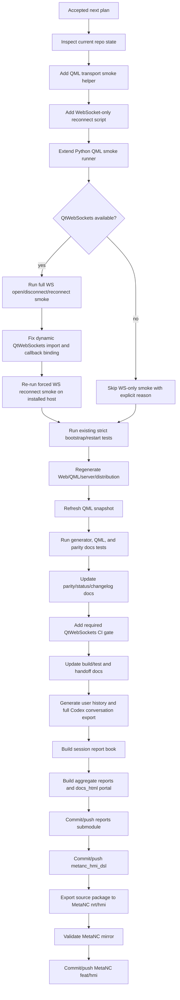

# Workflow Diagram

```mermaid
flowchart TD
    A[Accepted next plan] --> B[Inspect current repo state]
    B --> C[Add QML transport smoke helper]
    C --> D[Add WebSocket-only reconnect script]
    D --> E[Extend Python QML smoke runner]
    E --> F{QtWebSockets available?}
    F -->|yes| G[Run full WS open/disconnect/reconnect smoke]
    F -->|no| H[Skip WS-only smoke with explicit reason]
    G --> G1[Fix dynamic QtWebSockets import and callback binding]
    G1 --> G2[Re-run forced WS reconnect smoke on installed host]
    G2 --> I[Run existing strict bootstrap/restart tests]
    H --> I
    I --> J[Regenerate Web/QML/server/distribution]
    J --> K[Refresh QML snapshot]
    K --> L[Run generator, QML, and parity docs tests]
    L --> M[Update parity/status/changelog docs]
    M --> N[Add required QtWebSockets CI gate]
    N --> O[Update build/test and handoff docs]
    O --> P[Generate user history and full Codex conversation export]
    P --> Q[Build session report book]
    Q --> R[Build aggregate reports and docs_html portal]
    R --> S[Commit/push reports submodule]
    S --> T[Commit/push metanc_hmi_dsl]
    T --> U[Export source package to MetaNC nrt/hmi]
    U --> V[Validate MetaNC mirror]
    V --> W[Commit/push MetaNC feat/hmi]
```
