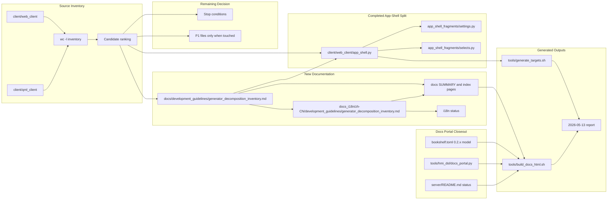

# Architecture Diagram

```mermaid
flowchart LR
    subgraph SourceInventory[Source Inventory]
        WEB[client/web_client]
        QML[client/qml_client]
        COUNT[wc -l inventory]
        RANK[Candidate ranking]
    end

    subgraph NewDocs[New Documentation]
        EN[docs/development_guidelines/generator_decomposition_inventory.md]
        ZH[docs_i18n/zh-CN/development_guidelines/generator_decomposition_inventory.md]
        NAV[docs SUMMARY and index pages]
        I18N[i18n status]
    end

    subgraph Outputs[Generated Outputs]
        TARGETS[tools/generate_targets.sh]
        DOCS[tools/build_docs_html.sh]
        REPORT[2026-05-13 report]
    end

    subgraph DocsPortal[Docs Portal Closeout]
        BOOKSHELF[bookshelf.toml 0.2.x model]
        PORTAL[tools/hmi_dsl/docs_portal.py]
        SERVERDOC[server/README.md status]
    end

    subgraph AppShellSplit[Completed App-Shell Split]
        SHELL[client/web_client/app_shell.py]
        SETTINGS[app_shell_fragments/settings.py]
        SELECTS[app_shell_fragments/selects.py]
    end

    subgraph Decision[Remaining Decision]
        STOP[Stop conditions]
        P1[P1 files only when touched]
    end

    WEB --> COUNT
    QML --> COUNT
    COUNT --> RANK
    RANK --> EN
    EN --> ZH
    EN --> NAV
    ZH --> NAV
    ZH --> I18N
    NAV --> DOCS
    EN --> SHELL
    SHELL --> SETTINGS
    SHELL --> SELECTS
    SHELL --> TARGETS
    TARGETS --> REPORT
    BOOKSHELF --> DOCS
    PORTAL --> DOCS
    SERVERDOC --> DOCS
    DOCS --> REPORT
    RANK --> SHELL
    RANK --> P1
    RANK --> STOP
```
