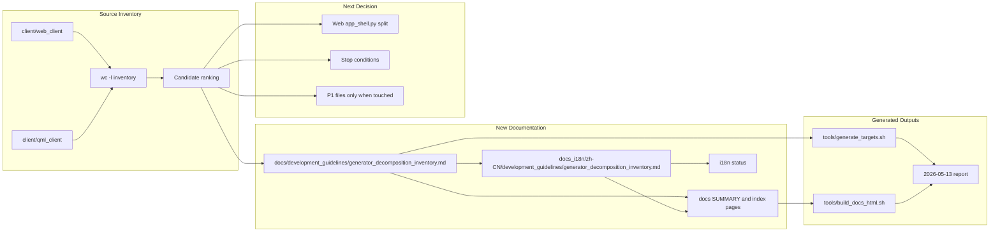

# Architecture Diagram

```mermaid
flowchart LR
    subgraph SourceInventory[Source Inventory]
        WEB[client/web_client]
        QML[client/qml_client]
        COUNT[wc -l inventory]
        RANK[Candidate ranking]
    end

    subgraph NewDocs[New Documentation]
        EN[docs/development_guidelines/generator_decomposition_inventory.md]
        ZH[docs_i18n/zh-CN/development_guidelines/generator_decomposition_inventory.md]
        NAV[docs SUMMARY and index pages]
        I18N[i18n status]
    end

    subgraph Outputs[Generated Outputs]
        TARGETS[tools/generate_targets.sh]
        DOCS[tools/build_docs_html.sh]
        REPORT[2026-05-13 report]
    end

    subgraph Decision[Next Decision]
        P0[Web app_shell.py split]
        STOP[Stop conditions]
        P1[P1 files only when touched]
    end

    WEB --> COUNT
    QML --> COUNT
    COUNT --> RANK
    RANK --> EN
    EN --> ZH
    EN --> NAV
    ZH --> NAV
    ZH --> I18N
    NAV --> DOCS
    EN --> TARGETS
    TARGETS --> REPORT
    DOCS --> REPORT
    RANK --> P0
    RANK --> P1
    RANK --> STOP
```
