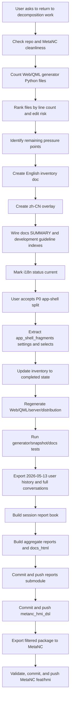

# Workflow Diagram

```mermaid
flowchart TD
    A[User asks to return to decomposition work] --> B[Check repo and MetaNC cleanliness]
    B --> C[Count Web/QML generator Python files]
    C --> D[Rank files by line count and edit risk]
    D --> E[Identify remaining pressure points]
    E --> F[Create English inventory doc]
    F --> G[Create zh-CN overlay]
    G --> H[Wire docs SUMMARY and development guideline indexes]
    H --> I[Mark i18n status current]
    I --> J[User accepts P0 app-shell split]
    J --> K[Extract app_shell_fragments settings and selects]
    K --> L[Update inventory to completed state]
    L --> M[Regenerate Web/QML/server/distribution]
    M --> N[Run generator/snapshot/docs tests]
    N --> O[Export 2026-05-13 user history and full conversations]
    O --> P[Build session report book]
    P --> Q[Build aggregate reports and docs_html]
    Q --> R[Commit and push reports submodule]
    R --> S[Commit and push metanc_hmi_dsl]
    S --> T[Export filtered package to MetaNC]
    T --> U[Validate, commit, and push MetaNC feat/hmi]
```
