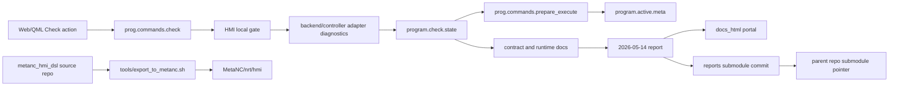

# Architecture Diagram

The command/resource boundary is the important product architecture change:
HMI coordinates check state and prepare gating, while real NC decode diagnostics
remain backend/controller-owned. The reports repository records this decision,
and MetaNC receives the filtered HMI package through the existing export script.
