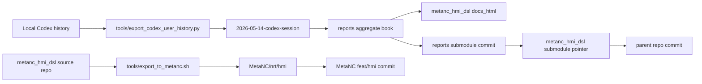

# Architecture Diagram

The reports repository remains the durable home for daily session assets. The
parent source repository owns the generated documentation portal and records the
reports submodule revision. The downstream MetaNC repository receives only the
filtered HMI package sync.
