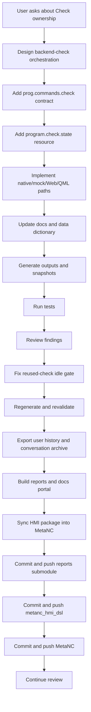

# Workflow Diagram

```mermaid
flowchart TD
    A[User asks about Check ownership] --> B[Design backend-check orchestration]
    B --> C[Add prog.commands.check contract]
    C --> D[Add program.check.state resource]
    D --> E[Implement native/mock/Web/QML paths]
    E --> F[Update docs and data dictionary]
    F --> G[Generate outputs and snapshots]
    G --> H[Run tests]
    H --> I[Review findings]
    I --> J[Fix reused-check idle gate]
    J --> K[Regenerate and revalidate]
    K --> L[Export user history and conversation archive]
    L --> M[Build reports and docs portal]
    M --> N[Sync HMI package into MetaNC]
    N --> O[Commit and push reports submodule]
    O --> P[Commit and push metanc_hmi_dsl]
    P --> Q[Commit and push MetaNC]
    Q --> R[Continue review]
```

The important ordering rule is that the reports submodule is published before
the parent repository records its updated submodule pointer.
