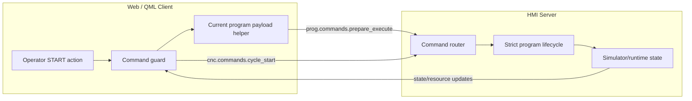

# Architecture Diagram

```mermaid
flowchart LR
    subgraph Client["Web / QML Client"]
        UI[Operator START action]
        Guard[Command guard]
        Payload[Current program payload helper]
    end

    subgraph Server["HMI Server"]
        Router[Command router]
        Lifecycle[Strict program lifecycle]
        Runtime[Simulator/runtime state]
    end

    UI --> Guard
    Guard --> Payload
    Payload -->|prog.commands.prepare_execute| Router
    Guard -->|cnc.commands.cycle_start| Router
    Router --> Lifecycle
    Lifecycle --> Runtime
    Runtime -->|state/resource updates| Guard
```
