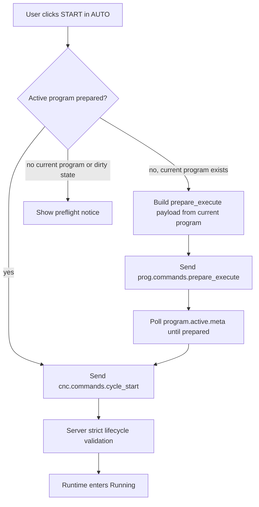

# Workflow Diagram

```mermaid
flowchart TD
    A[User clicks START in AUTO] --> B{Active program prepared?}
    B -- yes --> C[Send cnc.commands.cycle_start]
    B -- no, current program exists --> D[Build prepare_execute payload from current program]
    D --> E[Send prog.commands.prepare_execute]
    E --> F[Poll program.active.meta until prepared]
    F --> C
    B -- no current program or dirty state --> G[Show preflight notice]
    C --> H[Server strict lifecycle validation]
    H --> I[Runtime enters Running]
```
