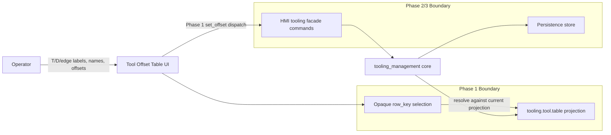

# Architecture Diagram

The UI row identity is `row_key`, not a user-facing selector and not a
database row id. Internal `tool_id` and `edge_id` remain owned by the tooling
domain; the HMI resolves the selected `row_key` against the latest
`tooling.tool.table` projection before dispatching existing offset writes.

Phase 1 focuses on row identity, display shape, selection, and inline offset
edit dispatch. Add, remove, status, and identity-edit workflows are deferred to
later HMI facade commands.
