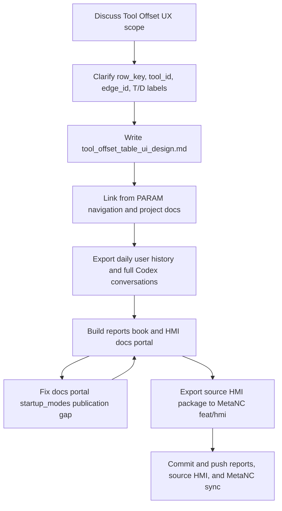

# Workflow Diagram

This workflow records the delivery order used for the 2026-05-20 session:
settle the Tool Offset UI contract first, publish the report/docs artifacts,
repair the generated docs portal gap found by tests, and only then mirror the
source HMI package into MetaNC.
