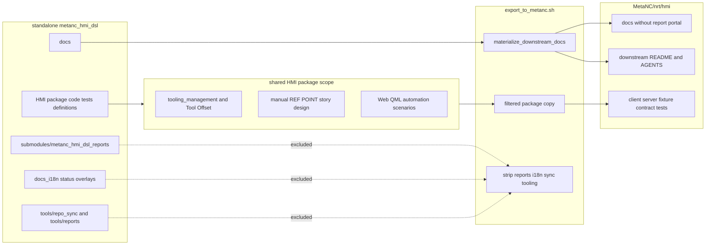

# Architecture Diagram

```mermaid
flowchart LR
  subgraph source[standalone metanc_hmi_dsl]
    srcDocs[docs]
    i18n[docs_i18n status overlays]
    reports[submodules/metanc_hmi_dsl_reports]
    sync[tools/repo_sync and tools/reports]
    package[HMI package code tests definitions]
  end

  subgraph shared[shared HMI package scope]
    tooling[tooling_management and Tool Offset]
    reference[manual REF POINT story design]
    automation[Web QML automation scenarios]
  end

  subgraph export[export_to_metanc.sh]
    copy[filtered package copy]
    materialize[materialize_downstream_docs]
    strip[strip reports i18n sync tooling]
  end

  subgraph downstream[MetaNC/nrt/hmi]
    downstreamDocs[docs without report portal]
    downstreamEntrypoints[downstream README and AGENTS]
    downstreamPackage[client server fixture contract tests]
  end

  package --> shared --> copy --> downstreamPackage
  srcDocs --> materialize --> downstreamDocs
  materialize --> downstreamEntrypoints
  reports -. excluded .-> strip
  i18n -. excluded .-> strip
  sync -. excluded .-> strip
```
