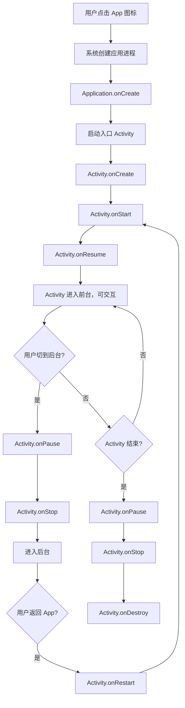

# 看一下下面的MetaNC和metanc_hmi_dsl什么状态

- Session ID: `019e5d93-3520-7f73-b05d-ac60a5fc9415`
- Session kind: `primary`
- Started: `2026-05-25 13:19:49 +0800`
- CWD: `/home/iaar/workspace/ccmix-wp`
- Source file: `~/.codex/sessions/2026/05/25/rollout-2026-05-25T13-19-49-019e5d93-3520-7f73-b05d-ac60a5fc9415.jsonl`
- Messages: `42`
- User prompts: `10`
- Synthetic events: `0`

<a id="turn-1"></a>
## Turn 1

### User
`2026-05-25 13:19:49 +0800`

```
看一下下面的MetaNC和metanc_hmi_dsl什么状态
```

### Codex Response 1 / commentary
`2026-05-25 13:20:23 +0800`

```
我先快速看一下这两个目录的仓库状态和分支关系，再结合之前这里常见的同步边界判断是否只是本地改动、未推送，还是子模块/镜像关系有偏差。
```

### Codex Response 2 / commentary
`2026-05-25 13:20:42 +0800`

```
当前第一眼：`MetaNC` 在 `feat/hmi`，本地比 `origin/feat/hmi` 多 1 个提交，而且还有 5 个未提交修改；`metanc_hmi_dsl` 在 `metanc-layout`，工作区先看是干净的。我再 fetch 一下远端并展开看具体差异和子模块指针，避免用到过期的远端引用。
```

### Codex Response 3 / commentary
`2026-05-25 13:21:06 +0800`

```
远端刷新完成，没有 fetch 报错。下一步我会看每个仓库的分支 ahead/behind、最近提交、未提交 diff 摘要，以及 `MetaNC/nrt/hmi` 是否和独立 `metanc_hmi_dsl` 的同步边界出现偏移。
```

### Codex Response 4 / commentary
`2026-05-25 13:21:32 +0800`

```
`MetaNC` 的本地修改集中在 tooling adapter/revision guard 相关代码和测试，不是泛泛的生成物漂移；`metanc_hmi_dsl` 本体干净，reports 子模块指针也没有 dirty 标记。我再补一下各自 upstream 差距、reports 子模块自身状态，以及 `MetaNC` 多出来的本地提交内容。
```

### Codex Response 5 / commentary
`2026-05-25 13:21:56 +0800`

```
刚才我把 reports 子模块路径按旧位置查了一次，实际现在挂在 `metanc_hmi_dsl/nrt/hmi/submodules/...` 下；这个不影响主判断，我用正确路径再查一遍。MetaNC 这边还需要注意：`main` 本地落后 `origin/main` 1 个提交，但当前工作分支是 `feat/hmi`，不是 `main`。
```

### Codex Response 6 / commentary
`2026-05-25 13:22:24 +0800`

```
从分支关系看，`metanc_hmi_dsl` 的 `metanc-layout` 是一条相对 `origin/main` 多 45 个提交的特性线；`MetaNC/feat/hmi` 相对 `origin/main` 是 HMI 集成线且多很多历史。为了判断这 5 个 MetaNC 未提交改动是不是已经反向进入独立仓库，我会按对应路径做一次文件级比较。
```

### Codex Response 7 / commentary
`2026-05-25 13:22:51 +0800`

```
这些本地改动看起来像从下游 `MetaNC` 里直接做出的乐观锁/revision guard 修复，还没有回到独立 `metanc_hmi_dsl`。我再做一个范围更广但排除子模块元数据的目录对比，确认是否只有这组文件不同，还是整棵 HMI 包还有别的偏差。
```

### Codex Response 8 / commentary
`2026-05-25 13:23:23 +0800`

```
目录级对比里有很多 `__pycache__` 这类可忽略噪音，我会再按源码/文档边界过滤一次，给你一个能直接决策的状态结论。
```

### Codex Response 9 / final_answer
`2026-05-25 13:23:48 +0800`

```
已刷新远端后看过，当前状态是：

**MetaNC**
- 分支：`feat/hmi`
- upstream：`origin/feat/hmi`
- 状态：本地 `ahead 1`，并且还有未提交修改。
- 本地多出的提交：`3250d48a tooling: guard adapter writes by revision`
- 未提交修改集中在 HMI tooling revision guard/乐观锁相关：
  - `nrt/hmi/definition/interfaces.machine.yaml`
  - `nrt/hmi/server/include/hmi/extensions/tooling/tooling_backend.h`
  - `nrt/hmi/server/src/extensions/tooling/tooling_management_backend.cpp`
  - `nrt/hmi/server/src/extensions/tooling/tooling_runtime_extension_adapter.cpp`
  - `nrt/hmi/server/tests/tooling_management_backend_test.cpp`
- 另：`MetaNC/main` 本地落后 `origin/main` 1 个提交，但当前不在 `main` 上。

**metanc_hmi_dsl**
- 分支：`metanc-layout`
- upstream：`origin/metanc-layout`
- 状态：干净，和 upstream 完全一致。
- 相对 `origin/main`：`metanc-layout` 多 45 个提交，是当前 HMI layout/tool-offset 特性线。
- reports 子模块路径：`nrt/hmi/submodules/metanc_hmi_dsl_reports`
- reports 子模块状态：干净，`main == origin/main`，当前提交 `57c9f85 docs: add 2026-05-25 HMI report`

**两个仓库之间**
- 当前 `MetaNC` 里那 5 个未提交 HMI tooling 改动还没有同步回 `metanc_hmi_dsl`，对应文件和独立仓库不同。
- 目录对比还有一些预期差异：`metanc_hmi_dsl` 有 source-only 的 sync/report 工具、`docs_i18n`、reports 子模块等；`MetaNC` 是下游集成面。
- 如果要整理，正确方向大概率是先把 `MetaNC` 里的下游改动反向导入 `metanc_hmi_dsl`，验证/生成后，再通过 `export_to_metanc.sh` 回写到 `MetaNC`。不要直接手工覆盖 report 相关内容。

<oai-mem-citation>
<citation_entries>
MEMORY.md:973-981|note=[used validated reverse import and export workflow for MetaNC and metanc_hmi_dsl]
MEMORY.md:828-831|note=[used workspace sibling repo sync context]
</citation_entries>
<rollout_ids>
019e4353-dbb4-7330-a876-2395c6fbc1fb
</rollout_ids>
</oai-mem-citation>
```

<a id="turn-2"></a>
## Turn 2

### User
`2026-05-25 13:31:16 +0800`

```
检查一下本地分支提交情况
```

### Codex Response 1 / commentary
`2026-05-25 13:31:43 +0800`

```
我按刚才这两个仓库继续查：先列本地分支和 upstream 差距，再把有 ahead/behind 的分支展开到具体提交。
```

### Codex Response 2 / commentary
`2026-05-25 13:32:16 +0800`

```
`MetaNC` 的工作区这会儿又多了文档、snapshot 和 adapter 测试修改；我会把“已提交但未推送/落后远端”和“未提交改动”分开列清楚。
```

### Codex Response 3 / final_answer
`2026-05-25 13:32:39 +0800`

```
基于当前本地状态：

**MetaNC**
- `feat/hmi`：当前分支，`ahead 1 / behind 0`
  - 未推送提交：`3250d48a tooling: guard adapter writes by revision`
  - 但工作区还有未提交修改，约 15 个文件，集中在 HMI tooling revision guard、docs、snapshot、测试。
- `main`：`ahead 0 / behind 1`
  - 落后远端：`6903a85d feat: very first rt and rt sdk part (#36)`
- `feat/plc`：`ahead 0 / behind 99`
  - 明显落后远端 PLC/rt-sdk 线。
- `feat/tooling_management`：`ahead 0 / behind 0`
  - 与远端一致，但当前在另一个 worktree：`/tmp/metanc_tooling_branch`
- `feat/hmi-tmp-tooling`：无 upstream
  - 停在 `6d2a8adb feat(hmi): integrate tooling management parameter workflows (#35)`，像是旧临时分支。

**metanc_hmi_dsl**
- `metanc-layout`：当前分支，`ahead 0 / behind 0`，干净。
- `main`、`claude`：都与各自 upstream 一致。
- `codex`、`front_back_seperate`、`front_back_unite`：本地分支无 upstream，需要看是否还要保留或推送。

**reports 子模块**
- `metanc_hmi_dsl/nrt/hmi/submodules/metanc_hmi_dsl_reports`
- `main`：`ahead 0 / behind 0`，干净。
- HEAD：`57c9f85 docs: add 2026-05-25 HMI report`

当前唯一真正需要处理的是 `MetaNC/feat/hmi`：有 1 个本地提交未推送，同时还有一批未提交修改。
```

<a id="turn-3"></a>
## Turn 3

### User
`2026-05-25 13:33:55 +0800`

```
重新检查一遍
```

### Codex Response 1 / commentary
`2026-05-25 13:34:11 +0800`

```
我重新拉取远端引用再查一遍，这样 ahead/behind 不是基于旧的本地远端缓存。先看 `MetaNC`、`metanc_hmi_dsl` 和 reports 子模块三处。
```

### Codex Response 2 / commentary
`2026-05-25 13:34:45 +0800`

```
远端刷新完成，没有输出错误。现在我把分支提交差距、工作区状态和未推送提交具体列出来。
```

### Codex Response 3 / commentary
`2026-05-25 13:34:56 +0800`

```
这次和上一轮结论一致，但 `MetaNC` 未提交文件数从之前的 15 个变成了 18 个，多了 QML/Web client command guard/table 相关文件。我补一个 diff stat，方便看改动规模。
```

### Codex Response 4 / final_answer
`2026-05-25 13:35:05 +0800`

```
重新 fetch 后状态如下：

**MetaNC**
- 当前分支：`feat/hmi`
- 与 upstream：`ahead 1 / behind 0`
- 未推送提交：
  - `3250d48a tooling: guard adapter writes by revision`
- 工作区未提交修改：18 个文件，`502 insertions / 71 deletions`
  - 多了 client 侧相关修改：`command_actions.py`、`command_guards.py`、`data_table.py`
  - 还有 definition、docs、server tooling backend/adapter、测试、web snapshot。
- `main`：`ahead 0 / behind 1`
  - 远端多：`6903a85d feat: very first rt and rt sdk part (#36)`
- `feat/plc`：`ahead 0 / behind 99`
- `feat/tooling_management`：`ahead 0 / behind 0`
- `feat/hmi-tmp-tooling`：无 upstream，旧临时分支状态。

**metanc_hmi_dsl**
- 当前分支：`metanc-layout`
- 与 upstream：`ahead 0 / behind 0`
- 工作区干净。
- 本地 `main`、`claude` 也都与 upstream 一致。
- `codex`、`front_back_seperate`、`front_back_unite` 无 upstream。

**reports 子模块**
- 路径：`metanc_hmi_dsl/nrt/hmi/submodules/metanc_hmi_dsl_reports`
- `main` 与 `origin/main` 一致，工作区干净。
- HEAD：`57c9f85 docs: add 2026-05-25 HMI report`

结论：现在只有 `MetaNC/feat/hmi` 有本地待处理内容：1 个已提交未推送提交 + 18 个未提交文件。
```

<a id="turn-4"></a>
## Turn 4

### User
`2026-05-25 13:51:12 +0800`

```
看一下本地情况
```

### Codex Response 1 / commentary
`2026-05-25 13:51:35 +0800`

```
我按本地状态重新扫一遍，不刷新远端引用：重点看当前分支、未提交改动、已提交未推送、本地分支是否有悬空/无 upstream。
```

### Codex Response 2 / commentary
`2026-05-25 13:51:50 +0800`

```
本地状态有变化：`MetaNC` 已经没有未提交改动了，但 `feat/hmi` 变成 ahead 2，说明那 18 个文件已经被提交成第二个本地提交。我再看这两个提交的 stat 和 `metanc_hmi_dsl` 是否仍然干净。
```

### Codex Response 3 / final_answer
`2026-05-25 13:52:01 +0800`

```
本地状态现在变了：

**MetaNC**
- 当前分支：`feat/hmi`
- 工作区：干净，没有未提交修改。
- 与 `origin/feat/hmi`：`ahead 2`
- 本地未推送提交：
  - `577397f2 hmi: guard tooling writes by revision`
    - 23 files changed, `585 insertions / 75 deletions`
    - 覆盖 HMI client、definition、docs、server tooling、tests、QML/Web snapshots。
  - `3250d48a tooling: guard adapter writes by revision`
    - 10 files changed, `210 insertions / 25 deletions`
    - 覆盖 `nrt/tooling_management` adapter/docs/tests。
- 其他本地分支：
  - `main` 落后 `origin/main` 1 个提交。
  - `feat/plc` 落后 `origin/feat/plc` 99 个提交。
  - `feat/tooling_management` 与远端一致，但在 worktree `/tmp/metanc_tooling_branch`。
  - `feat/hmi-tmp-tooling` 无 upstream，像旧临时分支。

**metanc_hmi_dsl**
- 当前分支：`metanc-layout`
- 工作区：干净。
- 与 `origin/metanc-layout`：一致。
- reports 子模块也干净，`main == origin/main`，HEAD 是 `57c9f85 docs: add 2026-05-25 HMI report`。

结论：本地待处理只剩 `MetaNC/feat/hmi` 的 2 个已提交未推送提交，没有未提交文件。
```

<a id="turn-5"></a>
## Turn 5

### User
`2026-05-25 13:53:57 +0800`

```
检查一下现在什么状态
```

### Codex Response 1 / commentary
`2026-05-25 13:54:16 +0800`

```
我重新刷新远端后再看当前状态，重点确认 `MetaNC/feat/hmi` 那两个本地提交是否还只是本地，以及 `metanc_hmi_dsl` 和 reports 子模块有没有新变化。
```

### Codex Response 2 / commentary
`2026-05-25 13:54:38 +0800`

```
远端刷新完成，没有 fetch 错误。现在我列分支差距、工作区和未推送提交清单。
```

### Codex Response 3 / final_answer
`2026-05-25 13:54:52 +0800`

```
当前状态和上一轮一致：

**MetaNC**
- 当前分支：`feat/hmi`
- 工作区：干净。
- 与 `origin/feat/hmi`：`ahead 2 / behind 0`
- 本地未推送提交：
  - `577397f2 hmi: guard tooling writes by revision`
  - `3250d48a tooling: guard adapter writes by revision`
- `main`：落后 `origin/main` 1 个提交：
  - `6903a85d feat: very first rt and rt sdk part (#36)`
- `feat/plc`：落后 `origin/feat/plc` 99 个提交。
- `feat/tooling_management`：与远端一致，但在 `/tmp/metanc_tooling_branch` worktree。
- `feat/hmi-tmp-tooling`：无 upstream，旧临时分支。

**metanc_hmi_dsl**
- 当前分支：`metanc-layout`
- 工作区：干净。
- 与 `origin/metanc-layout`：一致。
- `main`、`claude` 与 upstream 一致；`codex`、`front_back_seperate`、`front_back_unite` 无 upstream。

**reports 子模块**
- 路径：`metanc_hmi_dsl/nrt/hmi/submodules/metanc_hmi_dsl_reports`
- 当前分支：`main`
- 工作区：干净。
- 与 `origin/main`：一致。
- HEAD：`57c9f85 docs: add 2026-05-25 HMI report`

也就是说，现在唯一待处理的是 `MetaNC/feat/hmi` 有 2 个本地提交尚未推送。
```

<a id="turn-6"></a>
## Turn 6

### User
`2026-05-25 14:14:55 +0800`

```
再检查一下状态
```

### Codex Response 1 / commentary
`2026-05-25 14:15:11 +0800`

```
我再刷新一次远端引用，然后同时检查三个位置：`MetaNC`、`metanc_hmi_dsl`、reports 子模块。重点看有没有新的未提交改动、ahead/behind 是否变化。
```

### Codex Response 2 / commentary
`2026-05-25 14:15:32 +0800`

```
远端刷新无错误。现在读取分支状态和本地未推送提交明细。
```

### Codex Response 3 / commentary
`2026-05-25 14:15:42 +0800`

```
这次 `MetaNC` 又出现新的未提交修改：17 个已跟踪文件加 1 个新场景 JSON；分支仍然 ahead 2。为了说明规模，我补一个 diff stat。
```

### Codex Response 4 / final_answer
`2026-05-25 14:15:55 +0800`

```
现在状态有变化：

**MetaNC**
- 当前分支：`feat/hmi`
- 与 `origin/feat/hmi`：`ahead 2 / behind 0`
- 已提交但未推送：
  - `577397f2 hmi: guard tooling writes by revision`
  - `3250d48a tooling: guard adapter writes by revision`
- 工作区又有未提交改动：
  - 17 个已跟踪文件修改，`354 insertions / 64 deletions`
  - 1 个新增未跟踪文件：
    - `nrt/hmi/tests/ui_scenarios/web/tool_offset_stale_revision.json`
- 新的未提交改动集中在：
  - QML/Web client command guard 和 stale revision handling
  - `mock_tooling_backend.cpp`
  - `tool_offset_contract_parity_test.cpp`
  - UI automation smoke 脚本和 web 场景
  - QML/Web snapshots

**metanc_hmi_dsl**
- 当前分支：`metanc-layout`
- 工作区干净。
- 与 `origin/metanc-layout`：一致。

**reports 子模块**
- `metanc_hmi_dsl/nrt/hmi/submodules/metanc_hmi_dsl_reports`
- `main` 与 `origin/main` 一致，工作区干净。

另外 `MetaNC/main` 仍落后 `origin/main` 1 个提交：`6903a85d feat: very first rt and rt sdk part (#36)`。
```

<a id="turn-7"></a>
## Turn 7

### User
`2026-05-25 14:21:46 +0800`

```
检查一下现在的仓库状态
```

### Codex Response 1 / commentary
`2026-05-25 14:21:57 +0800`

```
我重新检查当前两个主仓库和 reports 子模块的状态，会先刷新远端引用，再看工作区、ahead/behind 和未提交改动。
```

### Codex Response 2 / commentary
`2026-05-25 14:22:23 +0800`

```
远端刷新完成，没有错误。我现在读取分支、状态和本地差异规模。
```

### Codex Response 3 / final_answer
`2026-05-25 14:22:35 +0800`

```
当前仓库状态：

**MetaNC**
- 当前分支：`feat/hmi`
- 工作区：干净，没有未提交修改。
- 与 `origin/feat/hmi`：`ahead 3 / behind 0`
- 本地未推送提交：
  - `80c58cb1 hmi: surface stale tooling revisions`
  - `577397f2 hmi: guard tooling writes by revision`
  - `3250d48a tooling: guard adapter writes by revision`
- 其他分支：
  - `main` 落后 `origin/main` 1 个提交。
  - `feat/plc` 落后 `origin/feat/plc` 99 个提交。
  - `feat/tooling_management` 与远端一致，但在 `/tmp/metanc_tooling_branch` worktree。
  - `feat/hmi-tmp-tooling` 无 upstream，像旧临时分支。

**metanc_hmi_dsl**
- 当前分支：`metanc-layout`
- 工作区：干净。
- 与 `origin/metanc-layout`：一致。
- `main`、`claude` 与 upstream 一致；`codex`、`front_back_seperate`、`front_back_unite` 无 upstream。

**reports 子模块**
- 路径：`metanc_hmi_dsl/nrt/hmi/submodules/metanc_hmi_dsl_reports`
- 当前分支：`main`
- 工作区：干净。
- 与 `origin/main`：一致。
- HEAD：`57c9f85 docs: add 2026-05-25 HMI report`

结论：现在只剩 `MetaNC/feat/hmi` 有 3 个本地提交未推送；没有未提交文件。
```

<a id="turn-8"></a>
## Turn 8

### User
`2026-05-25 16:42:48 +0800`

```
你可以做什么
```

### Codex Response 1 / final_answer
`2026-05-25 16:43:13 +0800`

```
按当前状态，我可以直接做这些事：

1. **审查 `MetaNC/feat/hmi` 的 3 个本地提交**
   - 看每个提交改了什么、有没有混入不该在 MetaNC 下游直接改的内容。
   - 判断是否应该 squash、拆分、改 commit message。

2. **跑验证**
   - 针对 HMI tooling / stale revision / UI automation 跑相关测试。
   - 检查 snapshots、docs contract、server tests 是否一致。

3. **推送 `MetaNC/feat/hmi`**
   - 如果你确认这 3 个提交就是要进远端，我可以直接 push。

4. **同步回 `metanc_hmi_dsl`**
   - 因为 HMI 主历史通常应该落在 `metanc_hmi_dsl`，我可以把 `MetaNC/nrt/hmi` 里的这批改动反向导入独立仓库，再生成/验证，再 export 回 MetaNC。

5. **更新或创建 PR**
   - 查看现有 PR 状态。
   - 更新 PR body、说明验证结果、处理 review comment。

6. **清理本地分支**
   - 检查 `feat/hmi-tmp-tooling`、无 upstream 的旧分支是否还需要。
   - 不会直接删，除非你明确说删。

我建议下一步先做：**审查这 3 个本地提交 + 跑相关验证**，确认没问题后再决定 push 还是先同步回 `metanc_hmi_dsl`。
```

<a id="turn-9"></a>
## Turn 9

### User
`2026-05-25 17:26:44 +0800`

```
写一段Fibonacci数列的c++代码
```

### Codex Response 1 / final_answer
`2026-05-25 17:26:49 +0800`

````
```cpp
#include <iostream>
using namespace std;

int main() {
    int n;
    cout << "Enter n: ";
    cin >> n;

    long long a = 0, b = 1;

    for (int i = 0; i < n; ++i) {
        cout << a << (i + 1 == n ? '\n' : ' ');
        long long next = a + b;
        a = b;
        b = next;
    }

    return 0;
}
```
````

<a id="turn-10"></a>
## Turn 10

### User
`2026-05-25 17:27:14 +0800`

```
画一段流程图，用mermaid，然后内容大概是android的启动生命周期
```

### Codex Response 1 / final_answer
`2026-05-25 17:27:22 +0800`

````

````
