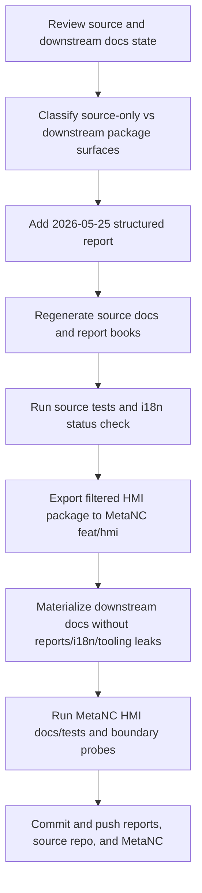

# Workflow Diagram

```mermaid
flowchart TD
  start[Review source and downstream docs state]
  boundary[Classify source-only vs downstream package surfaces]
  report[Add 2026-05-25 structured report]
  sourceDocs[Regenerate source docs and report books]
  tests[Run source tests and i18n status check]
  export[Export filtered HMI package to MetaNC feat/hmi]
  downstream[Materialize downstream docs without reports/i18n/tooling leaks]
  downstreamTests[Run MetaNC HMI docs/tests and boundary probes]
  publish[Commit and push reports, source repo, and MetaNC]

  start --> boundary --> report --> sourceDocs --> tests --> export --> downstream --> downstreamTests --> publish
```
