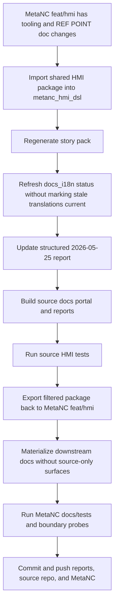

# Workflow Diagram

```mermaid
flowchart TD
  start[MetaNC feat/hmi has tooling and REF POINT doc changes]
  import[Import shared HMI package into metanc_hmi_dsl]
  story[Regenerate story pack]
  i18n[Refresh docs_i18n status without marking stale translations current]
  report[Update structured 2026-05-25 report]
  sourceDocs[Build source docs portal and reports]
  sourceTests[Run source HMI tests]
  export[Export filtered package back to MetaNC feat/hmi]
  downstream[Materialize downstream docs without source-only surfaces]
  downstreamTests[Run MetaNC docs/tests and boundary probes]
  publish[Commit and push reports, source repo, and MetaNC]

  start --> import --> story --> i18n --> report --> sourceDocs --> sourceTests --> export --> downstream --> downstreamTests --> publish
```
