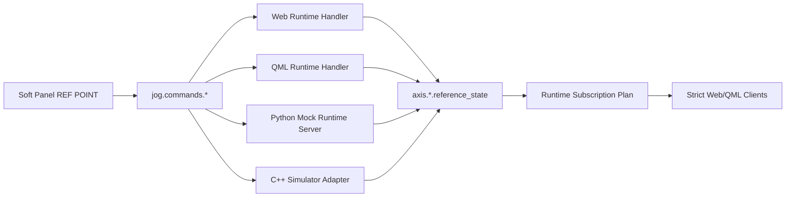

# Architecture Diagram

```mermaid
flowchart LR
  UI[Soft Panel REF POINT] --> Contract[jog.commands.*]
  Contract --> Web[Web Runtime Handler]
  Contract --> QML[QML Runtime Handler]
  Contract --> Mock[Python Mock Runtime Server]
  Contract --> Native[C++ Simulator Adapter]

  Web --> State[axis.*.reference_state]
  QML --> State
  Mock --> State
  Native --> State

  State --> Subscription[Runtime Subscription Plan]
  Subscription --> Strict[Strict Web/QML Clients]
```

The diagram describes the V1 simulator/mock surface. Real homing remains outside
this slice and must be owned by lower-level machine-control integration.
