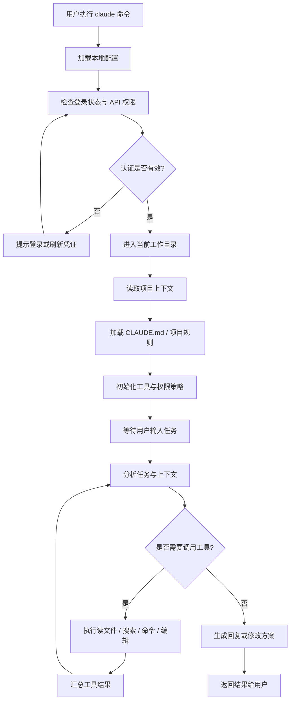
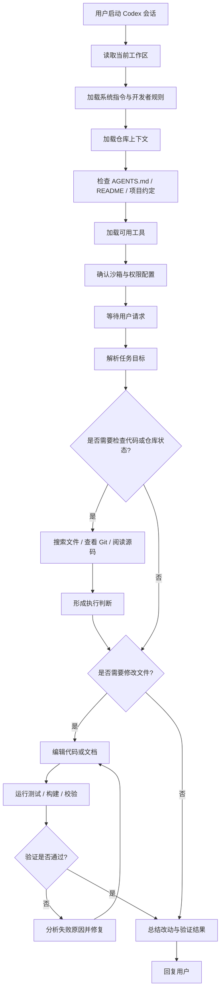
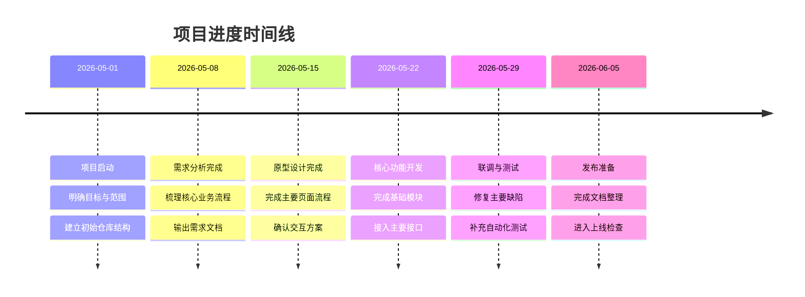
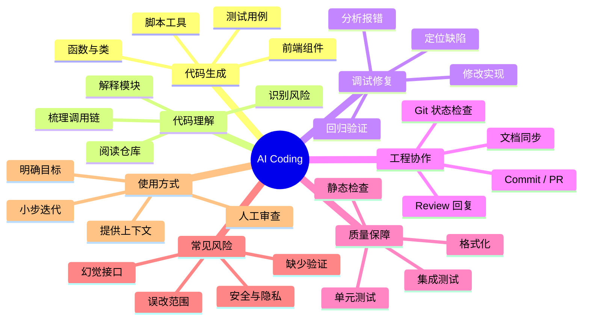
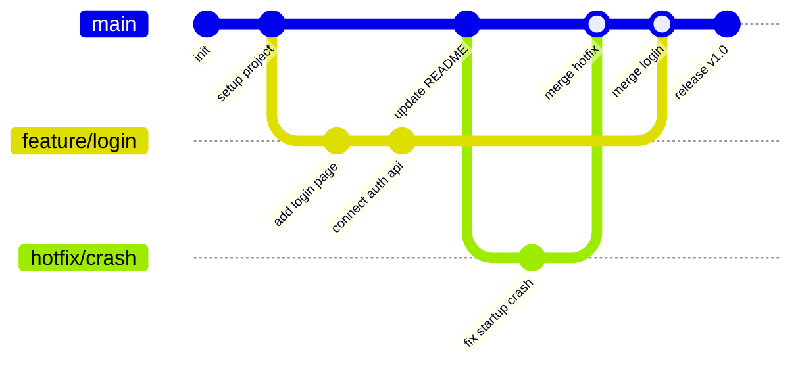
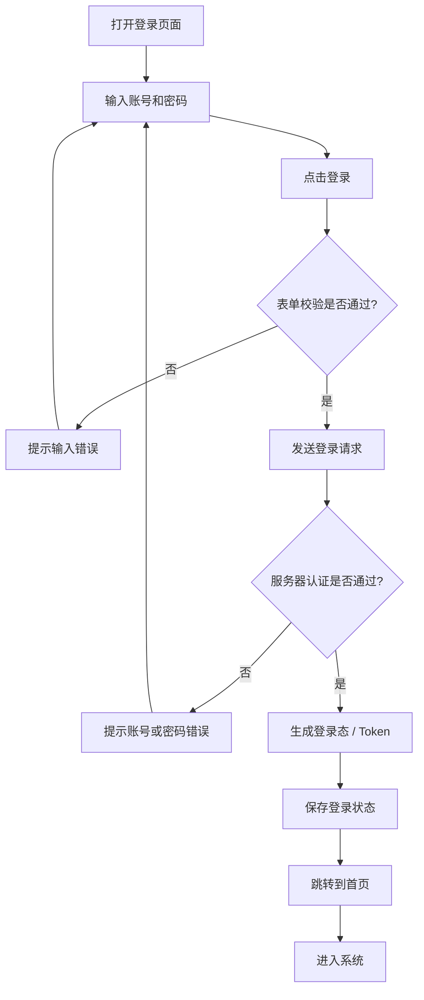

# 你可以做什么

- Session ID: `019e5d93-3520-7f73-b05d-ac60a5fc9415`
- Session kind: `primary`
- Started: `2026-05-25 13:19:49 +0800`
- CWD: `/home/iaar/workspace/ccmix-wp`
- Source file: `~/.codex/sessions/2026/05/25/rollout-2026-05-25T13-19-49-019e5d93-3520-7f73-b05d-ac60a5fc9415.jsonl`
- Messages: `43`
- User prompts: `18`
- Synthetic events: `1`

<a id="turn-1"></a>
## Turn 1

### User
`2026-05-26 09:36:33 +0800`

```
你可以做什么
```

### Codex Response 1 / final_answer
`2026-05-26 09:36:44 +0800`

```
我可以做几类事：

1. **写代码 / 改代码**
   - C++、Python、JS/TS、Shell、Qt/QML、Android 等。
   - 可以直接在当前工作区里读仓库、改文件、跑测试。

2. **查仓库状态**
   - 看 Git 分支、未提交修改、未推送提交、子模块状态。
   - 帮你判断现在该 commit、push、sync、rebase 还是先验证。

3. **调试和修复问题**
   - 根据报错、测试失败、review comment 找原因。
   - 做最小修改并跑验证。

4. **写文档 / 设计方案**
   - 架构说明、接口文档、开发计划、PR 描述、流程图、Mermaid 图。
   - 中英文都可以。

5. **生成和处理文件**
   - Markdown、HTML、Office 文档、表格、报告、mdBook、导出物等。
   - 对现有文件也可以直接修改。

6. **执行命令**
   - 比如构建、测试、格式化、Git 操作、搜索文件、检查磁盘占用。

如果你是问当前这个工作区，我现在可以继续检查或处理 `MetaNC` / `metanc_hmi_dsl` 的分支、提交、同步和验证状态。
```

<a id="turn-2"></a>
## Turn 2

### User
`2026-05-26 09:36:58 +0800`

```
你可以分析一下mermaid图形吗
```

### Codex Response 1 / final_answer
`2026-05-26 09:37:08 +0800`

```
可以。你把 Mermaid 代码贴出来，我可以帮你分析：

- 语法是否正确
- 节点和连线逻辑是否清楚
- 流程是否有遗漏、循环或歧义
- Android 生命周期、业务流程、架构图等内容是否准确
- 如何改得更清晰、更适合文档展示

例如你刚才那张 Android 启动生命周期图，我可以指出它大体正确，但还可以补充 `Application` 只在进程首次创建时执行、`onRestart` 只发生在 stopped 后重新回前台、以及配置变更可能触发 `onDestroy -> onCreate` 重建。
```

<a id="turn-3"></a>
## Turn 3

### User
`2026-05-26 10:26:43 +0800`

```
你还在吗
```

### Codex Response 1 / final_answer
`2026-05-26 10:26:48 +0800`

```
在。你可以直接把 Mermaid 图贴过来，我帮你看结构、语法和流程逻辑。
```

<a id="turn-4"></a>
## Turn 4

### User
`2026-05-26 11:25:35 +0800`

```
画两个流程图，一个是claude的启动流程，一个是codex的
```

### Codex Response 1 / final_answer
`2026-05-26 11:26:07 +0800`

````
下面按“代码助手 CLI/Agent 启动流程”的抽象版本画，适合放文档里：

**Claude 启动流程**


**Codex 启动流程**

````

<a id="turn-5"></a>
## Turn 5

### User
`2026-05-26 11:40:10 +0800`

```
"用 mermaid timeline 展示项目进度
```

### Codex Response 1 / final_answer
`2026-05-26 11:40:19 +0800`

````

````

<a id="turn-6"></a>
## Turn 6

### User
`2026-05-26 11:41:48 +0800`

```
画一个思维导图，关于ai coding
```

### Codex Response 1 / final_answer
`2026-05-26 11:41:56 +0800`

````

````

<a id="turn-7"></a>
## Turn 7

### User
`2026-05-26 11:45:39 +0800`

```
画一个gitGraph示例图
```

### Codex Response 1 / final_answer
`2026-05-26 11:45:45 +0800`

````

````

<a id="turn-8"></a>
## Turn 8

### User
`2026-05-26 13:37:37 +0800`

```
看一下现在的状态
```

### Codex
_No Codex response captured for this turn._

<a id="turn-9"></a>
## Turn 9

### User
`2026-05-26 13:37:49 +0800`

```
看一下现在里面两个仓库的状态
```

### Codex Response 1 / commentary
`2026-05-26 13:38:10 +0800`

```
我先按当前工作区重新查 `MetaNC` 和 `metanc_hmi_dsl`，会刷新远端引用后再看分支差距、工作区改动和未推送提交。
```

### Codex Response 2 / commentary
`2026-05-26 13:38:34 +0800`

```
远端有变化：`MetaNC` 的 `feat/plc` 和 `feat/work-offset` 更新了，且删了一个远端分支、新增一个远端分支。现在我看两个仓库的当前状态和分支差距。
```

### Codex Response 3 / final_answer
`2026-05-26 13:38:58 +0800`

```
当前两个仓库状态如下：

**MetaNC**
- 当前分支：`feat/hmi`
- 与 `origin/feat/hmi`：一致，没有 ahead/behind。
- 工作区：有未提交修改。
- 修改规模：10 个文件，`74 insertions / 20 deletions`
- 修改集中在 HMI REF / story / docs：
  - `nrt/hmi/definition/story.catalog.yaml`
  - `nrt/hmi/docs/acceptance_reference/story_pack/*`
  - `nrt/hmi/docs/client/web_qml_parity.md`
  - `nrt/hmi/docs/development_guidelines/*`
  - `nrt/hmi/docs/product/spec/interface_integration.md`
  - `nrt/hmi/docs/requirements/manual_reference_return_story_breakdown.md`
  - `nrt/hmi/docs/requirements/status_matrix.md`
- 当前 HEAD：`6647acea fix(hmi): show REF jog press feedback`
- 其他分支：
  - `main` 落后 `origin/main` 1 个提交。
  - `feat/plc` 落后 `origin/feat/plc` 132 个提交。
  - `feat/tooling_management` 与远端一致，但在 `/tmp/metanc_tooling_branch`。
  - `feat/hmi-tmp-tooling` 无 upstream。

**metanc_hmi_dsl**
- 当前分支：`metanc-layout`
- 与 `origin/metanc-layout`：一致。
- 工作区：干净。
- 当前 HEAD：`7124310 feat: add HMI REF POINT simulator flow`

**reports 子模块**
- 路径：`metanc_hmi_dsl/nrt/hmi/submodules/metanc_hmi_dsl_reports`
- 当前分支：`main`
- 与 `origin/main`：一致。
- 工作区：干净。
- 当前 HEAD：`dfbe6b6 docs: add 2026-05-26 HMI REF report`

远端刷新时 `MetaNC` 远端也有变化：`feat/plc` 和 `feat/work-offset` 更新了，新增 `origin/rt/mode-api-workflow`，删除了 `origin/rt/spindle-module-workflow`。

结论：`metanc_hmi_dsl` 和 reports 子模块干净；`MetaNC/feat/hmi` 没有未推送提交，但有 10 个未提交文档/故事状态类修改。

<oai-mem-citation>
<citation_entries>
MEMORY.md:815-828|note=[used sibling repo sync context for MetaNC and metanc_hmi_dsl status check]
MEMORY.md:972-980|note=[used reports submodule and sync workflow context]
</citation_entries>
<rollout_ids>
019e4353-dbb4-7330-a876-2395c6fbc1fb
</rollout_ids>
</oai-mem-citation>
```

<a id="turn-10"></a>
## Turn 10

### User
`2026-05-26 16:24:01 +0800`

```
你现在可以做什么
```

### Codex Response 1 / final_answer
`2026-05-26 16:24:14 +0800`

```
我现在可以直接做这些事：

1. **审查 `MetaNC/feat/hmi` 的 10 个未提交修改**
   - 看这些 REF/story/docs 修改是不是合理。
   - 判断是否应该从 `metanc_hmi_dsl` 同步而来，还是 MetaNC 下游本地修补。

2. **提交并推送 `MetaNC` 当前修改**
   - 如果确认这些文档/状态修改要保留，可以 commit。
   - 因为当前 `feat/hmi` 和远端一致，提交后会变成 `ahead 1`，再 push。

3. **同步两个仓库**
   - 如果这些改动本应以 `metanc_hmi_dsl` 为源头，我可以反向导入到 `metanc_hmi_dsl`，验证后再 export 回 `MetaNC`。
   - 这更符合当前 HMI 的主历史在 `metanc_hmi_dsl` 的流程。

4. **跑验证**
   - 针对 HMI docs/story 状态跑文档检查、mdBook、相关测试或 diff check。
   - 确认 story catalog、status matrix、acceptance reference 没断链。

5. **清理分支状态**
   - 看 `feat/hmi-tmp-tooling` 是否还要保留。
   - 检查 `main` 落后一提交是否需要快进。
   - 但我不会擅自删除或切换重要分支，除非你明确要求。

我建议下一步先做：**审查这 10 个 MetaNC 未提交修改，判断是否应该回流到 `metanc_hmi_dsl`**。
```

<a id="turn-11"></a>
## Turn 11

### User
`2026-05-26 16:32:47 +0800`

```
你在干什么
```

### Codex Response 1 / final_answer
`2026-05-26 16:32:58 +0800`

```
我现在没有在后台继续执行任何命令，刚才的状态检查已经结束。

当前停在这个结论上：`metanc_hmi_dsl` 和 reports 子模块是干净的；`MetaNC/feat/hmi` 有 10 个未提交的 HMI REF/story/docs 修改。下一步可以审查、提交推送，或者把这些改动按 HMI 主流程同步回 `metanc_hmi_dsl`。
```

<a id="turn-12"></a>
## Turn 12

### User
`2026-05-26 16:42:39 +0800`

```
你可以干什么
```

### Codex Response 1 / final_answer
`2026-05-26 16:42:48 +0800`

```
我现在可以继续处理当前工作区里的事，主要是这几类：

- 查清 `MetaNC/feat/hmi` 这 10 个未提交改动具体是谁、改了什么、是否该保留。
- 把这些改动提交并 push 到远端。
- 如果这些改动应该属于 `metanc_hmi_dsl` 主历史，我可以反向同步到 `metanc_hmi_dsl`，验证后再 export 回 `MetaNC`。
- 跑相关验证，比如 docs lint、mdBook、HMI story/status 检查。
- 清理本地分支状态，比如检查旧的 `feat/hmi-tmp-tooling` 是否还需要。
- 写/改代码、文档、Mermaid 图、PR 描述、review 回复。

如果按当前仓库状态推进，我建议先让我审查 `MetaNC` 这 10 个未提交改动。
```

<a id="turn-13"></a>
## Turn 13

### User
`2026-05-26 16:43:18 +0800`

```
你在干什么
```

### Codex Response 1 / final_answer
`2026-05-26 16:43:26 +0800`

```
我现在没有在执行任何任务，也没有后台命令在跑。

当前只是等你的下一步指令。最近一次检查到的状态是：`MetaNC/feat/hmi` 有 10 个未提交的 HMI REF/story/docs 修改；`metanc_hmi_dsl` 和 reports 子模块是干净的。
```

<a id="turn-14"></a>
## Turn 14

### User
`2026-05-26 16:55:48 +0800`

```
处理一下
```

### Codex Response 1 / commentary
`2026-05-26 16:56:11 +0800`

```
我来直接收口当前这批改动：先确认这 10 个 `MetaNC` 未提交文件和 `metanc_hmi_dsl` 源仓是否一致，再决定是提交下游，还是按既有流程回流到 `metanc_hmi_dsl` 后再同步回来。
```

### Codex Response 2 / commentary
`2026-05-26 16:56:36 +0800`

```
现在发现不是单边漂移：`MetaNC` 和 `metanc_hmi_dsl` 都有同一组 16 个 HMI UI/tool-offset 相关修改，reports 子模块是干净的。接下来我会确认两边内容是否逐文件一致，然后跑源仓的生成/测试路径；如果验证通过，我会按源仓优先的顺序提交并推送，再处理 downstream `MetaNC`。
```

### Codex Response 3 / commentary
`2026-05-26 16:56:55 +0800`

```
我已经确认两边这 16 个文件内容逐项一致，所以不是单边误改。接下来我会把它当作一组 HMI 源仓改动处理：先读差异确认语义，再跑现有生成/测试校验，最后按 `metanc_hmi_dsl` 源仓优先、`MetaNC` 下游同步的顺序提交和推送。
```

<a id="turn-15"></a>
## Turn 15

### User
`2026-05-26 17:06:09 +0800`

```
你可以做什么
```

### Codex Response 1 / commentary
`2026-05-26 17:06:29 +0800`

```
我现在正在处理你前面说的“处理一下”：已经确认 `MetaNC` 和 `metanc_hmi_dsl` 里这 16 个 HMI 改动内容完全一致，下一步是验证并按源仓优先提交推送。具体我可以做的是：审查差异、跑测试/生成、提交 `metanc_hmi_dsl`、再提交 `MetaNC` 下游同步，并最后复查两个仓库状态。
```

### Codex Response 2 / commentary
`2026-05-26 17:06:48 +0800`

```
我会继续推进当前处理链。下一步是按 `nrt/hmi/AGENTS.md` 的门禁在 `metanc_hmi_dsl/nrt/hmi` 跑验证：DSL validate、build-ir、生成目标、pipeline 测试和 reports mdBook；如果通过，再提交源仓并同步提交 `MetaNC`。
```

### Codex Response 3 / commentary
`2026-05-26 17:07:25 +0800`

```
验证在跑，`test_pipeline` 已经进入 QML offscreen snapshot 构建阶段，前面的 DSL validate、IR build 和多个 pipeline 用例已经通过。等这个长一点的测试完成后，我会继续生成目标和 mdBook 检查。
```

### Codex Response 4 / commentary
`2026-05-26 17:08:12 +0800`

```
`test_pipeline` 完成：50 个测试通过，Web 浏览器视觉快照按环境变量跳过 1 个。下一步我会跑生成目标和 mdBook，然后补齐必要的 changelog，再提交源仓和下游。
```

<a id="turn-16"></a>
## Turn 16

### User
`2026-05-26 17:21:51 +0800`

```
你现在在干嘛
```

### Codex Response 1 / final_answer
`2026-05-26 17:22:07 +0800`

```
现在没有后台命令在跑。

你打断前我正在处理前面说的“处理一下”：已经确认 `MetaNC` 和 `metanc_hmi_dsl` 里同一批 16 个 HMI UI/tool-offset 改动内容一致，并且已经跑完 `metanc_hmi_dsl/nrt/hmi` 的 `tests.test_pipeline`，结果是：

`50 tests OK, skipped=1`

下一步原本准备继续跑生成目标和 mdBook 检查，然后再考虑提交/推送。
```

<a id="turn-17"></a>
## Turn 17

### User
`2026-05-26 17:22:20 +0800`

```
你现在在干嘛呢
```

### Codex Response 1 / final_answer
`2026-05-26 17:22:26 +0800`

```
现在我没有在执行任何命令，也没有后台任务。

当前停在这里：前面已经检查并验证了一部分，`metanc_hmi_dsl/nrt/hmi` 的 `tests.test_pipeline` 通过了；还没继续跑生成目标、mdBook，也还没提交或推送。
```

<a id="turn-18"></a>
## Turn 18

### User
`2026-05-26 17:23:44 +0800`

```
画一个流程图，表达一下登录过程
```

### Codex Response 1 / final_answer
`2026-05-26 17:23:54 +0800`

````

````

## Session Events

<a id="event-1"></a>
### Event 1 / turn_aborted

#### Event
`2026-05-26 17:08:12 +0800`

```
<turn_aborted>
The user interrupted the previous turn on purpose. Any running unified exec processes may still be running in the background. If any tools/commands were aborted, they may have partially executed.
</turn_aborted>
```
