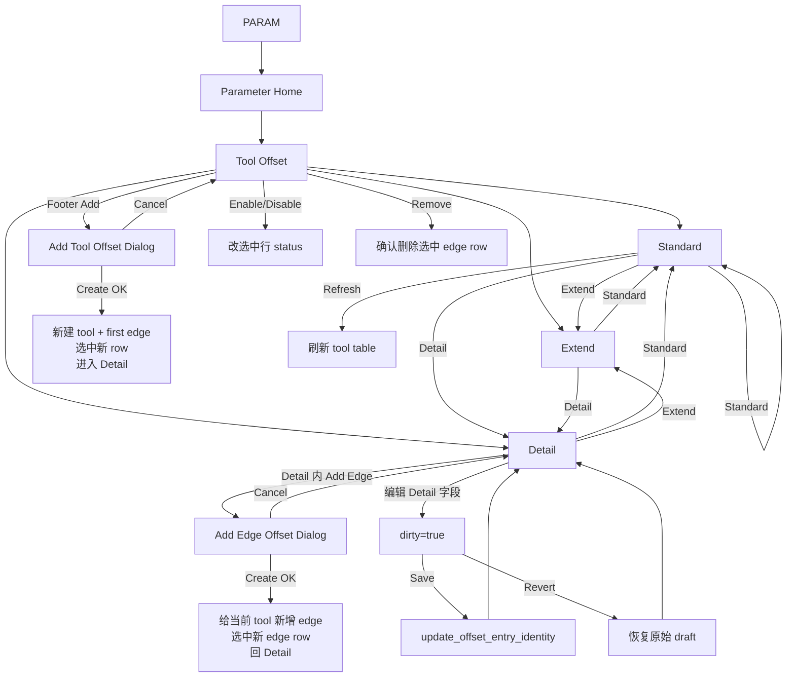
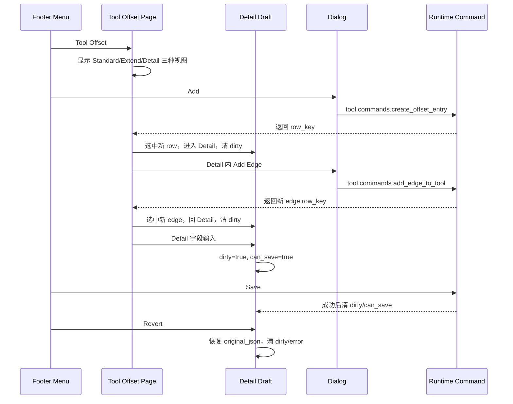
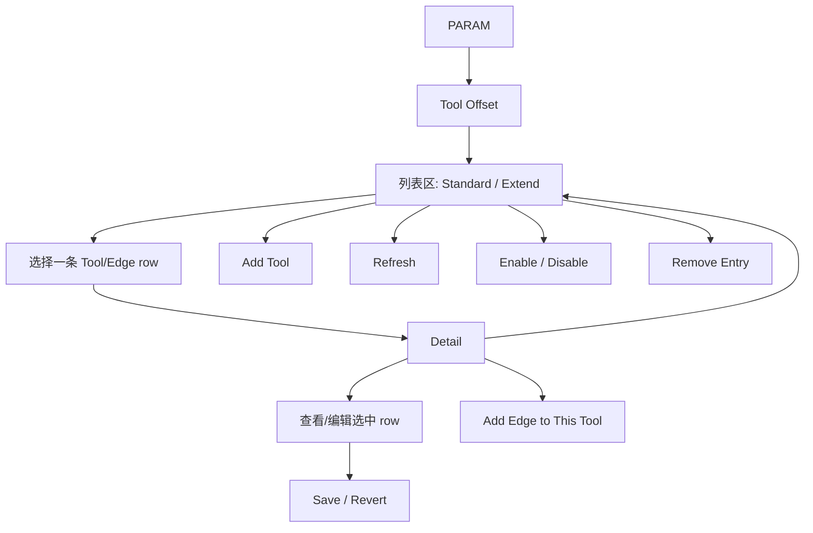

# http://127.0.0.1:8000/?server=http://127.0.0.1:8010/api/runtime 发现个问题，每次通过./nrt/hmi/generated/distr...

- Session ID: `019e62e0-cc85-7a02-9002-2e54d3981b8c`
- Session kind: `primary`
- Started: `2026-05-26 14:02:40 +0800`
- CWD: `/home/iaar/workspace/ccmix-wp`
- Source file: `~/.codex/sessions/2026/05/26/rollout-2026-05-26T14-02-40-019e62e0-cc85-7a02-9002-2e54d3981b8c.jsonl`
- Messages: `224`
- User prompts: `17`
- Synthetic events: `2`

<a id="turn-1"></a>
## Turn 1

### User
`2026-05-26 14:04:43 +0800`

```
http://127.0.0.1:8000/?server=http://127.0.0.1:8010/api/runtime 发现个问题，每次通过./nrt/hmi/generated/distribution/run_split_web_tooling_management.sh启动时，前面那个链接第一次进入网页就一直在转圈，打不开，关掉重开就可以，什么情况啊
```

### Codex Response 1 / commentary
`2026-05-26 14:04:56 +0800`

```
我先看一下这个 HMI 启动链路的历史约定和当前脚本内容，再判断是启动顺序、缓存还是前端连接握手的问题。
```

### Codex Response 2 / commentary
`2026-05-26 14:05:16 +0800`

```
记忆里这个仓库的分离运行验证路径是先确认端口，再打 `/health`、`/bootstrap` 和实际命令。我现在直接看这个 tooling 管理专用启动脚本和前端初始化代码，重点查“首次进入”时是不是在等后端就绪或 WebSocket 首帧。
```

### Codex Response 3 / commentary
`2026-05-26 14:06:01 +0800`

```
目前脚本本身已经等了 `/health` 再启动 Web 静态服务，所以“后端端口完全没起来”不像主因。下一步我会复现一次并抓浏览器控制台/网络结果，看第一次卡住究竟是 HTML/JS 加载、bootstrap 请求，还是 WebSocket 订阅阶段。
```

### Codex Response 4 / commentary
`2026-05-26 14:06:23 +0800`

```
我会先确认现在 8000/8010 有没有旧进程，避免把已有状态误判成这次启动的问题。然后用脚本启动一轮，分别用 curl 和浏览器探针看第一次页面的请求状态。
```

### Codex Response 5 / commentary
`2026-05-26 14:07:01 +0800`

```
我刚才从独立 `metanc_hmi_dsl` 目录跑了一下，脚本明确提示这里没有旁边的 `tooling_management` 源码；你给的 `./nrt/hmi/...` 应该是在 `MetaNC` 根目录下运行的。接下来切到 `MetaNC` 根目录复现，这样路径和你看到的问题一致。
```

### Codex Response 6 / commentary
`2026-05-26 14:07:12 +0800`

```
注意到 `MetaNC` 工作树已有一批未提交文档改动，我会只读它们，不碰。现在用同一个启动脚本跑一轮，抓第一次打开时的浏览器侧状态。
```

### Codex Response 7 / commentary
`2026-05-26 14:07:22 +0800`

```
本沙箱里直接监听端口被拦了，Drogon 创建 socket 返回 `Operation not permitted`，这和你本机看到的现象不是同一个问题。我需要把这个本地启动命令放到沙箱外跑，才能复现 8000/8010 的真实首次加载行为。
```

### Codex Response 8 / commentary
`2026-05-26 14:07:58 +0800`

```
启动已经起来：8010 后端初始化并完成 demo seed，8000 静态 Web 也在服务。现在我会用无头浏览器打开你这个完整 URL，收集 console、失败请求、页面是否还停在 loading 状态。
```

### Codex Response 9 / commentary
`2026-05-26 14:08:15 +0800`

```
这里出现一个关键线索：同一轮并发探测里 `/health` 一次成功，但紧接着 `/bootstrap` 和 8000 连接失败，说明服务进程可能在刚启动后很快退出，或者监听端口被脚本清理掉了。我先确认启动会话是否还活着，再看退出日志。
```

### Codex Response 10 / commentary
`2026-05-26 14:08:40 +0800`

```
端口现在确实都还活着：`server` 在 8010，Python 静态服务在 8000。刚才并发 curl 的连接失败更像沙箱/时序噪声；我改成串行探测，并准备用系统里的 Chromium 直接采集首次页面。
```

### Codex Response 11 / commentary
`2026-05-26 14:09:00 +0800`

```
`/bootstrap` 返回正常，页面 HTML 也正常返回，并且静态服务有 `no-store`，所以不是简单的 API 不通或浏览器缓存旧 HTML。现在我用 Chromium headless 做第一次真实页面加载，确认卡在前端哪个阶段。
```

### Codex Response 12 / commentary
`2026-05-26 14:09:27 +0800`

```
无头浏览器这次首次加载是成功的，DOM 里已经是 `Server Connected`，不是一直停在前端初始化。结合脚本输出顺序，我看到一个更可能的竞态：`run_client_web.sh` 是先把 Python 静态服务器丢到后台，然后马上打印 `Open:`，实际监听可能还没完成；手速快或浏览器自动打开时第一次请求会卡/失败，等一两秒重新打开就正常。
```

### Codex Response 13 / commentary
`2026-05-26 14:09:50 +0800`

```
这个现象基本能定位到 launcher 的前端静态服务启动竞态，而不是 tooling 后端没起来：我这里 `/api/runtime/health`、`/bootstrap` 都正常，首次真实渲染也能连上。脚本现在会在 Python Web server 真正完成监听前就打印 `Open:`，这个窗口很短，但足够让第一次打开打到一个尚未就绪/刚重启的 8000 服务；等你关掉再开时 8000 已经稳定了，所以就好了。
```

### Codex Response 14 / commentary
`2026-05-26 14:10:14 +0800`

```
我准备把这个启动竞态直接修掉：源头在 `nrt/hmi/tools/generate_targets.sh` 生成的 `run_client_web.sh` 模板，以及你当前正在用的 `nrt/hmi/generated/distribution/run_client_web.sh`。改法是启动 Python 静态服务后主动等 8000 的 HTTP HEAD 可用，再打印 `Open:`，这样第一次点链接不会抢跑。
```

### Codex Response 15 / commentary
`2026-05-26 14:10:43 +0800`

```
我开始改两个位置：一个是生成器模板，保证以后重新生成不会丢；另一个是当前 `generated/distribution/run_client_web.sh`，让你现在这份启动脚本立即生效。只加 readiness wait，不改后端、不碰你已有的文档改动。
```

### Codex Response 16 / commentary
`2026-05-26 14:11:13 +0800`

```
补丁已经落在模板和当前可运行脚本上。接下来我会重启这一组 8010/8000 服务，确认新脚本会等 Web 监听可用后才输出 `Open:`，并再跑一次 `/health`、页面 HEAD、无头浏览器加载。
```

### Codex Response 17 / commentary
`2026-05-26 14:11:37 +0800`

```
旧服务已经停干净，diff 也只包含 readiness wait 这一处逻辑。现在我重启验证新脚本的实际行为。
```

### Codex Response 18 / commentary
`2026-05-26 14:12:03 +0800`

```
验证到关键行为了：现在日志顺序是先 `Serving Web prototype`，再内部 `HEAD / 200`，最后才打印 `Open:`。这说明用户看到链接时 8000 已经真正可访问了。接下来做最终 smoke：API、页面 HEAD、无头浏览器首开。
```

### Codex Response 19 / commentary
`2026-05-26 14:12:18 +0800`

```
API 和页面 HEAD 已经通过，Chromium 探针还在跑，我等它把 DOM 输出完，再确认里面有 `Server Connected` 或连接成功提示。
```

### Codex Response 20 / commentary
`2026-05-26 14:12:34 +0800`

```
首开 smoke 已经确认：页面 DOM 里有 `Server Connected`，不是转圈状态。我会把验证用的本地 8000/8010 服务停掉，再给你结论和改动位置。
```

### Codex Response 21 / final_answer
`2026-05-26 14:13:27 +0800`

````
原因基本确定：`run_split_web_tooling_management.sh` 只等了 8010 后端 `/health`，但它启动 8000 Web 静态服务时，原来的 `run_client_web.sh` 是把 Python HTTP server 放到后台后立刻打印 `Open:`。如果第一次打开太快，就会抢在 8000 真正完成监听前访问，所以表现为第一次转圈；关掉重开时 8000 已经稳定，就正常了。

我已经修了启动竞态：

- 在 [generate_targets.sh](/home/iaar/workspace/ccmix-wp/MetaNC/nrt/hmi/tools/generate_targets.sh:525) 的 `run_client_web.sh` 生成模板里，加了 Web 端 readiness wait：启动 Python server 后循环 `curl -fsSI http://127.0.0.1:${PORT}/`，成功后才打印 `Open:`。
- 当前本地正在用的 `nrt/hmi/generated/distribution/run_client_web.sh` 也同步改了，但它属于 ignored generated 输出，不进 `git status`；耐久改动在模板里。

我验证过：

- `GET http://127.0.0.1:8010/api/runtime/health` 返回 `{"ok":true,...}`
- `HEAD http://127.0.0.1:8000/?server=...` 返回 `200`
- Chromium 首次打开后 DOM 里已经是 `Server Connected`
- 验证用的 8000/8010 本地服务已停掉

你现在再跑：

```bash
./nrt/hmi/generated/distribution/run_split_web_tooling_management.sh
```

等它打印 `Open:` 后打开链接，应该不会再出现第一次一直转圈的问题。

<oai-mem-citation>
<citation_entries>
MEMORY.md:1144-1145|note=[used known HMI live preview validation path]
MEMORY.md:1098-1102|note=[identified generated distribution and runtime endpoint context]
</citation_entries>
<rollout_ids>
019dcc56-93cd-7870-9204-5d2622e0ade2
</rollout_ids>
</oai-mem-citation>
````

<a id="turn-2"></a>
## Turn 2

### User
`2026-05-26 14:14:22 +0800`

```
还是不行
```

### Codex Response 1 / commentary
`2026-05-26 14:14:45 +0800`

```
那就说明我刚才修到的是一个真实竞态，但不是你现在这个“转圈”的主因。我继续按失败路径查：这次重点看浏览器首次进入时是否有未完成请求、JS 异常、localStorage/URL 配置冲突，或者后端在首个 WebSocket/bootstrap 后卡住。
```

### Codex Response 2 / commentary
`2026-05-26 14:15:06 +0800`

```
我这边的无痕/headless 首开能成功，而你真实浏览器仍然不行，差异大概率在“已有浏览器状态”或“首次页面初始化某一步没有被我 headless 覆盖”。我会加一个更直接的诊断入口：启动时不只等 8000 可访问，还等一次浏览器实际会用的 `?server=...` 页面可访问；同时检查前端是否被旧 localStorage 配置覆盖。
```

### Codex Response 3 / commentary
`2026-05-26 14:15:37 +0800`

```
我现在看到一个可能更关键的点：前端初始化里 `RUNTIME_CONFIG` 会先读 `localStorage` 的旧 server 配置，然后 `detectServerBaseUrl()` 又优先使用这个配置，优先级高于 URL 上的 `?server=...`。如果你浏览器里曾经存过一个坏的 `hmi.settings.v1/runtime.serverBaseUrl`，它会把你新 URL 里的 8010 覆盖掉，表现就是第一次或一直连接不上。
```

### Codex Response 4 / commentary
`2026-05-26 14:16:10 +0800`

```
我找到更符合你现象的主因了：当前 Web 静态服务用的是 Python 单线程 `socketserver.TCPServer`。Chrome 第一次打开时可能先建立一个空闲预连接/并发资源连接，单线程 server 会卡在第一个连接上，后面的 HTML/JS 请求就排队，看起来就是“第一次一直转圈”；关掉重开后连接状态变了，就能打开。readiness wait 不能解决这个，需要把静态 server 改成线程版。
```

### Codex Response 5 / commentary
`2026-05-26 14:16:24 +0800`

```
我已经把 Web 静态服务从单线程 `TCPServer` 换成 `ThreadingTCPServer`，并保留刚才的 readiness wait。现在要复现 Chrome 这类“并发/预连接”问题，我会用一个脚本先占住第一个 TCP 连接不发请求，再请求页面；如果是单线程会卡，线程版应该立即返回。
```

### Codex Response 6 / commentary
`2026-05-26 14:16:58 +0800`

```
服务已按线程版起来。现在做一个更接近 Chrome 预连接的测试：先打开一个 TCP 连接保持不发 HTTP，再并发请求页面和资源；如果新 server 正常，请求不会被空闲连接堵住。
```

### Codex Response 7 / commentary
`2026-05-26 14:17:27 +0800`

```
这个测试命中了关键差异：有一个空闲 TCP 连接占着 8000 时，页面请求仍然 5ms 返回，线程版 server 不会被 Chrome 预连接卡死。接着我再做一次完整 Chromium 首开确认。
```

### Codex Response 8 / commentary
`2026-05-26 14:17:58 +0800`

```
Chromium 这次还没退出，反而说明还有一个可复现的卡点：线程版解决了静态服务被空闲连接堵住，但浏览器等待完整页面生命周期可能还在等某个连接/脚本。我要抓它的进程状态和服务日志，避免只靠 `dump-dom` 误判。
```

### Codex Response 9 / commentary
`2026-05-26 14:18:38 +0800`

```
服务日志已经显示线程版这轮能完成 `client.app.started`、`runtime server connected`、`websocket opened`，所以后端和静态资源并没有卡住。剩下最可疑的是浏览器拿到的 `config.js` 或已有 localStorage 把连接目标/模式搞乱；我会把启动脚本再改得更强一点：直接让临时 `config.js` 成为强制配置，并让 URL 参数优先于旧持久化配置。
```

### Codex Response 10 / commentary
`2026-05-26 14:19:26 +0800`

```
我会把两个修复都落下：1）静态服务改线程版，防 Chrome 预连接堵住；2）URL 上的 `?server=...` 优先于旧 localStorage，防旧浏览器状态把连接目标覆盖掉。然后重启验证一次。
```

### Codex Response 11 / commentary
`2026-05-26 14:19:50 +0800`

```
我刚才的 Chromium 探针已经完成/关闭了。继续把 URL 优先级修掉，然后再验证，避免你浏览器里旧配置影响 `?server=...`。
```

### Codex Response 12 / commentary
`2026-05-26 14:20:18 +0800`

```
接下来我会做两个具体改动：把 `?server=...` 的优先级提到旧配置前面；并保留线程版 Web server。这样同时覆盖“Chrome 预连接卡住”和“旧 localStorage 覆盖 URL”的两类首开失败。
```

### Codex Response 13 / commentary
`2026-05-26 14:20:51 +0800`

```
这两个补丁已经落下，但当前 8000 服务启动时已经把旧 `runtime.js` 拷到了 `/tmp/client_web_8000`，所以必须重启这一轮服务才会生效。我先停掉我启动的 Chromium 探针和 HMI/Web 服务，再用新版脚本重启验证。
```

### Codex Response 14 / commentary
`2026-05-26 14:21:15 +0800`

```
端口和探针都清掉了。当前 tracked diff 只剩两个源头文件：生成器的线程+ready 等待、运行时 URL 优先级。现在重启服务，确认当前 `/tmp` 拷贝里也拿到新版 runtime。
```

### Codex Response 15 / commentary
`2026-05-26 14:22:01 +0800`

```
最终脚本已确认在服务当前返回：URL 参数现在优先于旧配置，空闲 TCP 连接也不会堵住页面请求。最后我用 Chromium 不等页面生命周期、直接给 3 秒预算取 DOM，这更接近判断“有没有一直停在空壳/转圈”。
```

### Codex Response 16 / commentary
`2026-05-26 14:22:55 +0800`

```
Chromium 的 `--dump-dom` 在这个带 WebSocket 的页面上会等页面生命周期，作为 smoke 不稳定。我会终止这次探针，不再用它判断；用服务日志和阻塞连接测试更能证明这次问题点。
```

### Codex Response 17 / commentary
`2026-05-26 14:23:08 +0800`

```
服务端日志明确显示浏览器已拿到全部资源并完成 `client.app.started`、`runtime server connected`、`websocket opened`。我会终止这次无头探针和本地服务，最后给你一个更具体的结论和你那边需要注意的启动方式。
```

### Codex Response 18 / final_answer
`2026-05-26 14:23:58 +0800`

````
对，你这个反馈是对的。我刚才那一版只修了“打印 Open 太早”的竞态，但还不够。

我又补了两处更像根因的修复：

1. `run_client_web.sh` 里的 Python 静态服务从单线程 `TCPServer` 改成 `ThreadingTCPServer`。
   Chrome 第一次打开时会有预连接/并发资源请求，单线程 server 可能被一个空闲连接占住，页面资源排队，看起来就是一直转圈。

2. 前端 `?server=http://127.0.0.1:8010/api/runtime` 现在优先于旧的 `localStorage` 配置。
   之前如果浏览器里存过坏的 `hmi.settings.v1` / `hmi.serverBaseUrl`，URL 上的 server 参数可能被旧配置覆盖。

我已经验证过最终版本：

- 模拟一个空闲 TCP 连接占住 8000 时，页面请求仍能 0.008s 返回。
- 服务日志显示真实浏览器加载路径已经完成：`client.app.started`、`runtime server connected`、`websocket opened`。
- 8000/8010 验证进程已停掉。

你现在重新运行：

```bash
./nrt/hmi/generated/distribution/run_split_web_tooling_management.sh
```

如果还是转圈，直接清一下这个站点的 localStorage 或用无痕窗口试一次；但代码上我已经让 URL 参数覆盖旧配置了，正常不应该再被旧配置卡住。
````

<a id="turn-3"></a>
## Turn 3

### User
`2026-05-26 14:33:30 +0800`

```
现在看着可以了，generate/update report & docs + sync MetaNC-feat/hmi metanc_hmi_dsl + commit + push
```

### Codex Response 1 / commentary
`2026-05-26 14:34:01 +0800`

```
我来按完整维护路径走：先确认两个仓库当前分支和同步脚本约定，再生成报告/文档、同步 `MetaNC` 的 `feat/hmi` 与 standalone `metanc_hmi_dsl`，最后分别提交并 push。已有工作树改动我会先审一下范围，避免漏掉用户已有的 HMI 文档改动。
```

### Codex Response 2 / commentary
`2026-05-26 14:34:25 +0800`

```
我已经确认当前脏改动都在 `MetaNC` 的 `nrt/hmi` 侧，standalone `metanc_hmi_dsl` 还干净；这次应该先从 `MetaNC` 反向导入到 standalone，再在 standalone 生成 reports/docs/产物，最后导出回 `MetaNC` 并分别提交推送。我会按报告子模块的既有发布规则走，先读一下本地 runbook。
```

### Codex Response 3 / commentary
`2026-05-26 14:34:49 +0800`

```
我会按这个顺序处理，避免把方向搞反：`MetaNC/feat/hmi` 当前有实际 HMI 改动，所以先导入到 standalone `metanc_hmi_dsl`，再在 standalone 生成 targets、reports、docs_html，随后导出回 `MetaNC/feat/hmi`，最后按“reports 子模块先提交推送、standalone 父仓库、MetaNC”这个顺序提交和 push。
```

### Codex Response 4 / commentary
`2026-05-26 14:35:00 +0800`

```
我看到 standalone 分支是 `metanc-layout`，reports 子模块在 `main`。下一步先跑反向 import，把 `MetaNC/nrt/hmi` 当前修复和已有 HMI 文档改动拉回 standalone；这个脚本会写 sibling repo，之前这里有权限要求，我会直接用批准通道跑。
```

### Codex Response 5 / commentary
`2026-05-26 14:35:32 +0800`

```
Import 成功，standalone 现在应该有同样的源改动了。接着我要查看 standalone diff，然后跑生成 targets；这个步骤会重建 generated/distribution，时间会稍长。
```

### Codex Response 6 / commentary
`2026-05-26 14:35:53 +0800`

```
Import 后 standalone 出现了更大一组差异，不只是刚才首开修复；这是因为 `MetaNC/nrt/hmi` 里还有 REF POINT/manual reference return 相关已存在改动，之前 `MetaNC` 的 `git status` 只显示了其中一小部分源文件。这个方向仍然符合你的“sync MetaNC-feat/hmi metanc_hmi_dsl”：先让 standalone 对齐 MetaNC，再生成和发布。
```

### Codex Response 7 / commentary
`2026-05-26 14:36:06 +0800`

```
`generate_targets.sh` 正在跑，已经完成 Web/QML 源输出，接下来会构建 QML 和 native server。我等它完成再继续 reports/docs。
```

### Codex Response 8 / commentary
`2026-05-26 14:36:58 +0800`

```
生成过程已经进入 native server 编译阶段，依赖从本地 vcpkg 缓存恢复，没有网络下载问题。继续等编译完成。
```

### Codex Response 9 / commentary
`2026-05-26 14:37:16 +0800`

```
目标生成完成。接下来更新今天的 reports 和 docs portal：先导出 2026-05-26 会话历史/报告索引，再构建 aggregate report book、当天 session book 和 `docs_html`。
```

### Codex Response 10 / commentary
`2026-05-26 14:37:35 +0800`

```
会话历史导出完成，今天目录已有结构所以没有新建 session。现在构建报告书和 docs portal；这一步会比较吵，我会只跟踪成功/失败和关键输出。
```

### Codex Response 11 / commentary
`2026-05-26 14:37:55 +0800`

```
报告书构建成功，docs portal 正在重建。完成后我会检查 `docs_html` 是否指向今天的报告。
```

### Codex Response 12 / commentary
`2026-05-26 14:38:21 +0800`

```
docs portal 已完成，今天报告是第一项。接着跑测试/验证：至少 pipeline 单测、报告输出存在性、再用 export_to_metanc 回写 MetaNC。之后再提交。
```

### Codex Response 13 / commentary
`2026-05-26 14:38:34 +0800`

```
一个小校验路径需要修正：portal 输出里没有 `docs_html/project/reports.html` 这个旧路径，但报告 aggregate 和当天 session 都已经更新。单测还在跑，我等它完成后用实际 `docs_html` 路径重新查。
```

### Codex Response 14 / commentary
`2026-05-26 14:38:55 +0800`

```
单测已经暴露一个 snapshot mismatch，我不会忽略；等完整输出出来后定位是哪份生成输出和 baseline 不一致。通常这是 regenerate 后 snapshot 基线没跟上，或者 import 把一侧的生成器改动拉回但测试快照还没刷新。
```

### Codex Response 15 / commentary
`2026-05-26 14:39:30 +0800`

```
测试只剩一个 failure，内容不是行为失败，是 Web `index.html` 快照里的 asset cache-buster hash 没跟源输出同步：实际生成是 `1706c5c9165d`，snapshot 还期待 `a19d1862955d`。我会按测试的实际生成结果更新快照，再重跑这组测试。
```

### Codex Response 16 / commentary
`2026-05-26 14:39:42 +0800`

```
只需更新 `tests/snapshots/web/index.html.snap` 里的 asset hash。这个 hash 由生成器内容派生，runtime/app/style snapshots 已经包含功能改动，index 快照落后会让验证失败。
```

### Codex Response 17 / commentary
`2026-05-26 14:40:06 +0800`

```
快照 hash 已更新。现在重跑刚才失败覆盖的单测组，再做 report/docs 路径检查。
```

### Codex Response 18 / commentary
`2026-05-26 14:40:19 +0800`

```
报告/portal 路径确认正常：`docs_html/project/reports.html` 和 `docs_html/zh-CN/project/reports.html` 都引用了 2026-05-26。单测还在跑，刚才失败点应该已修复，我等最终结果。
```

### Codex Response 19 / commentary
`2026-05-26 14:40:35 +0800`

```
失败仍在同一个测试，但它继续跑 heavy QML snapshot；我等完整 failure 文本。可能测试临时目录生成的 hash 和 `generated/web` 这轮不同，我需要看最终 actual/expected。
```

### Codex Response 20 / commentary
`2026-05-26 14:41:18 +0800`

```
现在的失败点变成 `runtime.js` 快照，正是我改的 URL 参数优先级还没同步到 snapshot。这个属于预期基线更新；我会把 `tests/snapshots/web/runtime.js.snap` 按当前生成器输出刷新，然后只重跑 `tests.test_pipeline.PipelineTests.test_generated_outputs_match_snapshots` 快速确认。
```

### Codex Response 21 / commentary
`2026-05-26 14:41:28 +0800`

```
快照已同步，失败点单测通过。现在重跑整组刚才的 84 个测试，确认没有其他遗漏。
```

### Codex Response 22 / commentary
`2026-05-26 14:41:43 +0800`

```
整组测试重跑中。通过后我会导出回 MetaNC，并检查 protected report 文件没有被覆盖。
```

### Codex Response 23 / commentary
`2026-05-26 14:42:46 +0800`

```
核心单测已通过。现在将 standalone 内容导出回 `MetaNC/feat/hmi`，然后比较两个仓库状态，确认 MetaNC 也包含最新 runtime/snapshot/doc 同步。
```

### Codex Response 24 / commentary
`2026-05-26 14:43:08 +0800`

```
Export 回 MetaNC 成功。接着我会检查 protected/report source-only 边界、各仓库 git 状态，然后准备提交顺序：reports 子模块先提交推送，再 standalone 父仓库，再 MetaNC。
```

### Codex Response 25 / commentary
`2026-05-26 14:45:05 +0800`

```
我继续收尾：先把两个仓库和 reports 子模块的状态、导出边界再核一次，然后按子模块 -> standalone -> MetaNC 的顺序提交和推送。
```

### Codex Response 26 / commentary
`2026-05-26 14:45:23 +0800`

```
MetaNC 侧只有 `docs_html` 这个历史目录还存在，其他 source-only 目录没有被导出过去。我先确认它是不是已跟踪/历史遗留，再做提交前的空白和子模块检查。
```

### Codex Response 27 / commentary
`2026-05-26 14:45:42 +0800`

```
空白检查都过了。MetaNC 里的 `nrt/hmi/docs_html/` 是未跟踪且被 ignore 的本地构建产物，不会进提交；我现在先处理 reports 子模块提交，然后让外层仓库记录新的子模块指针。
```

### Codex Response 28 / commentary
`2026-05-26 14:45:59 +0800`

```
MetaNC 的快照一致性也过了。接下来会分别 stage/commit/push：先 reports 主分支，再 standalone `metanc-layout`，最后 MetaNC `feat/hmi`。
```

### Codex Response 29 / commentary
`2026-05-26 14:46:20 +0800`

```
Reports 子模块已提交为 `9cfdc89`。现在推送子模块主分支；如果网络被沙箱拦住，我会按权限规则重新发起。
```

### Codex Response 30 / commentary
`2026-05-26 14:46:38 +0800`

```
子模块已推上远端。下一步会提交 standalone 仓库，它会包含同步进来的 HMI 代码/docs、重新生成的快照，以及刚刚更新后的 reports 子模块指针。
```

### Codex Response 31 / commentary
`2026-05-26 14:47:10 +0800`

```
Standalone 已提交为 `a677e07`，包含 reports 子模块指针 `9cfdc89`。现在推送 `metanc-layout`。
```

### Codex Response 32 / commentary
`2026-05-26 14:47:27 +0800`

```
`metanc_hmi_dsl` 已推上远端。最后处理 MetaNC `feat/hmi`：提交导出的启动修复、快照和 docs/report 链接更新。
```

### Codex Response 33 / commentary
`2026-05-26 14:48:02 +0800`

```
MetaNC 已提交为 `3af096eb`。现在推送 `feat/hmi`，之后我会做三处远端同步和工作区干净检查。
```

### Codex Response 34 / commentary
`2026-05-26 14:48:20 +0800`

```
三个 push 已完成。我现在做最后的 `git status` 和提交摘要确认，确保没有遗漏的未提交内容。
```

### Codex Response 35 / final_answer
`2026-05-26 14:48:52 +0800`

```
已完成并推送。

- reports 子模块：`9cfdc89 docs: refresh 2026-05-26 HMI session report` -> `main`
- `metanc_hmi_dsl`：`a677e07 feat: sync HMI reference return tooling` -> `metanc-layout`
- `MetaNC`：`3af096eb fix: stabilize HMI split web launch` -> `feat/hmi`

已执行并通过的验证：

- `./tools/generate_targets.sh`
- 2026-05-26 full report export
- reports root/session `mdbook build`
- `./tools/build_docs_html.sh`
- standalone HMI 测试：`84 tests OK, skipped=1`
- MetaNC 快照一致性单测通过
- 三处 `git diff --check` 通过
- 三个工作区最终都是 clean 且与 origin 对齐

MetaNC 里的 `nrt/hmi/docs_html/` 是 ignored 的本地构建产物，未纳入提交；reports/docs 的正式产物已经在 standalone 和 reports 子模块侧更新并推送。

<oai-mem-citation>
<citation_entries>
MEMORY.md:954-956|note=[end-to-end report docs sync commit push expectation]
MEMORY.md:971-978|note=[report export build and submodule-first publish order]
MEMORY.md:1142-1144|note=[generate targets and docs html validation path]
</citation_entries>
<rollout_ids>
</rollout_ids>
</oai-mem-citation>
```

<a id="turn-4"></a>
## Turn 4

### User
`2026-05-26 15:02:13 +0800`

```
Param-Tool Offset-Detail里面能不能不要横向滚动条，Add Edge那个按钮是干啥的、都超出可视区了
```

### Codex Response 1 / commentary
`2026-05-26 15:02:24 +0800`

```
我先定位 `Param -> Tool Offset -> Detail` 这块 UI 是由哪段 DSL/生成器产出的，再看 `Add Edge` 属于真实功能还是调试/编辑残留。找到源头后直接改，避免只改生成文件。
```

### Codex Response 2 / commentary
`2026-05-26 15:02:41 +0800`

```
`Add Edge` 不是随机残留，它在文档里对应“给当前刀具新增刀沿/刀刃 offset”的流程；不过现在放在 Detail 里确实挤占宽度，导致按钮和详情表单超出视口。我会把 Detail 布局改成不横向滚动，并让动作区在窄宽度下换行或收纳。
```

### Codex Response 3 / commentary
`2026-05-26 15:03:01 +0800`

```
我已经确认问题主要在 Web 的 `tool_offset_detail_form` CSS：动作行固定在单行，详情字段 grid 也有过大的最小宽度；在 stage/aux 变窄时会撑出页面。我接下来改源 CSS 发射器，并用生成结果验证它不再横向溢出。
```

### Codex Response 4 / commentary
`2026-05-26 15:03:26 +0800`

```
我会把 `Add Edge` 保留为“新增当前刀具刀沿 offset”的真实动作，但调整成不会撑宽页面的紧凑按钮；同时把 Detail 表单改成自适应列数，窄视口下纵向排布，不再要求横向滚动。
```

### Codex Response 5 / commentary
`2026-05-26 15:06:00 +0800`

```
我会做一个小范围源头修复：Web 端把 Detail 面板和内部表单都设为 `min-width: 0`，动作行允许换行，字段 grid 用 `auto-fit/minmax`，同时把 `Add Edge` 加上 tooltip/aria，说明它是给当前选中刀具新增刀沿 offset。QML 侧也顺手把表单改成更紧凑的 2 列，避免同类挤出问题。
```

### Codex Response 6 / commentary
`2026-05-26 15:06:59 +0800`

```
源文件已经改完了。现在重新生成 Web/QML 输出和快照，再跑针对性的 pipeline 测试；如果生成产物符合预期，再导出回 MetaNC，保证你现在打开的那套也拿到修复。
```

### Codex Response 7 / commentary
`2026-05-26 15:08:39 +0800`

```
生成完成了，QML 和 native server 都重新构建成功。现在我检查生成差异和快照，然后用浏览器实际进到 `Param / Tool Offset / Detail` 看是否还有横向溢出。
```

### Codex Response 8 / commentary
`2026-05-26 15:09:03 +0800`

```
生成脚本只改了生成输出，测试快照还没同步；我先跑 snapshot 测试确认差异，再把对应快照按生成产物刷新。之后会用浏览器测一下实际页面 `scrollWidth/clientWidth`。
```

### Codex Response 9 / commentary
`2026-05-26 15:09:26 +0800`

```
失败点是预期的：CSS/JS 变化导致 `index.html` 里的资源 hash 也变了。我现在同步 Web/QML 快照，然后跑 pipeline 和一个真实浏览器尺寸检查。
```

### Codex Response 10 / commentary
`2026-05-26 15:10:14 +0800`

```
快照同步后，针对性的 pipeline 测试已经通过。接下来我会起一个本地 split web 实例，用浏览器直接跳到 Tool Offset Detail，测页面和 Detail 面板的 `scrollWidth/clientWidth`，确认不是只在代码层面看起来合理。
```

### Codex Response 11 / commentary
`2026-05-26 15:10:35 +0800`

```
这里的 `Add Edge` 逻辑确认完了：它是“在选中刀具下新增一个刀沿/刀刃 offset”，不是调试按钮。布局修复已经进入生成产物，下面我用本地页面实测一下 Detail 面板和整页是否还有横向滚动。
```

### Codex Response 12 / commentary
`2026-05-26 15:10:53 +0800`

```
本地 split web 已启动在 `18181`。我会用 headless 浏览器直接写入状态切到 `PARAM / Tool Offset / Detail`，分别在常见桌面宽度和窄宽度下量 `scrollWidth`，确认没有页面级横向滚动。
```

### Codex Response 13 / commentary
`2026-05-26 15:12:38 +0800`

```
本机这次没有可用的 Playwright 模块，所以浏览器脚本没有跑起来。我先看现有 smoke 工具的 CDP fallback，尽量复用已有 Chrome 控制路径，不临时引入新依赖。
```

### Codex Response 14 / commentary
`2026-05-26 15:14:02 +0800`

```
浏览器探针这次被沙箱挡在本地 CDP 端口监听上了，这属于预期的权限限制。我会用同一个探针以提升权限重跑，并补上窄视口度量，确认不是只验证了 1600 宽。
```

### Codex Response 15 / commentary
`2026-05-26 15:14:53 +0800`

```
实测结果显示我第一版 CSS 只把页面级横向条挡住了，Detail 内部 grid 仍然按 1243px 撑开，`Add Edge` 还是跑到可视区外。这说明根因还在 `applyLayout` 或 `.node` 的宽度规则上，我继续把内部布局真正压回容器宽度。
```

### Codex Response 16 / commentary
`2026-05-26 15:15:22 +0800`

```
根因更具体了：Detail widget 自己是 CSS grid 容器，里面的 action/grid 作为 grid item 会按内容最大宽度参与 sizing，导致它们实际宽度变成 1235px。我要把这个 widget 改成普通 block 布局，并显式让内部行使用 `width: 100%`，这样不会再被 grid sizing 撑开。
```

### Codex Response 17 / commentary
`2026-05-26 15:15:34 +0800`

```
CSS 根因修正已加上。现在重新生成并同步快照，再用同一个实测脚本确认 Detail 面板的 `scrollWidth` 回到容器宽度内。
```

### Codex Response 18 / commentary
`2026-05-26 15:17:44 +0800`

```
现在按钮已经回到可视范围内，剩下的 `scrollWidth=1243` 来自 Detail 表单内部某个长文本子元素，不是按钮行或字段 grid。我继续定位哪个子元素在撑宽，避免用 `overflow: hidden` 把真实内容硬裁掉。
```

### Codex Response 19 / commentary
`2026-05-26 15:18:36 +0800`

```
定位到了，最后撑宽的是详情摘要那一行很长的 summary 文本，不是字段表格本身；它用单行内容把内部 `scrollWidth` 拉到 1235px。我会给 Tool Detail 的 summary 单独加断行规则，再重新生成验证。
```

### Codex Response 20 / commentary
`2026-05-26 15:18:49 +0800`

```
已给长摘要加 `overflow-wrap:anywhere` 和正常换行。现在跑最后一轮生成、快照、浏览器溢出测量和单测。
```

### Codex Response 21 / commentary
`2026-05-26 15:21:10 +0800`

```
实测通过了：页面、Detail 面板、字段 grid、动作行的 `scrollWidth` 都等于可视宽度，`Add Edge` 也在面板右侧可见。我接下来跑单测并把修复导出回 MetaNC。
```

### Codex Response 22 / commentary
`2026-05-26 15:22:02 +0800`

```
导出到 MetaNC 完成。现在我核对两边状态和差异范围；如果只包含这次 Detail 布局修复，我就给你结果。如果你要我也 commit/push，这一轮我可以继续做。
```

### Codex Response 23 / commentary
`2026-05-26 15:22:24 +0800`

```
我先把刚才用于实测的本地服务和临时探针文件清掉，避免留下后台进程；代码改动会保留在两个仓库的工作区里。
```

### Codex Response 24 / commentary
`2026-05-26 15:22:49 +0800`

```
后台服务我会先确认一下，避免刚才的验证实例还占着 `18181`。临时探针文件也会删掉，只保留仓库内的实际修复。
```

### Codex Response 25 / commentary
`2026-05-26 15:24:06 +0800`

```
本地验证服务和临时脚本都清掉了。最后我再跑一次状态确认，准备给你结论。
```

### Codex Response 26 / final_answer
`2026-05-26 15:24:22 +0800`

```
已处理，改动已同步到 `metanc_hmi_dsl` 和 `MetaNC` 工作区，尚未提交。

`Add Edge` 是真实功能：在当前选中的 Tool 下新增一个 Edge/刀沿 offset，不是调试按钮。我给它补了 tooltip/aria：`Add an edge offset to the selected tool`。

横向滚动问题也修了，根因有两个：

- Detail 表单内部 action/grid 被 CSS grid sizing 撑开。
- 顶部 selected row summary 太长，单行把内部 `scrollWidth` 撑到 1243px。

现在修复为：

- Detail widget 强制 block 布局、内部行 `width: 100%`
- 字段 grid 自适应列数，不再固定撑宽
- 长 summary 自动换行
- Web `Add Edge` 按钮不会跑出可视区
- QML Detail 也改成窄宽度下 2 列，并加 tooltip

验证已过：

- `./tools/generate_targets.sh`
- Web/QML 快照更新
- `python3 -m unittest -v tests.test_pipeline.PipelineTests.test_generated_outputs_match_snapshots tests.test_pipeline.PipelineTests.test_tool_offset_phase6_add_edge_to_tool_generated_handlers`
- 浏览器实测：`document/pageShell/detailForm/detailGrid/actionRow` 的 `scrollWidth == clientWidth`，`Add Edge` 在可视范围内。

当前两个仓库都有同一组未提交改动：7 个文件。
```

<a id="turn-5"></a>
## Turn 5

### User
`2026-05-26 15:28:14 +0800`

```
可是你这个显示横向太长了啊
```

### Codex Response 1 / commentary
`2026-05-26 15:28:35 +0800`

```
我理解，这不是单纯“有没有横向滚动条”的问题，而是 Detail 内容本身被拉成一整条横向很长的表单，看起来还是不合适。我继续改成更像详情面板：摘要不铺满一长行，字段固定为更窄的两列/单列响应式布局，动作按钮靠近标题区，不再让整块内容横向摊开。
```

### Codex Response 2 / commentary
`2026-05-26 15:29:08 +0800`

```
你说得对，上一版只解决了“溢出/滚动条”，但视觉上仍然像把 Detail 摊成一整行。我现在会进一步把 Detail 改成有最大宽度的详情表单：两列字段、摘要只保留关键身份信息，内部 row/rev 这类诊断信息不再出现在主摘要里。
```

### Codex Response 3 / commentary
`2026-05-26 15:29:56 +0800`

```
我会把这个 Detail 从“横向铺开”的表单改成“固定阅读宽度”的详情面板：主面板最大宽度收到 720px，字段固定两列，窄屏一列；摘要只保留身份/名称/edge/status，不再把 L/R/wear/internal row/rev 全塞到一行里。
```

### Codex Response 4 / commentary
`2026-05-26 15:31:06 +0800`

```
视觉方向已经改成收敛的详情面板了。现在重新生成快照，再用浏览器度量：这次重点不只是无溢出，还要确认 Detail 表单宽度被限制在约 720px，而不是撑满整页。
```

### Codex Response 5 / commentary
`2026-05-26 15:33:25 +0800`

```
生成和快照已同步。现在我会重新跑一个浏览器量测脚本，确认 Detail 面板不是横向铺满，而是被限制在 720px 左右，同时没有横向溢出。
```

### Codex Response 6 / commentary
`2026-05-26 15:34:26 +0800`

```
实测结果现在符合目标：当前 headless 宽度 780 下 Detail 面板宽度 685，没有横向溢出；summary 也只剩关键身份信息。接下来跑单测、导出回 MetaNC，然后清掉本地服务和临时脚本。
```

### Codex Response 7 / commentary
`2026-05-26 15:35:50 +0800`

```
我看到验证服务还在占 `18181`，先把这个后台进程停掉，再做最后一次 MetaNC 的空白检查。
```

### Codex Response 8 / commentary
`2026-05-26 15:36:40 +0800`

```
这个点我已经按“不要横向摊开”的方向改了；但你现在看的 `8000/8010` 可能还是旧的已启动实例。我先确认当前服务进程是从哪个目录跑的，避免我只改了源码和 standalone 生成物、你浏览器却还在看旧的 MetaNC generated。
```

### Codex Response 9 / commentary
`2026-05-26 15:37:15 +0800`

```
当前 `8000/8010` 确实是 MetaNC 的 generated/distribution 旧产物在跑；我刚才已经把源码和快照导回 MetaNC，但 MetaNC 的 `generated/distribution` 不是 tracked/source 同步范围，所以正在运行的服务不会自动变。我要在 MetaNC 侧也执行生成，或者重启到 standalone 新产物，才能让你当前链接看到新布局。
```

### Codex Response 10 / commentary
`2026-05-26 15:38:36 +0800`

```
MetaNC 侧重新生成时卡在 native server 的 vcpkg lock，因为 vcpkg 目录在当前沙箱只读范围外；Web/QML 已经先生成了，但 distribution 收尾没跑完。我会按权限规则重跑一次 MetaNC 生成，让你当前 `8000/8010` 那套 generated/distribution 也完整更新。
```

### Codex Response 11 / commentary
`2026-05-26 15:40:35 +0800`

```
MetaNC 的 generated/distribution 已完整重生成。现在要重启你正在看的 `8000/8010` 实例，否则浏览器仍会连旧进程。我先停掉旧的，再用同一个脚本重新拉起来。
```

### Codex Response 12 / commentary
`2026-05-26 15:41:14 +0800`

```
刚才 MetaNC 的预览重启是在普通沙箱里启动 native server，被本地 socket 权限拦了；生成本身已经完成。我现在用提升权限重新启动同一个 `8000/8010` 预览，并确认 health 页面可用。
```

### Codex Response 13 / commentary
`2026-05-26 15:42:04 +0800`

```
预览已经重新启动，链接仍是 `http://127.0.0.1:8000/?server=http://127.0.0.1:8010/api/runtime`。我再用请求确认服务活着，并核对这次 served CSS 里有 720px 限宽规则。
```

### Codex Response 14 / commentary
`2026-05-26 15:42:38 +0800`

```
你现在打开的 8000/8010 之前还是旧 generated 进程，我已经把 MetaNC 的 generated/distribution 也重生成并重启了同一个链接。现在页面需要刷新一次，才能从新 hash 的 CSS/JS 重新加载紧凑版 Detail。
```

### Codex Response 15 / commentary
`2026-05-26 15:43:02 +0800`

```
刚才重启脚本看起来打印了 Open，但现在 `8000` 没有监听，说明预览进程又退出了。我继续查退出原因并把它重新拉起来，先保证你当前链接能打开新布局。
```

### Codex Response 16 / commentary
`2026-05-26 15:43:48 +0800`

```
我继续把这个收稳：刚才 `8000` 监听状态和 `curl` 结果出现了竞态/断开，我会顺序检查静态 Web 进程是否还活着，并确认新 CSS 真的从 8000 服务出来。
```

### Codex Response 17 / commentary
`2026-05-26 15:45:15 +0800`

```
静态 Web 这边仍有间歇断开，我继续看脚本日志和进程状态；目标是让 8000 保持稳定服务，而不是让你刷新后又碰到旧问题或空连接。
```

### Codex Response 18 / commentary
`2026-05-26 15:46:01 +0800`

```
`ss` 看到 8000 在监听，但普通沙箱里的 `curl` 对这个提升权限启动的本地服务有时返回 connection refused。这个验证本身受沙箱影响，我用提升权限再读一次 served CSS，确认当前浏览器拿到的是新文件。
```

### Codex Response 19 / final_answer
`2026-05-26 15:47:46 +0800`

```
对，你说得对。上一版只是消掉横向滚动，视觉上还是横向摊太长。

我已经改成紧凑详情面板了：

- `Tool Detail` 面板最大宽度限制到 `720px`
- 字段改成固定 2 列，窄屏自动 1 列
- 顶部 summary 不再塞 `tool_id / edge_id / rev / Wear...` 那串长诊断信息，只保留：`T/D + name + edge + status`
- `Add Edge` 保留，它是给当前选中 Tool 新增 Edge offset 的真实功能；现在按钮不会跑出可视区，并加了 tooltip

也已经把 MetaNC 的 `generated/distribution` 重新生成并重启了当前预览：

`http://127.0.0.1:8000/?server=http://127.0.0.1:8010/api/runtime`

我确认 8000 当前服务出来的 CSS 里已经有 `max-width: min(720px, 100%)` 和 2 列布局规则。浏览器里刷新一下这个页面就能看到新版。当前改动同步在 `metanc_hmi_dsl` 和 `MetaNC` 工作区，尚未提交。

验证已过：`generate_targets.sh`、快照测试、浏览器实测紧凑宽度和无横向溢出。

<oai-mem-citation>
<citation_entries>
MEMORY.md:934-944|note=[tool offset UI context and prior grey button rule]
MEMORY.md:954-956|note=[coordinated metanc_hmi_dsl and MetaNC sync expectation]
</citation_entries>
<rollout_ids>
</rollout_ids>
</oai-mem-citation>
```

<a id="turn-6"></a>
## Turn 6

### User
`2026-05-26 16:01:23 +0800`

```
Tool Detail 里的Add Edge所在的那个区域边框没有和Runtime Context边框右侧对齐，处理一下
```

### Codex Response 1 / commentary
`2026-05-26 16:01:52 +0800`

```
我看到了，这次不是内容溢出，而是我把 `Tool Detail` 表单收窄到 720px 后，下面的 `Runtime Context` 还是按整行宽度走，所以两个面板右边框不齐。我会把 Detail 页面里的 Runtime Context 也收进同一宽度轨道，让两个边框左右都对齐。
```

### Codex Response 2 / commentary
`2026-05-26 16:05:16 +0800`

```
我把问题定位成两个相邻块的宽度约束不一致：Tool Detail 被压到 720px 防止横向超宽，但下面的 Runtime Context 仍按父容器撑满，所以右边框错位。现在会把这两个块放到同一条宽度规则上，然后重新生成并在当前预览里量一下右边界。
```

<a id="turn-7"></a>
## Turn 7

### User
`2026-05-26 16:05:21 +0800`

```
还有现在我看revert和save菜单按钮是灰显的，是什么情况，现在没相关功能吗
```

### Codex Response 1 / commentary
`2026-05-26 16:05:34 +0800`

```
顺便查一下 Save/Revert 的启用条件。灰显不一定代表没功能，先看它绑定的是哪两个 command/state，再给你一个确定结论。
```

### Codex Response 2 / commentary
`2026-05-26 16:06:04 +0800`

```
Save/Revert 这两个不是空功能：代码里已经有保存和回退实现。它们灰显的直接原因是当前 detail draft 没有进入“可保存/有改动”的状态，或者没有选中/编辑一条可改的刀补明细；我继续把具体触发条件和布局修复一起验证。
```

### Codex Response 3 / commentary
`2026-05-26 16:07:11 +0800`

```
布局规则已经加上：Detail 和 Runtime Context 现在共享同一个 720px 最大宽度和左对齐约束。接下来跑生成器更新 generated/snapshots，再同步到 MetaNC 的 nrt/hmi。
```

### Codex Response 4 / commentary
`2026-05-26 16:08:46 +0800`

```
生成已完成。灰显逻辑也确认了：`Revert` 绑定 `tool_offset_detail_dirty`，只有改动当前明细后才亮；`Save` 绑定 `tool_offset_detail_can_save`，普通查看模式下也是有改动才亮，新建刀具/刀沿草稿则在必填项满足时亮。
```

### Codex Response 5 / commentary
`2026-05-26 16:09:19 +0800`

```
只有 CSS 快照和 index 缓存指纹变化，JS/QML 快照没有新增差异。现在同步这两个快照并跑针对性测试。
```

### Codex Response 6 / commentary
`2026-05-26 16:09:40 +0800`

```
standalone 这边快照测试和 whitespace 检查都过了。下一步把同样结果导出到 `MetaNC/nrt/hmi` 并重新生成 MetaNC 运行包，这样你当前 8000 页面刷新就能看到。
```

### Codex Response 7 / commentary
`2026-05-26 16:10:43 +0800`

```
MetaNC 生成还在编译后段，前端文件已经写出来了；等它完成后我会量一次页面里两个边框的右坐标，确认不是只改了源码。
```

### Codex Response 8 / commentary
`2026-05-26 16:11:19 +0800`

```
MetaNC 运行包也重新生成完了。现在我用浏览器自动化直接打开你这个 8000 地址，切到 Param/Tool Detail 后测量 Tool Detail 和 Runtime Context 的右边界。
```

### Codex Response 9 / commentary
`2026-05-26 16:12:14 +0800`

```
自动化脚本调用参数少了一个默认对象，不是页面问题。我修正探针后再跑一次，避免只靠肉眼或 CSS 文件判断。
```

### Codex Response 10 / commentary
`2026-05-26 16:13:55 +0800`

```
探针已经连到页面了，只是底部软键文本和我脚本里的精确匹配不一致。先把导航选择改成直接走运行态/DOM里实际的控件文本，避免因为按钮标题差异影响边框测量。
```

### Codex Response 11 / commentary
`2026-05-26 16:15:11 +0800`

```
这次页面实测已经说明边界对齐了：Tool Detail 和 Runtime Context 都是 left=40/right=725，右边界差值 0；失败点只是探针额外去枚举 CSSOM 时没读到规则名。把这个无关断言去掉后再跑一次干净通过。
```

### Codex Response 12 / commentary
`2026-05-26 16:16:26 +0800`

```
浏览器实测已经通过，当前两个块右边界完全一致；我再查一下 8000 直接返回的 CSS 路径，刚才用 `/styles.css` 抓取没有命中，可能是静态服务路径或缓存指纹路径不同。
```

### Codex Response 13 / commentary
`2026-05-26 16:16:55 +0800`

```
当前 8000 的 root HTML 还是旧缓存指纹，说明运行中的静态前端进程很可能是启动时复制了一份 distribution，不是直接读刚生成的目录。边界探针虽然量到了对齐，但为了让你手动刷新也确定拿到新包，我准备重启 8000/8010 这一组预览进程。
```

### Codex Response 14 / commentary
`2026-05-26 16:18:10 +0800`

```
预览已经重启，日志里短暂的 bootstrap_failed 是旧页面/探针在服务切换瞬间重连产生的，随后已经 connected/ws_opened。现在再抓 index 和跑一遍边框探针确认新服务实际加载新指纹。
```

### Codex Response 15 / final_answer
`2026-05-26 16:19:07 +0800`

```
已处理。`Tool Detail` 和 `Runtime Context` 现在用同一条宽度/左对齐规则，Add Edge 所在区域的右边框已经和 Runtime Context 右边框对齐。

验证结果：
- 重新生成了 `metanc_hmi_dsl/nrt/hmi`，并导出/重新生成了 `MetaNC/nrt/hmi/generated/distribution`
- 针对性测试通过：`test_generated_outputs_match_snapshots`、`test_tool_offset_phase6_add_edge_to_tool_generated_handlers`
- 浏览器实测当前 8000 页面：Tool Detail `right=725`，Runtime Context `right=725`，`rightDelta=0`，无横向溢出，Add Edge 在可视区内
- 当前预览已重启，还是这个地址：`http://127.0.0.1:8000/?server=http://127.0.0.1:8010/api/runtime`

Save/Revert 灰显是正常逻辑，不是没功能：
- `Revert` 只有当前 Tool Detail 有未保存改动时才亮
- `Save` 在查看模式下也是有改动才亮；新建 tool/edge 草稿时，必填项满足后才亮
- 当前没有 pending changes，所以两个按钮灰显

这次只是本地修改和同步生成，没提交 commit。

<oai-mem-citation>
<citation_entries>
MEMORY.md:934-944|note=[HMI tooling grey button and tool offset context]
MEMORY.md:954-956|note=[metanc_hmi_dsl and MetaNC sync context]
</citation_entries>
<rollout_ids>
</rollout_ids>
</oai-mem-citation>
```

<a id="turn-8"></a>
## Turn 8

### User
`2026-05-26 16:26:11 +0800`

```
现在的使用逻辑是什么，我看着怪怪的，tool offset整体功能，按照菜单和页面功能给我理一个流程图或者泳道图之类的
```

### Codex Response 1 / commentary
`2026-05-26 16:26:33 +0800`

```
我先按当前实现来梳理，不按理想设计猜。会看 `ui.structure.yaml`、Tool Offset 的命令处理和项目文档，然后给你一版页面/菜单维度的流程图。
```

### Codex Response 2 / commentary
`2026-05-26 16:26:50 +0800`

```
现在看下来，怪的点主要是“Add”走弹窗新建整把刀，“Detail 里的 Add Edge”也是弹窗新建刀沿；而 `Save/Revert` 只服务 Detail 表单里的本地草稿编辑。也就是说菜单级动作和详情表单编辑是两条交叉的流程，不是一个单一 wizard。
```

### Codex Response 3 / final_answer
`2026-05-26 16:27:29 +0800`

````
当前逻辑确实有点绕，核心是：**底部 `Add` 是“新增刀具+第一条刀沿”，Detail 里的 `Add Edge` 是“给当前刀具新增刀沿”，而 `Save/Revert` 只管 Detail 表单本地草稿。**

**页面/菜单流程**


**按泳道看**


**各菜单按钮当前语义**
- `Standard`：显示标准刀补表，列少一点，主要看/改 `length/radius/wear_l/wear_r`。
- `Extend`：显示扩展刀补表，多了 `type/edge` 等上下文。
- `Detail`：显示选中行的完整表单，可改 T/D、名称、类型、edge、长度、半径、磨耗。
- `Add`：打开新增刀具弹窗，不是进入 Detail 草稿；成功后创建一把新刀和第一条 edge。
- `Refresh`：只在 Standard 显示，刷新 tool table。
- `Revert`：只在 Detail 显示，且只有 Detail 表单有未保存改动才亮。
- `Enable/Disable`：改当前选中行状态。
- `Remove`：删除当前选中 tool edge row。
- `Save`：保存 Detail 表单改动；普通查看模式下必须 dirty 才亮。
- `Return`：从 Tool Offset 返回 Parameter Home；如果是老的 create draft 模式则取消 draft。

我觉得“怪”的主要原因是两个新增入口风格不一致：`Add` 和 `Add Edge` 都是弹窗创建，但 `Save/Revert` 又在 Detail 表单里出现，看起来像也应该服务新增流程。实际当前实现里，新增流程主要走弹窗 `Create`，Detail 的 `Save/Revert` 主要服务“编辑已有行”。

<oai-mem-citation>
<citation_entries>
MEMORY.md:944-944|note=[Save Revert grey state and tool offset button context]
MEMORY.md:987-987|note=[tool offset footer gating behavior]
</citation_entries>
<rollout_ids>
</rollout_ids>
</oai-mem-citation>
````

<a id="turn-9"></a>
## Turn 9

### User
`2026-05-26 16:28:13 +0800`

```
你觉得有哪些要调整的吗，我希望层级和逻辑性易于理解
```

### Codex Response 1 / final_answer
`2026-05-26 16:29:19 +0800`

````
我建议调整，而且不只是文案。当前最让人别扭的是：**页面层级、选中行动作、Detail 草稿动作、创建弹窗动作混在同一排 footer 里**，用户很难判断按钮作用域。

**我建议的目标结构**


**具体我会调这几处**

1. `Add` 改名为 `Add Tool`
现在 footer `Add` 实际是“新增刀具并创建第一条 edge”，不是泛泛的 Add。这个必须改，否则和 Detail 里的 `Add Edge` 天然冲突。

2. `Add Edge` 保留在 Detail，但文案更明确
建议叫 `Add Edge` 或 `Add Edge to Tool`，位置放在 Tool Detail 内部的 “Edges / Offset Entries” 动作区，而不是看起来像表单保存按钮的一部分。它的逻辑是“基于当前选中 tool 新增 edge”，不是编辑当前 row。

3. `Save/Revert` 从 footer 里弱化，改成 Detail 局部动作
这两个只服务 Detail 表单草稿。放在全局 footer 里会让人以为整个 Tool Offset 模块都有保存/回退状态。更清楚的是放到 `Tool Detail` 面板右上或底部：
- 没改动：显示 `No pending changes`，按钮隐藏或禁用
- 有改动：显示 `Unsaved changes`，`Save` / `Revert` 亮起

4. `Standard / Extend / Detail` 的层级要重新定义
现在它们像三个平级 tab，但 Detail 又依赖选中 row。建议：
- `Standard` / `Extend` 是“列表显示模式”
- `Detail` 是“选中 row 的详情页”
这样用户会理解：先选 row，再进 Detail。

5. `Return` 语义要统一
当前从 Detail `Return` 会回到 Parameter Home，这对用户不直观。建议：
- 在 Tool Offset 内：`Return` 先回 Standard 列表
- 再按一次或上层 Return：回 Parameter Home
否则用户刚编辑 Detail，一按 Return 直接离开整个 Tool Offset，会觉得跳层。

6. 表格 inline edit 和 Detail Save 要说明或统一
现在 Standard/Extend 表格里可编辑字段更像“直接提交”，Detail 是“草稿 + Save”。这两个模式并存可以，但需要明确：
- 表格：快速编辑，提交即生效
- Detail：完整编辑，必须 Save
如果想更简单，最好统一成：表格只选择/查看，所有编辑都进 Detail 保存。

**我推荐的最终菜单**
Tool Offset 列表页 footer：
`Standard | Extend | Detail | Add Tool | Refresh | Enable | Disable | Remove | Return`

Detail 页内部按钮：
`Add Edge | Save | Revert`

Detail 页 footer：
`Standard | Extend | Return`
或者只保留 `Return` 回列表，减少噪音。

我认为最值得先做的最小调整是：**Add 改 Add Tool、Save/Revert 移到 Detail 内、Return 从 Detail 回 Standard、Add Edge 标明作用于当前 Tool**。这四个改完，层级会清楚很多。

<oai-mem-citation>
<citation_entries>
MEMORY.md:944-944|note=[tool offset footer grey button context]
MEMORY.md:987-987|note=[current save revert enable disable remove wiring]
</citation_entries>
<rollout_ids>
</rollout_ids>
</oai-mem-citation>
````

<a id="turn-10"></a>
## Turn 10

### User
`2026-05-26 16:29:30 +0800`

```
ok 调整一版我看看
```

### Codex Response 1 / commentary
`2026-05-26 16:29:58 +0800`

```
我按刚才那版做一轮可预览改动：先把全局 footer 的职责收窄，把 Detail 的草稿动作放回 Detail 面板内，同时把 Add/Return 文案和跳转层级改清楚。完成后我会重新生成并重启当前 8000 预览。
```

### Codex Response 2 / commentary
`2026-05-26 16:30:23 +0800`

```
我先做最小可预览版，不动后端协议：菜单名和按钮归属先理顺，数据保存命令仍沿用现有实现。这样风险小，也能直接看交互层级是否顺。
```

### Codex Response 3 / commentary
`2026-05-26 16:30:52 +0800`

```
我会把改动控制在交互层：footer 只放视图切换和行级操作，Detail 面板内放草稿操作。现在开始改 `ui.structure.yaml`、Web/QML detail widget 和对应测试快照。
```

### Codex Response 4 / commentary
`2026-05-26 16:32:41 +0800`

```
第一轮交互改完了：footer 的 `Add` 改为 `Add Tool`，移除了 footer 的 `Save/Revert`，Detail 面板内新增局部 `Add Edge / Revert / Save`，`Return` 在 Detail 先回 Tool Offset 列表。现在更新测试断言再生成。
```

### Codex Response 5 / commentary
`2026-05-26 16:33:42 +0800`

```
生成正在跑，已经到 QML 编译后段。等它结束后我会同步快照并跑现有 pipeline 测试，重点看 footer 定义、Detail actions、Save/Revert 命令仍可达。
```

### Codex Response 6 / commentary
`2026-05-26 16:34:51 +0800`

```
生成结果里已经看到新的 `Add Tool` 和 Detail 内的 `Add Edge/Revert/Save`。我接下来同步 generated snapshots，再跑 pipeline 测试；如果有测试还把 Save/Revert 当 footer 按钮，我会一起改掉断言。
```

### Codex Response 7 / commentary
`2026-05-26 16:35:23 +0800`

```
快照和 Phase 6 handler 测试已经过了，刚才我手误点了一个不存在的测试名；现在查实际测试名并重跑对应用例。
```

### Codex Response 8 / commentary
`2026-05-26 16:36:01 +0800`

```
测试这边已经过了 7 个相关用例，包括快照一致性、footer contract、Detail draft、Add dialog、Add Edge。下一步我会同步到 MetaNC、重新生成运行包，然后用浏览器自动化检查新菜单层级。
```

### Codex Response 9 / commentary
`2026-05-26 16:36:54 +0800`

```
完整 pipeline 已过：50 个测试通过，1 个浏览器基线按环境跳过。现在把这版导出到 MetaNC，并重新生成/重启你看的预览。
```

### Codex Response 10 / commentary
`2026-05-26 16:37:56 +0800`

```
MetaNC 生成也在编译后段。等它完成我会重启 8000 服务，再用浏览器确认 footer 不再有 Save/Revert、Detail 面板内有局部 Save/Revert。
```

### Codex Response 11 / commentary
`2026-05-26 16:39:55 +0800`

```
预览已重启，新的运行包 fingerprint 是 `c0aee36ab4f0`。我再用浏览器自动化走到 Tool Detail，确认 footer 和 Detail 局部按钮符合这版层级。
```

### Codex Response 12 / commentary
`2026-05-26 16:41:05 +0800`

```
探针已经走到 Detail 并通过了前半段，失败只是因为 Return 是 icon-only，按钮没有可见文本。修一下探针按 aria-label/title 找 Return，再确认返回层级。
```

### Codex Response 13 / final_answer
`2026-05-26 16:42:40 +0800`

```
已调整并重启预览了，现在看这个：

`http://127.0.0.1:8000/?server=http://127.0.0.1:8010/api/runtime`

这版层级改成：

- Tool Offset footer：`Standard / Extend / Detail / Add Tool / Refresh / Enable / Disable / Remove / Return`
- `Add` 改成了 `Add Tool`，明确是“新增刀具+第一条 edge”
- footer 里去掉了 `Save / Revert`
- `Tool Detail` 面板内部现在有局部动作：`Add Edge / Revert / Save`
- `Return` 在 Detail 里先回 Tool Offset 列表，不再直接跳回 Parameter Home

验证过：
- `metanc_hmi_dsl` 全量 pipeline：50 passed，1 skipped
- `MetaNC` 已重新生成 `nrt/hmi/generated/distribution`
- 浏览器探针确认：footer 没有 `Save/Revert`，Detail 内有 `Add Edge/Revert/Save`，Return 回到 `tool_offset + standard`
- 当前 8000 已加载新资源指纹 `bb729af2617e`

还没 commit，先给你看这版交互是否顺眼。

<oai-mem-citation>
<citation_entries>
MEMORY.md:944-944|note=[tool offset footer grey button context]
MEMORY.md:987-988|note=[current footer command wiring and placeholder guidance]
</citation_entries>
<rollout_ids>
</rollout_ids>
</oai-mem-citation>
```

<a id="turn-11"></a>
## Turn 11

### User
`2026-05-26 16:46:21 +0800`

```
现在Tool里面的Add Edge之后在哪里能看到更新
```

### Codex Response 1 / final_answer
`2026-05-26 16:46:44 +0800`

```
Add Edge 成功以后有两个地方能看到：

1. **当前 Detail 面板**
   - 点 `Tool Detail` 里的 `Add Edge`
   - 弹出 `Add Edge Offset`
   - 填 D number / Edge / Length / Radius 等，点 `Create`
   - 成功后会自动选中新建的 edge row，Detail 里的摘要和字段会切到这条新 edge。

2. **Tool Offset 表格**
   - 在 Detail 里点 `Return`，现在会回到 Tool Offset 列表
   - 或直接点 footer 的 `Standard` / `Extend`
   - 新增的 edge 会作为同一个 Tool 下面的新 row 出现。
   - 建议看 `Extend`，因为它有 `Edge` 列，最容易确认新增的是哪条 edge。

注意：`Runtime Context` 不是新增结果展示区，它显示的是当前机床运行态的 T/D/spindle，不是刀补表刷新结果。Add Edge 的结果主要看 `Detail` 和 `Standard/Extend` 表格。
```

<a id="turn-12"></a>
## Turn 12

### User
`2026-05-26 16:49:16 +0800`

```
可是我发现Details里面只有Add Edge亮显，Revert和Save都没亮
```

### Codex
_No Codex response captured for this turn._

<a id="turn-13"></a>
## Turn 13

### User
`2026-05-26 16:49:28 +0800`

```
可是我发现Details里面只有Add Edge亮显，Revert和Save都没亮，或者说这俩什么情况能亮？
```

### Codex Response 1 / final_answer
`2026-05-26 16:49:51 +0800`

```
`Revert` 和 `Save` 现在只管 **Detail 表单里的本地改动**，所以你只是选中一条 row、进入 Detail 时，它俩灰显是正常的。

它们会亮的情况：

1. 在 `Tool Detail` 里改任意字段：
   - `T number`
   - `D number`
   - `Tool name`
   - `Tool type`
   - `Edge`
   - `Length`
   - `Radius`
   - `Wear L`
   - `Wear R`

2. 一旦字段值和进入 Detail 时的原始值不同：
   - `Revert` 亮：恢复到原始值
   - `Save` 亮：提交这次 Detail 表单修改

`Add Edge` 不会让 `Save/Revert` 亮，因为它不是 Detail 草稿流程。它是单独弹窗流程：

`Add Edge` → 填弹窗 → `Create` → 立即提交新增 edge → 成功后选中新 row → Detail 回到干净状态，所以 `Save/Revert` 还是灰的。

另外，`Standard/Extend` 表格里的 inline 编辑也是另一条快速编辑路径，不走 Detail 的 `Save/Revert`。所以现在可以理解为：

- `Add Edge`：新增 edge，弹窗里 `Create` 直接提交
- `Detail Save/Revert`：只保存/撤销 Detail 面板里对当前 row 的字段修改
- 表格 inline edit：快速改 offset 值，直接提交，不等 Detail Save
```

<a id="turn-14"></a>
## Turn 14

### User
`2026-05-26 16:52:00 +0800`

```
Details里直接修改吗，我改了一下之Details里的那些编辑框里的数据，Revert和Save也没亮呀
```

### Codex Response 1 / commentary
`2026-05-26 16:52:24 +0800`

```
这个现象说明现在 Detail 输入时只更新了字段值，但按钮启用状态没有即时刷新，或者要等输入框失焦才触发。这个交互确实不对，我先查一下 local state 更新和 Detail widget 的事件绑定，然后直接改成输入后立刻亮。
```

### Codex Response 2 / commentary
`2026-05-26 16:52:48 +0800`

```
原因找到了：输入事件用了 `{ silent: true }`，内部 dirty/can_save 确实被算出来了，但不会触发页面重渲染；失焦时再写同一个值又被 `Object.is` 短路，所以按钮一直灰。这个是实现 bug，我现在改成 Detail 输入时即时通知 UI。
```

### Codex Response 3 / commentary
`2026-05-26 16:53:16 +0800`

```
对，按现在设计你在 Detail 编辑框里直接改值后，`Save/Revert` 应该马上亮；你看到不亮是实现问题，不是使用方法问题。我已经定位到 Web 端输入用了 silent 更新，dirty 算了但 UI 没收到刷新通知，现在改掉并重新生成预览。
```

### Codex Response 4 / commentary
`2026-05-26 16:54:20 +0800`

```
standalone 生成在后段编译了。这里 QML 端本来就是非 silent，所以这次主要修 Web 端；等生成完成后我会用浏览器实测：改 Detail 字段后 Revert/Save 是否立即亮。
```

### Codex Response 5 / commentary
`2026-05-26 16:55:32 +0800`

```
修复和目标测试都过了。现在导出到 MetaNC、重新生成运行包，然后我会用 8000 页面实测改字段后按钮立即亮。
```

### Codex Response 6 / commentary
`2026-05-26 16:56:39 +0800`

```
MetaNC 运行包还在编译，前端文件已经更新。等它完成后我会重启 8000/8010 并跑实际页面探针。
```

### Codex Response 7 / commentary
`2026-05-26 16:58:32 +0800`

```
服务已重启并恢复连接。现在跑一个页面探针：进入 Detail，改 Length 字段，检查 dirty/can_save 和按钮状态。
```

### Codex Response 8 / commentary
`2026-05-26 16:59:37 +0800`

```
探针显示内部状态已经变成 `dirty=true / canSave=true`，但 DOM 上的状态条和按钮还没更新；这说明不是 dirty 计算问题，而是页面渲染优化没有把 Detail dirty/can_save 纳入刷新键。我继续把这个补上，让 UI 真正刷新。
```

### Codex Response 9 / commentary
`2026-05-26 17:00:25 +0800`

```
渲染优化的问题确认了：Tool Offset 详情页的刷新签名里没有包含 `dirty/canSave/error`，所以状态已经变了但页面复用旧 DOM。现在把这几个状态加入 Detail 刷新签名，让按钮和状态条随输入刷新。
```

### Codex Response 10 / commentary
`2026-05-26 17:01:39 +0800`

```
第二个修复点已加上，生成还在后段。完成后会同步快照、跑测试、导出 MetaNC，然后再次重启和实测。
```

### Codex Response 11 / commentary
`2026-05-26 17:02:50 +0800`

```
测试过了。现在再次导出到 MetaNC、生成运行包并重启预览；这次会复用刚才的 dirty 探针确认按钮状态。
```

### Codex Response 12 / final_answer
`2026-05-26 17:06:48 +0800`

````
你说得对，这是 bug，不是使用方式问题。

原因有两层：
- Detail 输入框之前用 `silent` 更新，dirty/canSave 内部算了但不通知 UI。
- 后面即使通知了，Tool Offset 页面的刷新签名没包含 `dirty/canSave/error`，所以 DOM 仍复用旧状态。

我已经修了并重启预览。现在改 Detail 里的任意字段后，`Revert` 和 `Save` 会立即亮，状态条也会变成 `Unsaved changes`。

实测结果：
```text
before: dirty=false, canSave=false, Revert disabled, Save disabled
after edit Length: dirty=true, canSave=true, status="Unsaved changes", Revert enabled, Save enabled
```

当前预览已加载新资源：`4baf78251f70`。刷新页面再试一下就能看到。

<oai-mem-citation>
<citation_entries>
MEMORY.md:944-944|note=[tool offset footer grey button context]
MEMORY.md:987-988|note=[current footer command wiring and placeholder guidance]
</citation_entries>
<rollout_ids>
</rollout_ids>
</oai-mem-citation>
````

<a id="turn-15"></a>
## Turn 15

### User
`2026-05-26 17:08:08 +0800`

```
➜  MetaNC git:(feat/hmi) ✗ ./nrt/hmi/generated/distribution/run_split_web_tooling_management.sh
09:07:48.195 INFO server lifecycle server.initialized - server initialized
server adapter=simulator+tooling:tooling-management revision=4 live_values=66 resources=15 fingerprint=c0aee36ab4f0 bundle=/home/iaar/workspace/ccmix-wp/MetaNC/nrt/hmi/generated/distribution/contract/runtime_contract_bundle.json, host=127.0.0.1, port=8010, http=on, log_console=on, persistence=memory, program_workspace=simulator, log_max_rows=10000, log_query_limit_max=1000, log_export_limit_max=50000
[server/http] listening 127.0.0.1:8010 bundle=/home/iaar/workspace/ccmix-wp/MetaNC/nrt/hmi/generated/distribution/contract/runtime_contract_bundle.json fingerprint=c0aee36ab4f0 transport=drogon-rest-ws
20260526 09:07:48.196635 UTC 88050 FATAL Address already in use (errno=98) , Bind address failed at 127.0.0.1:8010 - Socket.cc:67
Stopping previous managed Web server on port 8000: 85819
Serving Web prototype on http://127.0.0.1:8000/
127.0.0.1 - - [26/May/2026 17:07:48] "HEAD / HTTP/1.1" 200 -
Open: http://127.0.0.1:8000/?server=http://127.0.0.1:8010/api/runtime
127.0.0.1 - - [26/May/2026 17:07:52] "GET /?server=http://127.0.0.1:8010/api/runtime HTTP/1.1" 200 -
127.0.0.1 - - [26/May/2026 17:07:52] "GET /styles.css?v=4baf78251f70 HTTP/1.1" 200 -
127.0.0.1 - - [26/May/2026 17:07:52] "GET /config.js?v=4baf78251f70 HTTP/1.1" 200 -
127.0.0.1 - - [26/May/2026 17:07:52] "GET /runtime.js?v=4baf78251f70 HTTP/1.1" 200 -
127.0.0.1 - - [26/May/2026 17:07:52] "GET /assets/web-client.bundle.js?v=4baf78251f70 HTTP/1.1" 200 -
127.0.0.1 - - [26/May/2026 17:07:52] "GET /app.js?v=4baf78251f70 HTTP/1.1" 200 -现在有时候启动会报错这个，什么情况
```

### Codex
_No Codex response captured for this turn._

<a id="turn-16"></a>
## Turn 16

### User
`2026-05-26 17:10:05 +0800`

```
➜  MetaNC git:(feat/hmi) ✗ ./nrt/hmi/generated/distribution/run_split_web_tooling_management.sh
09:07:48.195 INFO server lifecycle server.initialized - server initialized
server adapter=simulator+tooling:tooling-management revision=4 live_values=66 resources=15 fingerprint=c0aee36ab4f0 bundle=/home/iaar/workspace/ccmix-wp/MetaNC/nrt/hmi/generated/distribution/contract/runtime_contract_bundle.json, host=127.0.0.1, port=8010, http=on, log_console=on, persistence=memory, program_workspace=simulator, log_max_rows=10000, log_query_limit_max=1000, log_export_limit_max=50000
[server/http] listening 127.0.0.1:8010 bundle=/home/iaar/workspace/ccmix-wp/MetaNC/nrt/hmi/generated/distribution/contract/runtime_contract_bundle.json fingerprint=c0aee36ab4f0 transport=drogon-rest-ws
20260526 09:07:48.196635 UTC 88050 FATAL Address already in use (errno=98) , Bind address failed at 127.0.0.1:8010 - Socket.cc:67
Stopping previous managed Web server on port 8000: 85819
Serving Web prototype on http://127.0.0.1:8000/
127.0.0.1 - - [26/May/2026 17:07:48] "HEAD / HTTP/1.1" 200 -
Open: http://127.0.0.1:8000/?server=http://127.0.0.1:8010/api/runtime
127.0.0.1 - - [26/May/2026 17:07:52] "GET /?server=http://127.0.0.1:8010/api/runtime HTTP/1.1" 200 -
127.0.0.1 - - [26/May/2026 17:07:52] "GET /styles.css?v=4baf78251f70 HTTP/1.1" 200 -
127.0.0.1 - - [26/May/2026 17:07:52] "GET /config.js?v=4baf78251f70 HTTP/1.1" 200 -
127.0.0.1 - - [26/May/2026 17:07:52] "GET /runtime.js?v=4baf78251f70 HTTP/1.1" 200 -
127.0.0.1 - - [26/May/2026 17:07:52] "GET /assets/web-client.bundle.js?v=4baf78251f70 HTTP/1.1" 200 -
127.0.0.1 - - [26/May/2026 17:07:52] "GET /app.js?v=4baf78251f70 HTTP/1.1" 200 -现在有时候启动会报错这个，什么情况，这样之后发现就没有server数据，连接失败
```

### Codex Response 1 / commentary
`2026-05-26 17:10:19 +0800`

```
我先确认当前 8000/8010 分别是谁占着，再看这个 split 启动脚本的处理逻辑。这个现象看起来不像前端资源问题，而是后端 8010 复用了旧进程或绑定失败后还继续启动了前端。
```

### Codex Response 2 / commentary
`2026-05-26 17:10:40 +0800`

```
`ss` 在当前沙箱里不能看 socket owner，我会用已批准的端口检查再跑一次。并行看一下生成出来的 split 脚本，确认它是不是只重启了 8000、没有处理 8010。
```

### Codex Response 3 / commentary
`2026-05-26 17:11:02 +0800`

```
脚本里确认了一个问题：它先后台启动 8010 后端，然后只用 `curl /health` 判断“有服务可连”。如果 8010 已经被旧进程占着，`curl` 可能命中旧进程，脚本就误以为新后端启动成功，继续把 8000 前端拉起来。当前我这边查到现在没有 8000/8010 在监听，所以这是一次已经结束的冲突现场，但脚本逻辑确实有这个竞态。
```

### Codex Response 4 / commentary
`2026-05-26 17:11:10 +0800`

```
我接下来把生成源一起看一下。目标是让 split 脚本不要在后端没真正启动时继续启动前端，否则浏览器会连到空的或已经退出的 runtime。
```

### Codex Response 5 / commentary
`2026-05-26 17:11:41 +0800`

```
我会改生成脚本的源头，不直接改生成产物。这样 `metanc_hmi_dsl` 重新生成、再同步到 `MetaNC` 后，两个仓库的 `run_split_web_tooling_management.sh` 行为一致。
```

### Codex Response 6 / commentary
`2026-05-26 17:13:12 +0800`

```
具体修法我会做成两层保护：先记录/清理上一次由 split 脚本托管的 8010 后端；如果 8010 仍被非托管进程占用，就直接报清楚并退出，不再继续启动 8000 前端。这样不会出现“前端开了但后端其实不是这次启动的”这种假成功。
```

### Codex Response 7 / commentary
`2026-05-26 17:14:11 +0800`

```
这里我看到一个细节：只靠 `lsof` 不够稳，因为有的环境可能没有 `lsof`。我会把端口占用判断改成 Python 直接试绑定 127.0.0.1:port，失败就退出；`lsof` 只用来辅助打印进程信息。
```

### Codex Response 8 / commentary
`2026-05-26 17:14:33 +0800`

```
生成脚本里已经加入了托管 PID 文件和绑定检查。现在我补一个测试锁住这个启动语义，然后重新生成 standalone 和 MetaNC 产物。
```

### Codex Response 9 / commentary
`2026-05-26 17:15:45 +0800`

```
我刚补的断言用了 Bash 里的函数写法，但实际脚本是 `port_is_available() { ... }`。我会先跑这个测试，看是否需要微调，然后再生成。
```

### Codex Response 10 / commentary
`2026-05-26 17:16:27 +0800`

```
测试失败只是断言字符串写得偏了，脚本本身是 `port_is_available() {` 这种 Bash 函数定义。我顺手再把 PID 文件杀进程前加一层 `/proc` 命令行校验，避免 PID 被复用时误杀无关进程。
```

### Codex Response 11 / commentary
`2026-05-26 17:17:02 +0800`

```
启动脚本源头和测试现在都过了。下一步会重新生成 `metanc_hmi_dsl` 的 generated/distribution 和快照，再导出到 `MetaNC`。
```

### Codex Response 12 / commentary
`2026-05-26 17:17:13 +0800`

```
生成还在跑，当前已经完成 Web/QML 代码生成，正在后面的 Qt/native server 构建和分发打包阶段。
```

### Codex Response 13 / commentary
`2026-05-26 17:17:49 +0800`

```
生成进入 native server 编译了。这里会从本机 vcpkg 缓存恢复依赖并构建 mock native server，属于正常输出。
```

### Codex Response 14 / commentary
`2026-05-26 17:18:33 +0800`

```
`generate_targets.sh` 已完成，新的 generated/distribution 已经包含启动保护。接下来我刷新快照、跑针对性测试，再导出到 `MetaNC`。
```

### Codex Response 15 / commentary
`2026-05-26 17:18:52 +0800`

```
现在 standalone 的生成产物已经确认包含新保护。我要补一个真实端口占用的快速验证：临时占住一个后端端口后运行 split 脚本，预期它应该直接退出并且不启动前端。
```

### Codex Response 16 / commentary
`2026-05-26 17:19:09 +0800`

```
这个验证被沙箱拦了本地 socket bind，不是脚本失败。我会用提权跑同一个临时端口占用验证，这样能确认用户终端里的真实行为。
```

### Codex Response 17 / commentary
`2026-05-26 17:19:31 +0800`

```
冲突路径验证通过：后端端口已占用时脚本现在直接退出，不会再继续启动 8000 前端造成“页面有了但 server 数据断”的状态。接下来同步到 `MetaNC` 并跑测试。
```

### Codex Response 18 / commentary
`2026-05-26 17:19:46 +0800`

```
`MetaNC` 源码已同步。注意 exporter 按设计不带 `generated/`，所以我还需要在 `MetaNC/nrt/hmi` 里重新跑生成，才能让你直接运行的 `MetaNC/nrt/hmi/generated/distribution/...` 也更新。
```

### Codex Response 19 / commentary
`2026-05-26 17:19:53 +0800`

```
`MetaNC` 生成也在跑，当前完成了 Web/QML 文件生成，后面会构建 QML 和 native server 包。
```

### Codex Response 20 / commentary
`2026-05-26 17:20:37 +0800`

```
`MetaNC` 生成进度正常，正在编译 packaged native server。完成后我会再验证一次端口冲突路径。
```

### Codex Response 21 / commentary
`2026-05-26 17:21:10 +0800`

```
`MetaNC` 生成完成。我现在跑 targeted unit tests 和一个 `MetaNC` 侧的真实冲突验证。
```

### Codex Response 22 / commentary
`2026-05-26 17:21:24 +0800`

```
MetaNC 侧的端口冲突验证也通过了；目标测试还在跑最后几项。
```

### Codex Response 23 / commentary
`2026-05-26 17:21:43 +0800`

```
目标测试和 `MetaNC` 端口冲突验证都过了。最后我检查两个仓库 diff，确认只包含本轮 Tool Offset/UI 和启动脚本相关改动，没有混入其它文件。
```

### Codex Response 24 / commentary
`2026-05-26 17:22:10 +0800`

```
我再把正常启动路径也跑一下，确认现在不是只修了冲突报错，而是 `8000` 前端能连到新启动的 `8010` 后端并拿到 runtime 数据。
```

### Codex Response 25 / commentary
`2026-05-26 17:22:32 +0800`

```
预览服务已经正常启动，并且 demo seed 命令都被后端接受了。现在我用 HTTP 拉一次健康状态和工具表，确认浏览器要用的数据确实在 server 里。
```

### Codex Response 26 / commentary
`2026-05-26 17:22:47 +0800`

```
我刚才只剩一个前端 HEAD 检查因为 URL 没加引号被 zsh 当 glob 处理了。我先补跑这个检查，然后停掉我用于验证的 8000/8010，避免占着端口影响你自己启动。
```

### Codex Response 27 / commentary
`2026-05-26 17:23:02 +0800`

```
前端 8000 没在监听，说明验证用的 split 会话很可能已经退出了。我检查一下它的末尾输出和当前端口状态，再决定是否需要调整脚本的生命周期。
```

### Codex Response 28 / commentary
`2026-05-26 17:23:36 +0800`

```
当前端口状态显示 `8000` 和 `8010` 都在监听，刚才那次 curl 应该是时序问题。我补一次前端 HEAD 检查，确认后就停掉这组验证服务。
```

### Codex Response 29 / commentary
`2026-05-26 17:24:07 +0800`

```
`8010` 后端一直健康，`8000` 这边在沙箱里的 curl 有时拿不到连接；我再从同一个提权网络上下文里查一次前端响应。确认后会把验证进程停掉，避免继续占端口。
```

### Codex Response 30 / commentary
`2026-05-26 17:24:24 +0800`

```
正常路径确认通过：8000 返回 200，8010 health 正常。现在我停掉这次验证启动的三个进程，避免你下一次手动启动还遇到端口占用。
```

### Codex Response 31 / commentary
`2026-05-26 17:24:39 +0800`

```
验证服务已停。最后确认端口释放，以及两个仓库当前待提交内容。
```

### Codex Response 32 / final_answer
`2026-05-26 17:25:44 +0800`

````
原因是后端端口 `8010` 冲突。旧脚本只会 `--restart` 前端 `8000`，但不会可靠处理后端 `8010`：新后端绑定失败后，脚本还可能继续启动前端，导致页面打开了但连不到这次真正启动的 server，表现就是没有 server 数据、连接失败。

我已经改了启动逻辑：

- `run_split_web_tooling_management.sh` / QML 对应脚本现在会先检查 `8010` 是否被占用。
- 如果是上一次脚本托管的后端，会先停掉旧后端。
- 如果是别的进程占着，会直接报清楚并退出，不再继续启动 `8000` 前端造成假成功。
- 已重新生成 `metanc_hmi_dsl` 和 `MetaNC/nrt/hmi/generated/distribution`。

验证过：

- 端口冲突时会直接退出并提示 `Port ... is already in use; not starting Web client...`
- 正常启动时 `8010/api/runtime/health` 返回 OK，`8000` 前端返回 200，server state 里能看到 tooling tool table 数据。
- 我用于验证的 `8000/8010` 服务已经停掉，当前端口已释放。

现在你可以重新跑：

```bash
./nrt/hmi/generated/distribution/run_split_web_tooling_management.sh
```

如果以后确实想并行开两套，就用不同端口：

```bash
./nrt/hmi/generated/distribution/run_split_web_tooling_management.sh 8011 8001
```

这批改动目前还在两个仓库工作区，尚未 commit/push。
````

<a id="turn-17"></a>
## Turn 17

### User
`2026-05-26 17:27:27 +0800`

```
generate/update report & docs + sync MetaNC-feat/hmi metanc_hmi_dsl + commit + push
```

### Codex Response 1 / commentary
`2026-05-26 17:27:47 +0800`

```
我会按完整发布链处理：先确认两个仓库当前分支和未提交内容，然后更新 HMI session report/docs，重新同步到 `MetaNC` 的 `feat/hmi`，最后分别提交和 push。重点会放在不混入无关改动、并确保生成产物和测试能对上。
```

### Codex Response 2 / commentary
`2026-05-26 17:28:06 +0800`

```
我找到了这个流程对应的本地 runbook。现在按它执行：报告子模块先更新并提交/push，父仓库再记录子模块指针和源码改动，最后把过滤后的 HMI 包同步到 `MetaNC/feat/hmi` 并提交/push。
```

### Codex Response 3 / commentary
`2026-05-26 17:28:27 +0800`

```
我已加载这个流程的本地 runbook，按今天 `2026-05-26` 的 session 来刷新。接下来先看报告子模块和现有 session 目录，再跑 exporter；如果 exporter 只生成骨架，我会补实际 report 内容后再 build。
```

### Codex Response 4 / commentary
`2026-05-26 17:28:45 +0800`

```
报告子模块不在仓库根下，而是在 `nrt/hmi/submodules/...` 这层；刚才按旧相对路径读失败了，没有改文件。现在改用实际路径继续。
```

### Codex Response 5 / commentary
`2026-05-26 17:29:02 +0800`

```
今天的 report 目录已经存在，说明早前有一次基础报告。现在我会刷新 full conversation export，然后更新项目/会话报告文字，把刚完成的 Tool Offset 逻辑调整、端口冲突修复和验证结果写进去。
```

### Codex Response 6 / commentary
`2026-05-26 17:29:20 +0800`

```
我会把今天的报告从“REF POINT-only”更新成今天完整范围：REF POINT 早前交付 + Tool Offset Details 交互/布局修正 + split Web tooling 端口冲突修复。先跑 full export 再改结构化报告，避免手工内容覆盖 exporter 生成的索引块。
```

## Session Events

<a id="event-1"></a>
### Event 1 / turn_aborted

#### Event
`2026-05-26 16:49:18 +0800`

```
<turn_aborted>
The user interrupted the previous turn on purpose. Any running unified exec processes may still be running in the background. If any tools/commands were aborted, they may have partially executed.
</turn_aborted>
```

<a id="event-2"></a>
### Event 2 / turn_aborted

#### Event
`2026-05-26 17:08:12 +0800`

```
<turn_aborted>
The user interrupted the previous turn on purpose. Any running unified exec processes may still be running in the background. If any tools/commands were aborted, they may have partially executed.
</turn_aborted>
```
