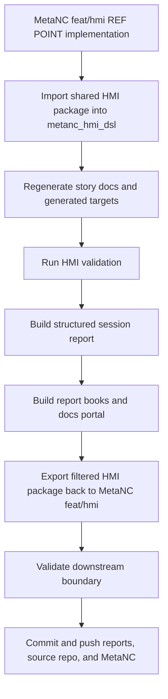

# Workflow Diagram

```mermaid
flowchart TD
  A[MetaNC feat/hmi REF POINT implementation] --> B[Import shared HMI package into metanc_hmi_dsl]
  B --> C[Regenerate story docs and generated targets]
  C --> D[Run HMI validation]
  D --> E[Build structured session report]
  E --> F[Build report books and docs portal]
  F --> G[Export filtered HMI package back to MetaNC feat/hmi]
  G --> H[Validate downstream boundary]
  H --> I[Commit and push reports, source repo, and MetaNC]
```
