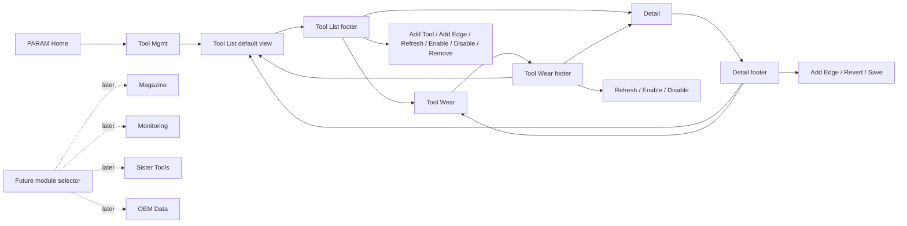

# Architecture Diagram

The default Tool Management path is deliberately short: PARAM opens Tool
Management and the operator lands on Tool List. Future modules should be added
through a dedicated selector so the Tool List footer remains focused on daily
row operations.
