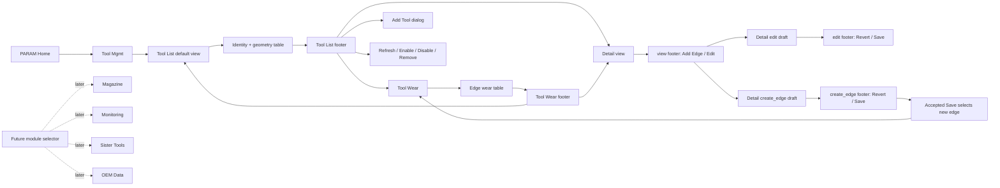

# Architecture Diagram

The default Tool Management path is deliberately short: PARAM opens Tool
Management and the operator lands on Tool List. Detail write actions are
state-specific so read-only review does not look like a disabled editing mode.
