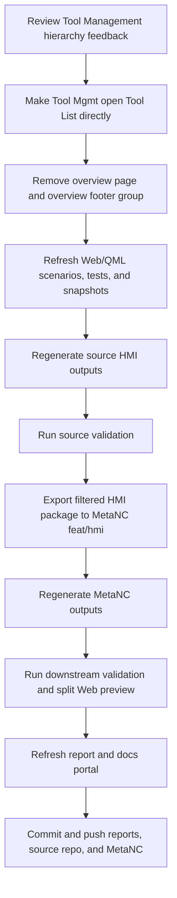

# Workflow Diagram

```mermaid
flowchart TD
  A[Review Tool Management hierarchy feedback] --> B[Make Tool Mgmt open Tool List directly]
  B --> C[Remove overview page and overview footer group]
  C --> D[Refresh Web/QML scenarios, tests, and snapshots]
  D --> E[Regenerate source HMI outputs]
  E --> F[Run source validation]
  F --> G[Export filtered HMI package to MetaNC feat/hmi]
  G --> H[Regenerate MetaNC outputs]
  H --> I[Run downstream validation and split Web preview]
  I --> J[Refresh report and docs portal]
  J --> K[Commit and push reports, source repo, and MetaNC]
```
